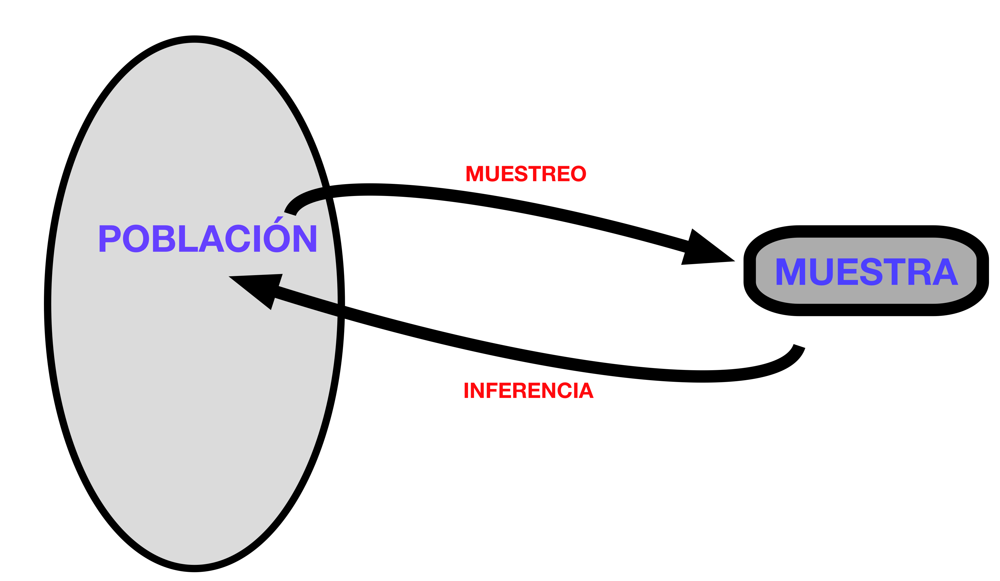

```{r echo=FALSE, eval=FALSE}
output:
  beamer_presentation:
    keep_tex: true
classoption: "handout"
```


```{r set-options, echo=FALSE}
options(width = 60)
library(knitr)
def.chunk.hook  <- knitr::knit_hooks$get("chunk")
knitr::knit_hooks$set(chunk = function(x, options) {
  x <- def.chunk.hook(x, options)
  ifelse(options$size != "normalsize", paste0("\\", options$size,"\n\n", x, "\n\n \\normalsize"), x)
})
```

# Población y muestra. 

## Inferencia Estadística.

+ El objetivo central de la Estadística es obtener información fiable sobre las características de una **población** a partir de **muestras**. Ese término significa aquí un conjunto de entidades individuales (individuos), no necesariamente seres vivos. La poblacion pueden ser los vehículos matriculados en 2015 o las órdenes de compra recibidas por una empresa cierto mes o  las especies de ave que visitan un comedero en Costa Rica en los últimos 10 años, etc.

+ Muchas veces estudiar toda la población es demasiado difícil, indeseable o imposible. Entonces surge la pregunta de si podemos usar las muestras para *inferir*, o *predecir* las características de la población. ¿Hasta qué punto los datos de la muestra son *representativos*de la población? 

+ La *Inferencia Estadística* es el núcleo de la Estadística porque da sentido a estas preguntas, las formaliza y responde.
```{r echo=FALSE, comment=NULL, fig.align='center', out.width = "40%"}

```


## Poblaciones y muestras aleatorias simples con vectores con R.

+ Al estudiar una población nos interesan determinadas características individuaes, que pueden cambiar de un individuo a otro y que constituyen las *variables de interés*. Cuando tomamos una muestra obtenemos los valores de esas variables en algunos individuos de la población. 

+ Para que la muestra sea representativa lo mejor es que sea una **muestra aleatoria simple**: elegimos a los individuos al azar y con remplazamiento (podemos incluri al mismo individuo más de una vez en la muestra). 

```{r echo=FALSE, comment=NULL, fig.align='center', out.width = "30%", size="small"}
set.seed(2019)
N = 158000
poblacion = as.integer(2 * rchisq(N, df = 13), 0)
```

+ Para entenderlo mejor  haremos un experimento con R. En este caso vamos a suponer una población de $N = 158000$ individuos. Por ejemplo, los viajeros que pasan por un aeropuerto en un día y sea la variable de interés su edad. El código de esta sesión construye un vector `poblacion` con las edades de los viajeros. Vamos a hacer una pequeña trampa y mostraremos el histograma de las edades. La línea de puntos indica *la media poblacional de la edad.* ¿Cuál crees que es? 
```{r echo=FALSE, comment=NULL, fig.align='center', out.width = "40%", size="small"}
# summary(poblacion)
hist(poblacion, main="", col="orange")
abline(v = mean(poblacion), lty=2, lwd=5, col="blue")
```

---

## Medias muestrales

- Ese es justo el tipo de preguntas que esperamos que responda la Estadística. Aunque en este caso disponemos del vector completo de edades debes tener claro que en los problemas reales no será así. Así que recurrimos a las muestras aleatorias (con remplazamiento), en inglés *random sample (with replacement)*. Por ejemplo, de tamaño 20. En R construimos una de esas muestras así:
\small
  ```{r echo=-c(1,4)}
  options(width= 90)
  n = 20
  (muestra = sample(poblacion, n, replace = TRUE))
  options(width= 70)
  ```
  \normalsize Esas son las 20 edades $x_1, \ldots, x_{20}$ de los viajeros de la muestra. Para *estimar* la edad media de *todos los viajeros* a partir de estos valores calcularíamos la **media muestral**.
$$
\bar X = \dfrac{x_1 + \cdots + x_{20}}{n} = 
\dfrac{`r  muestra[1]` + `r  muestra[2]` + \cdots + `r  muestra[20]`}{`r  n`} \approx
`r  signif(mean(muestra), 5)` = \text{mean(muestra) en R}
$$

+ Naturalmente, si tomas otra muestra, su media muestral puede ser otra: 
  \small
  ```{r echo = -1}
  options(width= 90)
  (muestra2 = sample(poblacion, n, replace = TRUE))
  mean(muestra2)
  ```
\normalsize 

## Muestras buenas y malas.

+ Hemos visto que cada muestra produce una media muestral y que esas medias muestrales pueden ser distintas. ¿Cuántas muestras distintas hay? Hay una cantidad inimaginablemente grande:\small
$$
158000^{20} = `r 158000^20`
$$
\normalsize Para ponerlo en perspectiva, se estima que en el universo hay menos de $10^{40}$ estrellas. Esta cantidad enorme de muestras, de las que solo hemos visto 2, forman lo que se llama el **espacio muestral** (de tamaño $n = 20$) de este problema. 

+ Entre esas muestras hay muestras *buenas* y muestras *malas*. ¿Qué queremos decir con esto? Para seguir con nuestro experimento vamos a ordenar *la población completa* por edad y tomemos los 20 primeros valores:
  \small
  ```{r echo = -1}
  options(width= 90)
  (muestra3 = sort(poblacion)[1:20])
  ```
  \normalsize Hemos llamado `muestra3` a ese vector porque es una más de las muchísimas muestras posibles que podríamos haber obtenido al elegir al azar 20 viajeros. Y si usáramos esta muestra para estimar la media de la población obtendríamos
  \small
  ```{r echo = -1}
  options(width= 90)
  mean(muestra3)
  ```
  \normalsize Eso es lo que llamamos una *muestra mala*, poco representativa.

## La distribución de las medias muestrales.

+ La última muestra que hemos examinado era muy poco representativa. Pero la pregunta esencial para la estadística es ¿cuál es la relación entre muestras buenas y malas? Al elegir una muestra al azar, ¿cómo de probable es que nos toque una muestra tan mala en lugar de una buena?

+ Podemos hacer otro pequeño experimento para explorar el espacio muestral. No podemos repasar todas las muestras una por una para clasificarlas en buenas o malas (eso sería demasiado incluso para R) pero podemos tomar *muchas* muestras aleatorias (pongamos $k = 10000$) y ver como de buenas o malas son (hacemos una *muestra de muestras*). En R es muy fácil hacer esto usando la función `replicate`: \small
  ```{r}
  k = 10000
  # replicate repite k veces los comandos entre llaves y guarda el resultado
  # del último comando en el vector mediasMuestrales
  mediasMuestrales = replicate(k, { 
    muestra = sample(poblacion, n, replace = TRUE)
    mean(muestra)
  })
  head(mediasMuestrales, 10)
  ```
  \normalsize Se muestran las primeras 10 de las 10000 medias muestrales que hemos obtenido. 

---

+ En lugar de examinar una a una esas 10000 medias muestrales vamos a representarlas en un histograma y una curva de densidad. Además, aprovechándonos de que en este caso tenemos acceso a la población completa hemos añadido su curva de densidad:
```{r echo=FALSE, comment=NULL, fig.align='center', out.width = "65%", size="small"}
hist(mediasMuestrales, breaks = 40, main="", 
     col="peachpuff", probability = TRUE, xlim=range(poblacion))
lines(density(mediasMuestrales), lwd=4, col="red")
lines(density(poblacion), lwd=4, col="blue")
abline(v = mean(poblacion), lty=2, lwd=5, col="blue")
```

+ Este es posiblemente \textbf{el gráfico más importante del curso}. Fíjate en tres cosas:  
  - La media de las medias muestrales es la media de la población.
  - Prácticamente no hay *muestras malas*. Es *extremadamente improbable* que una muestra elegida al azar sea muy mala.
  - La distribución de las medias muestrales tiene forma de campana (y es muy estrecha).
  
  Para entender bien estas ideas *necesitaremos aprender más sobre Probabilidad*.

## Otra población, mismos resultados.

+ Pero antes de lanzarnos a la probabilidad vamos a asegurarnos de algo. Puede que te preguntes si la población con la que hemos empezado tenía algo especial.  Probemos con otra muy distinta. La población la forman 20000 números elegidos al azar del 0 al 20, siendo todos los valores igual de probables (su curva de densidad es horizontal).\small
  ```{r}
  poblacion = sample(0:20, 20000, replace = TRUE)
  ```
  \normalsize Y ahora repetimos el proceso de construcción de medias muestrales usando replicate
  \scriptsize
  ```{r}
  k = 10000
  mediasMuestrales = replicate(k, { 
    muestra = sample(poblacion, n, replace = TRUE)
    mean(muestra)
  })
  ```
  \normalsize El  gráfico del resultado muestra el mismo comportamiento de las medias  muestrales, lo que se conoce como **Teorema Central del Límite**:
```{r echo=FALSE, comment=NULL, fig.align='center', out.width = "45%", size="small"}
hist(mediasMuestrales, breaks = 40, main="", 
     col="peachpuff", probability = TRUE, xlim=range(poblacion))
lines(density(mediasMuestrales, adjust = 1.5), lwd=4, col="red")
lines(x = c(0, 0, 20, 20), c(0, 1/20, 1/20, 0), lwd=4, col="blue")
abline(v = mean(poblacion), lty=2, lwd=5, col="blue")
```
  
```{r eval=FALSE}
Otras poblaciones:
  
#####################################################################
# Uniforme continua
#####################################################################

tamPoblacion = 100000
poblacion = runif(tamPoblacion, min = 0, max = 10)
head(poblacion, 100)


hist(poblacion)
plot(density(poblacion))
```

```{r eval=FALSE}
mean(poblacion)

Tmuestra = 20

# ¿Cuántas muestras distintas hay?
choose(tamPoblacion, Tmuestra)

# La población es moderadamente grande, pero el espacio de muestras es enorme.
```


```{r eval=FALSE}
# Vamos a tomar muchas muestras y en cada una calculamos una media muestral.
numMuestras = 100000

# Repetiremos esto varias veces para hacernos una idea.
(muestra = sample(poblacion, size = Tmuestra, replace = TRUE))
mean(muestra)

mediasMuestrales = replicate(numMuestras, {
  muestra = sample(poblacion, size = Tmuestra, replace = TRUE)
  mean(muestra)
})

# ¿Cómo se distibuyen esas medias muestrales?
head(mediasMuestrales)
hist(mediasMuestrales)
hist(mediasMuestrales, breaks = 40, main="")
plot(density(mediasMuestrales, adjust = 1.5), main="")
```


```{r eval=FALSE}
# ¿Cuál es la media de las me?
(mu = mean(poblacion))
mean(mediasMuestrales)

# ¿Cuál es su desviación típica?
(desvTipPob = sqrt(sum((poblacion - mu)^2) / tamPoblacion))

sd(mediasMuestrales)
desvTipPob / sqrt(Tmuestra)
```

# Probabilidad básica.

---

+ Para entender resultados como el Teorema Central del Límite tenemos que aprender el mínimo vocabulario necesario para poder hablar con precisión sobre la Probabilidad. 

+ Lo primero de lo que hay que ser conscientes es de que nuestra intuición en materia de probabilidad suele ser muy pobre. Vamos a empezar usando ejemplos de juegos de azar (dados, naipes, etc.) para poder desarrollar el lenguaje, igual que sucedió históricamente. 

## Experimentos del Caballero de Méré. 

+ ¿Qué es más probable?  
  
  $(a)$ obtener al menos un seis en cuatro tiradas de un dado, o  
  $(b)$ obtener al menos un seis doble en 24 tiradas de dos dados?
  
+ Los jugadores que en el siglo XVIII se planteaban esta pregunta pensaban así:  
  $(a)$ La probabilidad de obtener un seis en cada tirada es $\dfrac{1}{6}$. Por lo tanto, en cuatro tiradas es $\dfrac{1}{6}+\dfrac{1}{6}+\dfrac{1}{6}+\dfrac{1}{6} = \dfrac{2}{3}.$  
  $(b)$ La probabilidad de un doble seis en cada tirada de dos dados es $\dfrac{1}{36}$, (hay 36 resultados distintos) y todos aparecen con la misma frecuencia. Por lo tanto, en veinticuatro tiradas será $\dfrac{24}{36}=\dfrac{2}{3}.$  
    
  Así que en principio ambas apuestas parecen iguales,

+ Vamos a usar R para jugar a estos dos juegos sin tener que jugarnos el dinero. Descarga este \link{https://raw.githubusercontent.com/fernandosansegundo/MBDFME/master/scripts/sesion03-01-JuegosDeMere.R}{fichero de código} y ejecútalo. 


## La paradoja del cumpleaños.

+ Otro experimento que puede sevrir para afianzar la idea de que la probabilidad es poco intuitiva. Si en una sala hay 1000 personas entonces es seguro que hay dos que cumplen años el mismo día. De hecho basta con que haya 367 personas. Si hay menos de ese número, la probabilidad de que dos cumpleaños coincidan disminuye. ¿Cuál es el *menor número de personas* que nos garantiza una probabiidad mayor del 50% de coincidencia?

+ Usemos R para averiguar ese número. Repite el experimento varias veces para convencerte..\small
  ```{r}
  n = 366 # Número de personas en la sala
  
  # Vamos a repetir el experimento N veces (N salas de n personas)
  N = 10000
  pruebas = replicate(N, {
    fechas = sort(sample(1:366, n, replace=TRUE)) 
    max(table(fechas)) # si el máximo es mayor que 1 es que 2 fechas coinciden
  })
  mean(pruebas > 1) # ¿qué proporción de salas tienen coincidencias?
  ```


## Regla de Laplace.

## Tablas de frecuencia relativas, probabilidades. Modelos, primera visita.

# Axiomas de la Probabilidad.

# Probabilidad condicionada e independencia.

# Regla de Bayes.

# Tablas de Contingencia.

---

## Referencias para la sesión

**Enlaces**

```{r eval=FALSE, echo=FALSE, purl=FALSE, message=FALSE, error=FALSE}
sessionName = "03-PoblacionesMuestrasProbabilidad"
RmdName = paste0(sessionName,".Rmd")
ScriptName = paste0(sessionName,".R")
lnkScriptGitHub = paste0("https://raw.githubusercontent.com/fernandosansegundo/MBDFME/master/scripts/", ScriptName)
knitr::purl(RmdName, output = paste0("../scripts/", ScriptName))
```

- \link{https://raw.githubusercontent.com/fernandosansegundo/MBDFME/master/scripts/03-PoblacionesMuestrasProbabilidad.R}{Código de esta sesión}


**Bibliografía**

