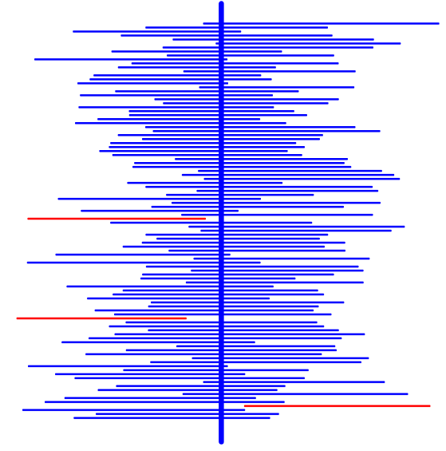
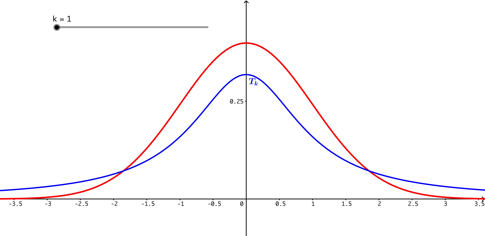
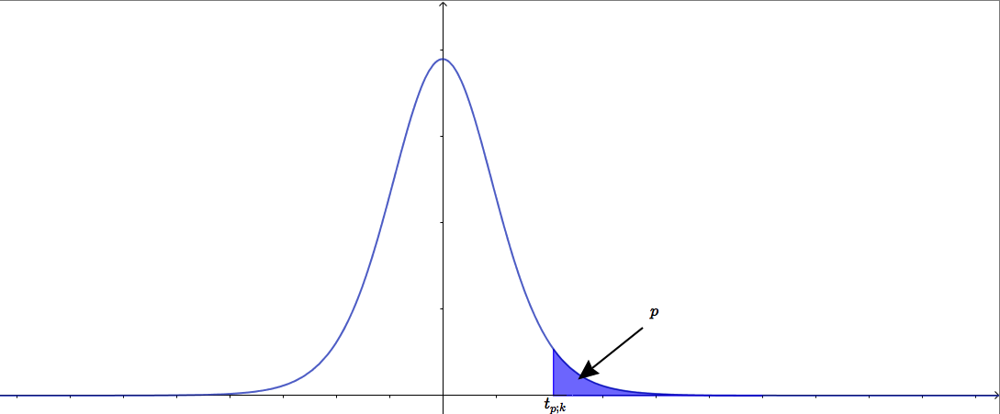

```{r echo=FALSE, eval=FALSE}
output:
  beamer_presentation:
    keep_tex: true
classoption: "handout"
```


```{r set-options, echo=FALSE}
options(width = 60)
library(knitr)
def.chunk.hook  <- knitr::knit_hooks$get("chunk")
knitr::knit_hooks$set(chunk = function(x, options) {
  x <- def.chunk.hook(x, options)
  ifelse(options$size != "normalsize", paste0("\\", options$size,"\n\n", x, "\n\n \\normalsize"), x)
})
```

# El Teorema Central del Límite.

## Medias muestrales.

+ En temas anteriores hemos visto de manera informal y mediante simulaciones que la distribución muestral de la media producía una curva normal. Ahora que sabemos más sobre la normal vamos a expresar ese resultado de forma más precisa y lo usaremos para empezar a hacer Inferencia.

+ Queremos estudiar la distribución de una variable aleatoria cuantitativa $X$ definida en los individuos de cierta población. En particular, la variable $X$ tendrá una media $\mu$ y una varianza $\sigma^2$. Aunque nos ocuparemos de las dos, vamos a empezar pensando en la media poblacional $\mu$. 

+ Recordemos que en general no nos podemos plantear el cálculo directo de la media. Así que se trata de **estimar** el valor de $\mu$ usando **muestras** de la población. Si tenemos una **muestra aleatoria simple** formada por $n$ valores como $x_1,\, x_2,\,\ldots,\, x_n$ (elegidos al azar y con remplazamiento) podemos usar la media muestral
$$
\bar x = \dfrac{x_1 + x_2 + \cdots + x_n}{n}
$$
para estimar la media poblacional $\mu$. 

<!-- ## Muestras aleatorias simples. -->

<!-- + Otra muestra distinta dará otro valor de la media muestral. Eso significa que la media muestral  -->

<!-- + Por lo tanto, usaremos muestras para estimar el valor de $\mu$. ¿Qué quiere decir esto? Una muestra, como las que venimos usando desde el principio del curso, está formada por la observación de $n$ valores de la variable $X$ -->

<!-- Y a partir de esos $n$ valores podemos calcular la **media muestral** aue ya conocemos: -->
<!-- $$ -->
<!-- \bar x = \dfrac{x_1 + x_2 + \cdots + x_n}{n} -->
<!-- $$ -->
<!-- + Nuestro plan descansa sobre la idea de que si la muestra es **representativa** de la población, entonces **la media muestral $\bar x$ se parecerá bastante a la media poblacional $\mu$.** -->

<!-- + Hay una manera de describir el muestreo que nos será útil. Podemos pensar en que el primer valor de la muestra es un valor aleatorio de una variable $X_1$ que es una copia exacta de $X$. De la misma forma $x_2$ es un valor de una variable $X_2$, etc. Entonces la **media muestral** es una variable aleatoria $\bar X$ definida mediante: -->
<!-- $$\bar X = \dfrac{X_1 + X_2 + \cdots + X_n}{n}$$ -->
<!-- Si las variables $X_1, X_2, \ldots, X_n$ son independientes entonces diremos que definen una **muestra aleatoria simple**. -->

<!-- --- -->

## El espacio muestral.

+ El proceso de muestreo, que pasa de una población a veces muy grande a una muestra comparativamente pequeña, puede resultar engañoso. La clave es que **esa muestra se elige al azar de entre todas las muestras posibles.**

+ Hay que pensar en el conjunto de todas las muestras aleatorias simples posibles de tamaño $n$ que llamaremos $\Omega^n$. 

+ **Ejemplo:** si tenemos una población de tamaño $1000$, ¿cuántas muestras aleatorias simples de tamaño 7 podemos construir? Es fácil ver que son 
$$1000^7 = 1000000000000000000000$$
muestras distintas. Esa es la parte engañosa: al pasar de la población original al conjunto de las muestras posibles no estamos pensando en un objeto más pequeño, sino en un espacio incomparablemente más grande. 

+ Entre todas esas muestras hay *muestras buenas* (en las que $\bar x\approx\mu$) y *muestras malas*, con un valor de $\bar x$ poco representativo. Nosotros elegimos la muestra al azar. *¿Cómo de probable es que nos toque una muestra buena?* Para responder a esa pregunta necesitamos información sobre la  distribución de los valores de $\bar X$ entre todas las muestras posibles.

---

## Distribucion muestral de la media: teorema central del límite (TCL).

+ Sea $X$ una v.a. con media $\mu_X$ y varianza $\sigma^2$. Sea $\bar X$ la media muestral construida a partir de una muestra aleatoria simple $X_1, X_2,\cdots, X_n$ de tamaño $n$. Es decir:
$$\bar X = \dfrac{X_1+X_2+\cdots +X_n}{n}$$
donde las $X_i$ son *copias independientes entre sí de $X$*.  Cuando consideramos valores **suficientemente grandes** del tamaño muestral $n$, la distribución de la media muestral en el conjunto de todas las muestras de tamaño $n$ posibles se aproxima a una variable normal, cuya media y varianza son:
$$
\bar X \sim N\left(\mu_X,\frac{\sigma}{\sqrt{n}}\right) \qquad
$$

+ ¿Cuánto es *suficientemente grande*? Depende de la población inicial. Por ejemplo, si la población es normal, $n$ puede ser arbitrariamente pequeño (incluso $n = 1$). Pero si la población es, por ejemplo, muy asimétrica, entonces puede que necesitemos $n$ muy grande. 

---

## Estimación en forma de intervalo. 

+ Para empezar nos situamos en el mejor caso posible: suponemos que la variable $X$ es (aproximadamente) normal, pero desconocemos su media $\mu$. Queremos estimarla usando muestras. Este caso es bastante frecuente porque hay muchas magnitudes en la naturaleza cuya distribución es (aproximadamente) normal.

+ Si $X$ es normal el TCL es válido para cualquier tamaño muestral $n$. Podemos tomar una muestra aleatoria simple y usar la estimación $\mu\approx\bar X$. Naturalmente esto significa;
$$
\mu = \bar X + \text{error}
$$
Y para que esto tenga alguna utilidad científica es imprescindible cuantificar ese error. Si descubrimos que el tamaño del error es menor que $\delta$ (piensa en un número pequeño) entonces podremos decir que:
$$
\bar X - \delta < \mu < \bar X + \delta
$$
y nuestra estimación de $\mu$ será **en forma de intervalo** $(a, b) = (\bar X - \delta, \bar X + \delta)$. Como veremos el TCL nos ayuda a (obtener $\delta$ y) construir esos intervalos. 

## El error es aleatorio porque la muestra es aleatoria.

+ La figura ilustra esa idea (mira el código que la ha generado). La marca roja indica la media de la población. Hemos obtenido 20 muestras de tamaño $n = 30$. Los puntos de cada muestra (puntos azules) están todos a la misma altura y se señala la media de esa muestra con un rombo naranja. Como ves, el error es aleatorio. Recuerda que en un caso real no sabemos donde está la línea roja.
  ```{r echo=FALSE, message=FALSE, fig.align='center', out.width = "75%"}
  par(mar = c(5.1,4.1,1,2.1)) 
  set.seed(2019)
  library(tidyverse)
  datos = data.frame(x = rnorm(600), tipo = rep(1:20, each = 30))
  medias = datos %>%
    group_by(tipo) %>%
    summarise(medias = mean(x)) %>%
    .$medias
  # medias = aggregate(x ~ tipo, data = datos, FUN = mean)[, 2] # Otra manera
  stripchart(x ~ tipo, data = datos, pch = 16, col="blue",
             xlab="Valores de la variable X", ylab = "Número de muestra")
  segments(x0 = min(datos$x), y0 = 1:20, x1 = max(datos$x), y1 = 1:20,  col="blue")
  abline(v = 0, lty=2, col= "red", lwd=5)
  points(x = medias, y = 1:20, col="orange", pch=18, cex=2)
  ```

## Intervalos de confianza para la media.

+ Por tanto si nos toca una muestra *"buena"* el error será pequeño, pero si nos toca una *"mala"* el error puede ser bastante grande. La clave es que, como hemos visto, el TCL garantiza que a medida que $n$ aumenta las muestras buenas son muchas veces más numerosas que las malas. Pero es importante entender que el muestreo es aleatorio: podemos *hacerlo todo bien* y obtener una estimación errónea por simple azar. Lo que queremos garantizar es que es *poco probable* que nos pase eso.

+ Por eso las estimaciones que haremos serán de esta forma:  
\begin{center} 
\textbf{(Si estimas $\mu$ usando este método) hay una probabilidad del 95\% de que (te toque una muestra buena y) $\mu$ esté dentro del intervalo $(a, b)$.}
\end{center}
  Las partes entre paréntesis suelen omitirse pero están implícitas.

+ La probabilidad del 95% que aparece en esa afirmación se denomina **nivel de confianza** $nc$. Los niveles de confianza siempre serán números cercanos a uno, como $0.90$, $0.95$ o $0.99$.
\begin{center}
  \fcolorbox{black}{Gris025}{\begin{minipage}{9cm}
      {\bf Intervalos de confianza.}\\
      Dado un {\bf nivel de confianza} $nc$, un intervalo $(a, b)$ tal que 
$$
P(a < \mu < b) = nc 
$$
es un {\bf intervalo de confianza al nivel $nc$} para la media $\mu$.
\end{minipage}}
\end{center}

## Comentarios sobre la definición de intervalo de confianza.

+ Los valores de $a$ y $b$ son aleatorios y **dependen de la muestra que nos toque**.

+ La probabilidad aquí se mide **sobre el conjunto de todas las muestras aleatorias simples** de tamaño $n$. El valor $nc$ es la probabilidad de que nos toque una muestra *"buena"*.

+ Es importante además entender que en la construcción del intervalo entran en juego dos factores:
    * El intervalo $(a, b)$ mide la **precisión** (o el error) con la que estimamos el valor de $\mu$. Cuanto más estrecho sea el intervalo, mejor.
    * Pero el nivel de confianza $nc$ mide la **incertidumbre** de esa estimación, que depende de que hayamos tenido suerte en el muestreo (y la muestra sea buena). Cuanto más cerca de 1 esté $nc$, mejor.
    Pero la precisión y la incertidumbre no son independientes, y en la práctica es necesario establecer un equilibrio entre las dos.
    
+ Cuando hayamos aprendido algo más sobre la construcción de intervalos de confianza volveremos sobre todas estas ideas.


 
---

## El papel del TCL en la construcción de intervalos de confianza. 

+ En el caso de una población normal el TCL nos garantiza que 
$$
\bar X \sim N\left(\mu_X,\frac{\sigma}{\sqrt{n}}\right) \qquad
$$
En particular, eso significa que  
$$Z = \dfrac{\bar X - \mu}{\frac{\sigma}{\sqrt{n}}}$$ 
es una normal estándar $N(0, 1)$. Y dado un nivel de confianza $nc$, por ejemplo $0.9$, sabemos (con `qnorm`, como veremos enseguida) construir un intervalo simétrico $(-K,\, K)$ tal que:
$$P(-K < \, Z \,<  K) = nc$$
```{r echo=FALSE, fig.align='center', out.width="7cm"}
include_graphics("../fig/06-02-ProblemaInversoZ-02.png")
```

---

##  

Pero entonces, si sabemos encontrar ese valor $K$ tendremos:
$$P\left(-K < \,\dfrac{\bar X - \mu}{\frac{\sigma}{\sqrt{n}}}  \,<  K\right) = nc$$
Despejando dentro de la probabilidad:
$$P\left(\bar X - K \dfrac{\sigma}{\sqrt{n}} < \, \mu \,<  \bar X + K\dfrac{\sigma}{\sqrt{n}}\right) = nc$$
Y eso tiene justo la forma que queríamos para el intervalo de confianza:
$$
P(a < \mu < b) = nc 
$$
siendo 
$$a = \bar X - K \dfrac{\sigma}{\sqrt{n}}, \qquad\qquad b = \bar X + K\dfrac{\sigma}{\sqrt{n}}$$
Así que todo pasa por aprender a calcular $K$.

---

##  Valores críticos de $Z$.

+ Fíjate en que si la zona central tiene una probabilidad igual a $nc = 0.90$, entonces queda una probabilidad $\alpha = 1 - nc = 0.10$ para repartir *entre las dos colas*. **Atención:** siempre vamos a usar esa notación
$$\alpha = 1 - nc$$
Y eso significa que *cada una de las dos colas* (que son iguales por simetría) tiene una probabilidad igual a 
$$\dfrac{\alpha}{2} = 0.05$$
Así que  $K$ es el valor que deja a su derecha $\dfrac{\alpha}{2} = 0.05$. 

+ **Definición:** Dada una probabilidad $p$, el **valor crítico** $z_p$ es el valor de la normal estándar que deja **a su derecha** esa probabilidad $p$. Es decir, $P(Z > z_p) = p$.

+ Con esa notación el valor $K$ que buscamos es $K = z_{\alpha/2}$


+ **¡¡Pero cuidado!!** Para calcularlo con $R$ tenemos que recordar que R trabaja con la cola izquierda. Así que para usar `qnorm` tenemos que utilizar la probabilidad 
$$1 - \dfrac{\alpha}{2}$$

---

## Ejemplo con R.

Vamos a usar el nivel de confianza $nc = 0.95$ y calcularemos el correspondiente valor crítico 
$$ z_{\alpha/2}$$
Para empezar calculamos $\alpha$
```{r}
nc = 0.95
(alfa = 1 - nc)
```
Ahora $\alpha/2$:
```{r}
(alfaMedios = alfa / 2)
```
Y por fin usamos `qnorm`
```{r}
(zAlfaMedios = qnorm(1 - alfaMedios))
```

---

### Fórmula del intervalo del confianza.

Recuerda que el valor crítico $z_{\alpha/2}$ es el valor $K$, (casi) la última pieza que nos faltaba para poder construir el intervalo de confianza. Poniendo esa pieza en su sitio tenemos:

**Intervalo de confianza para la media $\mu$ en una población normal (varianza conocida).**

Se puede obtener un intervalo de confianza $(a, b)$ al nivel $nc$ usando:

$$a = \bar X - z_{\alpha/2} \dfrac{\sigma}{\sqrt{n}}, \qquad\qquad 
b = \bar X + z_{\alpha/2}\dfrac{\sigma}{\sqrt{n}}$$
Que muchas veces se resume diciendo que:
$$\mu = \bar X \pm z_{\alpha/2}\dfrac{\sigma}{\sqrt{n}}$$

**Comentario:**

+ Hemos escrito arriba que esto es **casi** lo que necesitamos. ¿Cuál es el problema? Pues que en esa formula aparece $\sigma$, que es la desviación típica *de la población* y que, por tanto, no conocemos. Al fin y al cabo se supone que no conocemos $\mu$... ¿tiene sentido suponer que conocemos $\sigma$ si ni siquiera conocemos $\mu$?

+ Bueno, en algunos pocos casos especiales, sí tiene sentido. Por ejemplo en algunos procesos industriales es lícito suponer que la dispersión de los productos es siempre la misma y conocida, pero aún así queremos estimar el valor de $\mu$ en un cierto lote de productos. Pero, salvo este tipo de casos, lo normal es desconocer $\sigma$.

---

### La aproximación de las muestras grandes.

+ ¿Y entonces qué hacemos? Afortunadamente, hay un remedio sencillo, que funciona **siempre que la variable $X$ sea normal en la población**. Si sucede eso y **además la muestra es suficientemente grande ($n = 30$ puede servir, pero recomendamos $n > 100$)** entonces podemos cambiar $\sigma$ por la *cuasidesviación típica muestral* $s$ en la fórmula del intervalo:
$$a = \bar X - z_{\alpha/2} \dfrac{s}{\sqrt{n}}, \qquad\qquad 
b = \bar X + z_{\alpha/2}\dfrac{s}{\sqrt{n}}$$
Esta fórmula sí permite hacer cálculos completos. 

**Ejemplo:**

Dada una muestra aletoria de una población normal, si la muestra tiene estos *valores muestrales*:
$$n = 100,\qquad \bar X = 7.34, \qquad s = 0.31$$
el intervalo de confianza al 95% que se obtiene (recuerda que sabemos calcular $z_{\alpha/2}$ con R) es:
$$
\mu = \bar X \pm z_{\alpha/2}\dfrac{s}{\sqrt{n}} \approx 7.34 + `r signif(qnorm(0.975), 4)` \dfrac{0.31}{\sqrt{100}} =  
(`r signif(7.34 +c(-1, 1) * qnorm(0.975) * 0.31/sqrt(100), 4)`).
$$
**Ejercicio:** ¿Cómo hemos llegado a ese valor de $z_{\alpha/2}\approx 1.96$?


---

### Fichero plantilla de R.

El proceso, si partimos de los valores muestrales es completamente automático:
```{r}
n = 100
barX = 7.34
s = 0.31
nc = 0.95
alfa = 1 - nc
zAlfaMedios = qnorm(1 - alfa/2)
(intervalo = barX + c(-1, 1) * zAlfaMedios * s / sqrt(n))
```
```{r echo=FALSE}
set.seed(2017)
n = 120
barX = 4.43
s = 0.31
library(MASS)
x = data.frame(x = mvrnorm(n, mu = barX, Sigma = s^2,empirical = TRUE)[,1])
write.table(x, "../datos/06-ejemploICnormalGrande.csv", row.names = FALSE, col.names = TRUE)
```

Y si partes de un fichero de datos de la muestra, como el fichero:  
\link{https://raw.githubusercontent.com/fernandosansegundo/MBDFME/master/datos/06-ejemploICnormalGrande.csv}{06-ejemploICnormalGrande.csv}  
entonces leeremos los datos del fichero con `read.table` y usaremos `length, mean, sd` para calcular los valores muestrales $n$, $\bar X$ y $s$, respectivamente. A partir de ahí todo es igual. 

---

## Interpretación probabilística de los intervalos de confianza.

+ Ahora que tenemos una fórmula para calcular intervalos de confianza conviene insistir en que la construcción del intervalo siempre parte de una muestra aleatoria y, dado  que hay muestras buenas y malas, alguna vez el intervalo puede errar por completo, de manera que $\mu$ no pertenezca a ese intervalo. Usaremos el  
\hspace{2cm}[\textcolor{blue}{fichero GeoGebra Tut06-InterpretacionIntervalosConfianza\_n.ggb}](http://www3.uah.es/marcos\_marva/biologia1718/ficherosGgb.html)  
para ilustrar esto.

```{r echo=FALSE, fig.align='center', out.width="4cm"}

```

---


## Cálculo del tamaño muestral necesario.

+ Hemos visto que la **semianchura del intervalo** es
$$ z_{\alpha/2}\cdot\dfrac{\sigma_X}{\sqrt{n}}$$
y está claro que esta cantidad es la que define la **precisión** del intervalo. Si queremos conseguir una precisión $\delta$ dada, por ejemplo $0.0001$, podemos susituir en esta fórmula y despejar $n$, el tamaño muestral necesario:
$$ 
z_{\alpha/2}\cdot\dfrac{\sigma}{\sqrt{n}} < \delta \qquad \Rightarrow \qquad 
n=\left(z_{\alpha/2}\cdot\dfrac{\sigma}{\delta}\right)^2
$$
+ El problema, por supuesto, es que desconocemos $\sigma$. El remedio consiste en realizar un *estudio piloto* con una muestra de tamaño reducido para estimar mediante $s$ la desviación típica de la población. 

---

## Ejemplo.

*Una empresa farmacéutica está produciendo comprimidos, y como parte del control de calidad se desea medir el diámetro de esos comprimidos. Se sabe que el diámetro $X$ de los comprimidos sigue una distribución normal, con desviación típica $\sigma_X=1.3$mm. La empresa quiere una medida del diámetro con un error no mayor de $0.1$mm y un nivel de confianza del $99\%.$ ¿Qué tamaño de muestra debe utilizarse para conseguir ese objetivo?*

\vspace{3mm}

Lo que se ha hecho en este ejemplo es fijar una precisión $\delta=0.1$mm. Además, al ser $nc=0.99$, tenemos $\alpha=0.01$, con lo que $\frac{\alpha}{2}=0.005$, y $z_{\alpha/2}=z_{0.1}\approx 2.58$ (usaremos más precisión para el cálculo real). Sustituyendo los valores:
$$
n=\left(z_{\alpha/2}\cdot\dfrac{\sigma_X}{\delta}\right)^2     \approx \left(2.58\cdot\dfrac{1.3}{0.1}\right)^2\approx 1121.3
$$
\scriptsize
```{r}
delta = 0.1
sigma = 1.3
nc = 0.99
alfa = 1 - nc
zalfamedios = qnorm(1 - alfa/2)
(nMuestra = (zalfamedios * sigma / delta)^2)
```
\normalsize
Así que tomaremos una muestra de tamaño $1122$ al menos (conviene ser precavidos y redondear al alza).

---


## Muestras pequeñas en poblaciones normales.

+ ¿Y qué sucede si sabemos que **la variable $X$ tiene una distribución normal** en la población, pero sólo   disponemos de una **muestra pequeña** (con $n < 30$)?

+ El hecho de que la muestra sea pequeña significa que disponemos de menos información sobre la variable $X$. Y eso debe traducirse, necesariamente, en un intervalo de confianza más ancho. Student (que en realidad se llamaba [\textcolor{blue}{William S. Gosset}](https://es.wikipedia.org/wiki/William_Sealy_Gosset)) se dio cuenta de que en este tipo de problemas no se podía usar $Z$ directamente y descubrió un sustituto para $Z$, la distribución $t$ de Student. 


```{r echo=FALSE, fig.align='center', out.width="8cm"}

```

---

## Intervalos de confianza usando la $t$ de Student.

Si **la variable $X$ sea normal en la población y  la muestra es pequeña ($n < 100$, aunque tradicionalmente se consideraba $n < 30$)** entonces debemos cambiar $Z$ por la *distribución $t$ de Student* en la fórmula del intervalo de confianza:
$$\mu = \bar X \pm t_{\alpha/2;k} \dfrac{s}{\sqrt{n}}$$
siendo $k = n - 1$ los **grados de libertad** (en inglés, *degrees of freedom*). El valor $t_{\alpha/2;k}$ que aparece es el valor crítico de la $t$ de Student y siempre se cumple que si $T$ es una variable $t$ de Student con $k$ grados de libertad:
$$P(T_k > t_{k;p}) = p$$
Es decir, que la cola derecha de $t_{k;p}$ tiene probabilidad $p$.
```{r echo=FALSE, fig.align='center', out.width="7cm"}

```

---

## La distribución $t$ en R.

Para trabajar en R con las distribuciones de tipo de Student disponemos de las siguientes funciones:

+ `pt` sirve para resolver el *problema directo de probabilidad*; es decir, para calcular probabilidades de la cola izquierda (por defecto) de un valor dado. Por ejemplo, para calcular $P(T_17 > 2.5)$ (que es una cola derecha) usaríamos:
\scriptsize
```{r, indent = '    '}
1 - pt(2.5, df = 17)
```
\normalsize
+ `qt` permite responder al problema inverso de probabilidad; en el que, dada una probabilidad, buscamos *el valor* que deja esa probabilidad en su cola izquierda. Por ejemplo, para calcular el valor crítico $t_{11; 0.005}$, que deja $0.005$ *en su cola derecha*, usaríamos:
\scriptsize
```{r, indent = '    '}
qt(1 - 0.005, df = 11)
```
\normalsize
+ La función `rt`, como es de esperar, sirve para fabricar valores aleatorios de una variable de tipo $t$ de Student. La usaremos sobre todo en las prácticas, para construir simulaciones.

---

## Ejemplo de cálculo de intervalo de confianza con la $t$ de Student.

Vamos a usar estos datos, que provienen de las prácticas de Estadística del Grado en Farmacia (curso 2016-17).

*Se tiene la sospecha de que en las aguas de un embalse las concentraciones de nitritos superan el umbral establecido para la existencia de vida piscícola de tipo ciprinícolas, que es de 0.03 mg NO2/l o menos. Para tratar de verificar esta sospecha, se midieron los niveles de nitritos en diez puntos aleatorios del embalse y se obtuvieron los siguientes valores:*  
`0.02, 0.05, 0.03, 0.05, 0.04, 0.06, 0.07, 0.03, 0.04, 0.03`  
*Calcularemos un intervalo de confianza al 95% para el nivel medio de nitritos en las aguas del embalse. *
\scriptsize
```{r}
datos = c(0.02, 0.05, 0.03, 0.05, 0.04, 0.06, 0.07, 0.03, 0.04, 0.03)
n = length(datos)
barX = mean(datos)
s = sd(datos)
nc = 0.95
alfa = 1 - nc
(tAlfaMedios = qt(1 - alfa/2, df = n - 1))
(intervalo = barX + c(-1, 1) * tAlfaMedios * s / sqrt(n))
```
\normalsize
Como en el caso anterior, lo mejor es aprender a usar los *ficheros plantilla* del Tutorial 6.

---

## Resumen de intervalos de confianza para la media $\mu$.

+ Si la variable $X$ es normal en la población y tenemos una muestra grande, preferiblemente $n > 100$, entonces el intervalo de confianza es:
$$\mu = \bar X \pm z_{\alpha/2} \dfrac{s}{\sqrt{n}}$$
En raras ocasiones usaremos aquí $\sigma$ en lugar de $s$. 

+ Si la variable $X$ es normal en la población pero la muestra es pequeña, entonces el intervalo de confianza es:
$$\mu = \bar X \pm t_{\alpha/2;k} \dfrac{s}{\sqrt{n}}$$

+ Si la variable $X$ no es estrictamente normal, pero sí es *aproximadamente normal*, entonces podemos usar la anterior fórmula con la $t$ para el intervalo de confianza, cuando tenemos muestras grandes. Pronto volveremos sobre lo que significa ser aproximadamente normal.

+ Si tienes una muestra pequeña de una variable que posiblemente no sea normal, entonces los métodos que hemos visto aquí no sirven para obtener un intervalo de confianza para la media. 

---

## Inferencia sobre la varianza. Distribución $\chi^2$.

+ El siguiente paso natural es tratar de calcular intervalos de confianza para la varianza.  
+ Empezaremos suponiendo que tenemos una variable $X$ de tipo normal $N(\mu, \sigma)$. La idea evidente es que trataremos de aproximar $\sigma^2$  mediante $s^2$. 
+ Y para que esa idea funcione necesitamos algo que juege el papel del TCL, y que relacione los valores de $\sigma^2$ y $s^2$ en el conjunto de todas las muestras posibles con una distribución de probabilidad conocida.
+ Otro detalle importante que hay que tener en cuenta es que la media es una medida central y por eso era interesante analizar la diferencia entre $\mu$ y su estimador $\bar X$. Pero en el caso de la varianza estamos con una medida de dispersión y por eso los *cocientes* son más informativos que las diferencias. Así que no es de extrañar que el protagonismo en este caso en el análogo del TCL corresponda a un cociente.

## Estadístico para la distribución muestral de $\sigma^2$ en poblaciones normales.
Si $X$ es una variable aleatoria de tipo $N(\mu; \sigma)$, y se utilizan muestras aleatorias
de tamaño n, entonces:
$$(n - 1)\dfrac{s^2}{\sigma^2} \sim \chi^2_{n - 1}$$
siendo $\chi^2_{n - 1}$ la **distribución chi cuadrado con $n-1$ grados de libertad**, que presentamos a continuación.

---

## La distribución $\chi^2_k$

+ Esta distribución *sólo toma valores positivos* y además es *asimétrica*, a diferencia de la $Z$ o la $t$ de Student. Por ejemplo, la distribución $\chi^2_4$ tiene este aspecto:
```{r echo=FALSE, fig.align='center', out.width="6cm"}
include_graphics("../fig/06-06-DensidadChiCuadrado.png")
```
\hspace{5mm}La asimetría, como veremos, afecta al proceso de construcción de intervalos de confianza basados en esta distribución.

+ En R disponemos de las funciones esperables: `pchisq`, `qchisq` y `rchisq`.

---

## Intervalos de confianza para la varianza.

+ La mayor dificultad técnica en este caso es que, por la asimetría de $\chi^2_k$, tenemos que localizar dos valores críticos distintos a derecha e izquierda, cada uno de los cuales deja una probabilidad $\alpha/2$ en la cola correspondiente.
```{r echo=FALSE, fig.align='center', out.width="6cm"}
include_graphics("../fig/06-07-ChiCuadradoValoresCriticosIntervalo.png")
```
\hspace{5mm} donde si $Y = \chi^2_k$ se cumple $P(Y > \chi^2_{k, p}) = p$.

+ La fórmula del **intervalo de confianza para la varianza** es:
$$
\dfrac{(n-1)s^2}{\chi^2_{k,\alpha/2}}\leq\sigma^2\leq\dfrac{(n-1)s^2}{\chi^2_{k,1-\alpha/2}} ,\qquad\mbox{ con }k=n-1
$$

---

## Ejemplo.

*La variable aleatoria que representa la capacidad de las probetas producidas en una determinada empresa del vidrio tiene una distribución aproximadamente normal. Una muestra aleatoria de 7 de ellas dio como resultado una cuasivarianza de 62 mililitros$^2$. Obtener una estimación, mediante un intervalo de confianza del 95%, de la varianza de la capacidad de las probetas que fabrica dicha empresa.*

\scriptsize
```{r}
varianza = 62
n = 7
# Valores críticos de chi cuadrado.
nc = 0.95
(alfa = 1 - nc)
(chi1 = qchisq(1 - alfa / 2, df = n - 1))
(chi2 = qchisq(alfa/2, df = n - 1))
# Intervalo
(intervalo = (n - 1) * varianza / c(chi1, chi2))
```
\normalsize

---

## ¿Cómo podemos analizar la normalidad de una población?

En muestras grandes podemos usar *histogramas* y *curvas de densidad*.  Las figuras muestran a la izquierda datos normales y a la derecha datos no normales, con $n = 500$ en ambos casos. Con muestras más pequeñas las cosas pueden estar menos claras.

```{r echo=FALSE, fig.align='center', out.width="11cm"}
par(mfrow = c(1, 2))
set.seed(2017)
tamMuestra = 500
normales = rnorm(tamMuestra)
altDens = density(normales)
histNoPlot = hist(normales, plot=FALSE)
maxY = max(altDens$y[which.max(altDens$y)], max(histNoPlot$density))
hist(normales, #breaks = cortes, 
     cex.lab=0.7, cex.axis = 0.6,
     ylab = "", xlab="", main="", 
     freq = FALSE, ylim = c(0, maxY), col="#eec591")
# title(xlab="Altura", line=2, cex.lab=0.7)
title(ylab="Frecuencias", line=2, cex.lab=0.7)
lines(altDens, col="red", lwd=2)

set.seed(2017)
tamMuestra = 500
noNormales = rchisq(tamMuestra, df = 4)
altDens = density(noNormales)
histNoPlot = hist(noNormales, plot=FALSE)
maxY = max(altDens$y[which.max(altDens$y)], max(histNoPlot$density))
hist(noNormales, #breaks = cortes, 
     cex.lab=0.7, cex.axis = 0.6,
     ylab = "", xlab="", main="", 
     freq = FALSE, ylim = c(0, maxY), col="#eec591")
# title(xlab="Altura", line=2, cex.lab=0.7)
title(ylab="Frecuencias", line=2, cex.lab=0.7)
lines(altDens, col="red", lwd=2)
par(mfrow = c(1, 1))
```

---

## Boxplots para analizar la simetría.

A menudo la simetría es el requisito más importante para que los métodos de la Estadística funcionen. Los boxplots son especialmente útiles para detectar la falta de simetría (¡añade los puntos!).  

```{r echo=FALSE, fig.align='center', out.width="11cm"}
par(mfrow = c(1, 2))
boxplot(normales, main="Normal")
stripchart(normales, method = "jitter", 
           vertical = TRUE, add = TRUE, 
           pch=19, col="lightblue", cex=0.3)
boxplot(noNormales, main="No normal")
stripchart(noNormales, method = "jitter", 
           vertical = TRUE, add = TRUE, 
           pch=19, col="lightblue", cex=0.3)
par(mfrow = c(1, 1))
```

---

## Violinplot.

Pero recuerda que este tipo de gráficos son también interesantes y muchas veces más completos que el boxplot.

```{r echo=FALSE, fig.align='center', out.width="11cm", message=FALSE, warning=FALSE}
par(mfrow = c(1, 2))
library(vioplot)
vioplot(normales)
title("Normal")
vioplot(noNormales)
title("No normal")
par(mfrow = c(1, 1))
```

---

## QQplots.
    
Este tipo de gráficos son posiblemente los más utilizados para el análisis de la normalidad. Si la muestra procede de una población normal, los puntos deben coincidir con la recta. 
    
```{r echo=FALSE, fig.align='center', out.width="11cm", message=FALSE, warning=FALSE}
par(mfrow = c(1, 2))
qqnorm(normales, main="Normal")
qqline(normales, lwd=2, col="red")
qqnorm(noNormales, main="No normal")
qqline(noNormales, lwd=2, col="red")
par(mfrow = c(1, 1))
```    
    
    
---

## ¡¡Precaución con las muestras pequeñas!!

Todas las siguientes gráficas son de muestras de tamaño 15 que **provienen de poblaciones normales**.

```{r echo=FALSE, fig.align='center', out.width="11cm", message=FALSE, warning=FALSE}
par(mfrow=c(4, 4))
for(i in 1:16){
  plot(density(rnorm(15)), lwd=2, col="red", main="", xlab = "", ylab = "")
}
par(mfrow=c(1, 1))
```

---

##  

Y con los boxplots sucede algo parecido.


```{r echo=FALSE, fig.align='center', out.width="11cm", message=FALSE, warning=FALSE}
par(mfrow=c(3, 3))
for(i in 1:9){
  muestra = rnorm(15)
  boxplot(muestra, main="", xlab = "", ylab = "")
  stripchart(muestra, method = "jitter", add = TRUE, vertical = TRUE)
}
par(mfrow=c(1, 1))
```

---

## ¿Qué hacemos si tenemos dudas de que la población sea normal?

+ Habla con un estadístico.

+ Usa *métodos no paramétricos*. En las prácticas veremos algún ejemplo.


# Complementos de R.

## Listas.

## Rmarkdown para la creación de documentos.


## Referencias para la sesión

**Enlaces**

```{r eval=FALSE, echo=FALSE, purl=FALSE, message=FALSE, error=FALSE}
sessionName = "05-InferenciaMediaUnaVariable"
RmdName = paste0(sessionName,".Rmd")
ScriptName = paste0(sessionName,".R")
lnkScriptGitHub = paste0("https://raw.githubusercontent.com/fernandosansegundo/MBDFME/master/scripts/", ScriptName)
knitr::purl(RmdName, output = paste0("../scripts/", ScriptName))
```

- \link{https://raw.githubusercontent.com/fernandosansegundo/MBDFME/master/scripts/05- InferenciaMediaUnaVariable.R}{Código de esta sesión}


**Bibliografía**

