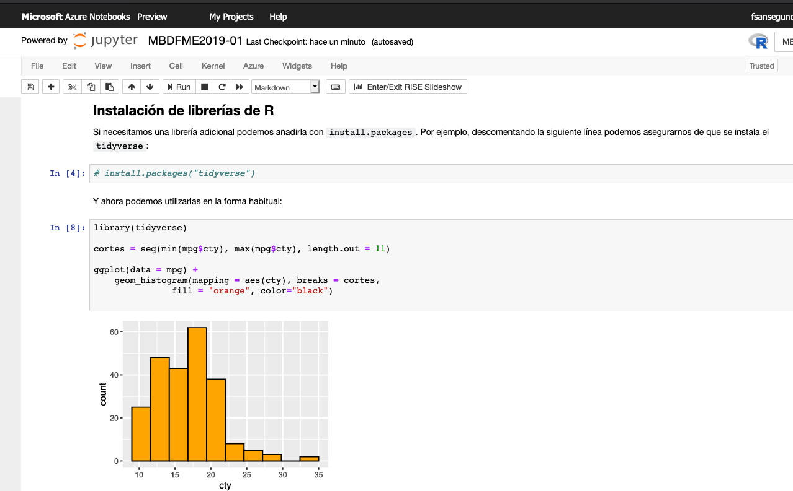

```{r set-options, echo=FALSE, purl=FALSE, warning=FALSE, message=FALSE}
options(width = 60)
library(knitr)
def.chunk.hook  <- knitr::knit_hooks$get("chunk")
knitr::knit_hooks$set(chunk = function(x, options) {
  x <- def.chunk.hook(x, options)
  ifelse(options$size != "normalsize", paste0("\\", options$size,"\n\n", x, "\n\n \\normalsize"), x)
})
```

# Relación entre dos variables.

## Introducción.

+ Vamos a extender los métodos de inferencia que hemos aprendido al estudio de las **relaciones entre dos variables aleatorias**, relación que representamos con un símbolo que ya conocemos:
$$Y \sim X$$
donde $X$ es la **variable explicativa**, mientras que $Y$ es la **variable respuesta.** 

+ Dependiendo del tipo de variables $X$ e $Y$ se pueden dar cuatro situaciones:
  ```{r echo=FALSE, message=FALSE, fig.align='center', out.width = "90%", purl=FALSE}
  include_graphics("../fig/06-Tabla2Variables.png")
  ```
  Empezaremos por el caso $C \sim C$, la relación entre dos variables continuas. Pero primero vamos a hablar sobre la exploración gráfica de estos cuatro tipos de relaciones. 

## Dos variables continuas.

+ Recomendamos encarecidamente la lectura del Capítulo 7 de [@Wickham2016] (disponible online).

+ Para representar gráficamente este tipo de situaciones usaremos un *diagrama de dispersión (sactterplot)*. Dibujamos pares $(x, y)$ donde $x$ es la variable explicativa e $y$ la respuesta. Con R clásico y las variables `cty` (respuesta) y `hwy` (explicativa) de `mpg` se obtiene este diagrama:\small
  ```{r message=FALSE, warning = FALSE, fig.align='center', out.width = "70%"}
  library(tidyverse)
  plot(mpg$hwy, mpg$cty, pch = 19, col = "blue", xlab = "hwy", ylab = "cty")
  ```

## Diagrama de dispersión con ggplot. 

+ Con ggplot el código y el diagrama son:\small   
  ```{r message=FALSE, fig.align='center', out.width = "65%", results= "hold"}
  library(tidyverse)
  plt = ggplot(mpg) +
    geom_point(aes(hwy, cty), col = "darkgreen")
  plt
  ```
\normalsize Pronto volveremos con más detalle sobre este tipo de gráficos. Hemos puesto nombre al gráfico porque lo reutilizaremos más adelante.

## Una variable continua $X$ y un factor $F$.

+ Para este tipo de situaciones podemos emplear varios recursos gráficos. Puesto que la variable $X$ es continua sus valores se pueden representar mediantes boxplots, histogramas, curvas de dnesidad, etc. Para ilustrar la relación con $F$ mostramos esos diagramas para cada nivel del factor $F$. 

+ Por ejemplo, para ilustrar la relación entre $X =$ `cty` y el factor `class` de `mpg` dibujamos boxplots (o violinplots) paralelos por niveles y añadimos los puntos de las poblaciones.\small  
  ```{r message=FALSE, fig.align='center', out.width = "50%"}
  boxplot(cty ~ class, data = mpg, col= heat.colors(7), 
          las=2, cex.axis=0.75, xlab = "")
  stripchart(cty ~ class, data = mpg, method = "jitter", 
             vertical = TRUE, pch = 19, col = "red", cex=0.3, add = TRUE)
  ```
  \normalsize 

## Otras opciones.

+ Las curvas de densidad por grupos son otra opción común. Con ggplot (en R base es algo más complicado):\small  
  ```{r message=FALSE, fig.align='center', out.width = "80%"}
  ggplot(mpg) +
    geom_density(aes(x = cty, color = class))
  ```
  \normalsize
  
## Invirtiendo los papeles de $X$ y $F$

+ Los dos gráficos anteriores invitan a pensar en $X$ como variable respuesta y el factor $F$ como variable explicativa, como en $X \sim F$. Pero a veces querremos cambiar los papeles. En casos así una opción es invertir el papel de los ejes y usar los mismos boxplots o bien diagramas de puntos con los valores de $X$ para cada nivel de $F$ como se ilustra aquí:\small
  ```{r message=FALSE, fig.align='center', out.width = "50%"}
  library(lattice)
  mpg$class = reorder(mpg$class, mpg$hwy, FUN = mean)
  dotplot(class ~ cty, data = mpg, lwd= 2)
  ```
  \normalsize Hemos aprovechado para ordenar los niveles según el valor medio de $X$ para hacer más fácil la visualización. 

## Dos factores.

+ En casos con pocos niveles lo más sencillo es mostrar la información en una tabla. Pero si se desea una representación gráfica entonces se pueden usar gráficos de mosaico.\small
  ```{r message=FALSE, echo = -c(2, 6), fig.align='center', out.width = "60%"}
  Tabla = table(mpg$year, mpg$class)
  mosaicplot(Tabla, col=terrain.colors(nlevels(mpg$class)), las = 1)
  ```
  \normalsize En este tipo de gráficos el *área de cada rectángulo* es proporcional al valor correspondiente en la tabla de contingencia. 

## Matrices de gráficos de correlación.

+ A veces para explorar las posibles relaciones entre variables de un conjunto de datos se utilizan este tipo de diagramas que comparan dos a dos las variables y disponen la información en forma de "matriz de gráficos".\scriptsize
  ```{r message=FALSE, fig.align='center', out.width = "60%"}
  library(GGally)
  ggpairs(iris, progress = FALSE, lower = list(combo = wrap("facethist", 
                                                            binwidth = 0.25)))
  ```
  \normalsize Aunque el contenido de la matriz puede ser distinto según la función que la crea, típicamente la información sobre cada par de variables se encuentra en los dos cruces de la tabla. La diagonal muestra información sobre la distribución de esa variable.


## Patrones y modelos.

+ Ver la \link{https://r4ds.had.co.nz/exploratory-data-analysis.html\#covariation}{sección 7.6 de R for Data Science}. Los gráficos, las tablas y las estimaciones que estamos aprendiendo a construir nos sirven para buscar *patrones* o *tendencias* en nuestros datos, que a su vez apuntan a la existencia de posibles relaciones entre las variables del problema. 

+ Y al explorar esos patrones, debemos tener presentes estas preguntas:  
    $-$ ¿el patrón que observamos puede ser fruto del azar?  
    $-$ ¿cómo describiríamos la relación que señala ese patrón?  
    $-$ ¿cómo de fuerte aparenta ser esa relación?  
    $-$ ¿puede haber otras variables implicadas?  
    $-$ y en particular ¿cambia la relación si se consideran subgrupos de los datos?  

+ Un *modelo* es una representación abstracta de las propiedades y relaciones que existen en un conjunto de variables. Al decir que una variable se distribuye como una normal ya estamos usando un modelo, De hecho, al decir que la media de una variable es $\mu$ ya estamos modelizando. Ahora queremos pensar en modelos de las *relaciones entre variables*. Vamos a empezar por uno de los modelos más sencillos, la regresión lineal simple.  
  
# Regresión lineal simple.

## Ejemplo: consumo de oxígeno y temperatura en herrerillos comunes.

+ En el artículo [@haftorn1985effect] los investigadores estudiaron la relación entre el consumo de oxígeno y la temperatura del aire en una hembra de *Herrerillo Común*, el ave que puedes ver en la Figura.  

\begin{center}
\includegraphics[height=5cm]{../fig/06-Herrerillo.png}
\end{center}

+ ¿Qué crees que sucede con el consumo de oxígeno cuando sube la temperatura del aire?
+ ¿Son igual de fáciles de medir ambas variables?  


## Intuición.

+ Al tratarse de dos variables continuas el resultado de las mediciones es un conjunto de **pares** de valores (por ejemplo $x =$ temp. del aire, $y =$ consumo de O$_2$)
$$
(x_1, y_1),\, (x_2, y_2), \ldots,\, (x_n, y_n)
$$
que podemos representar en unos ejes de coordenadas, con un *diagrama de dispersión*.

+ En el caso de los herrerillos la conjetura natural es que si representamos esos valores la *tendencia* o *patrón* será esta:
\begin{center}
\includegraphics[height=4cm]{../fig/06-IntuicionProblemaHerrerillos.png}
\end{center}

## Patrones lineales en el diagrama de dispersión.

+ En el caso de los herrerillos, los datos recogidos por los investigadores produjeron este gráfico:
  \begin{center}
  \includegraphics[height=5cm]{../fig/06-Figura05HaftornReinertsenHerrerillos.png}
  \end{center}
  que, como se ve, confirma nuestra intuición (hay dos muestras, una durante el periodo de incubación y otra fuera de ese periodo).

+ Las rectas que aparecen representan el *patrón* que parecen indicar esos datos.¿Cómo podemos elegir la mejor representación, la *mejor recta*? ¿En qué sentido sería la mejor?

## Relaciones entre variables. Funciones deterministas.

+ Al estudiar Matemáticas nos hemos encontrado con la idea de **función**
  $$y = f(x)$$
  que describe la relación entre una **variable independiente** $x$ y una **variable dependiente** $y$, ligadas a menudo por una expresión, como por ejemplo:
  $$
  y = \sin(3x)\cos(7x)
  $$
  que produce una gráfica como esta:
  \begin{center}
  \includegraphics[height=3cm]{../fig/06-FuncionTrigonometrica.png}
  \end{center}

+ Este tipo de relaciones pueden ser muy complicadas, pero son **deterministas**: dado el valor de $x$, calculamos el valor de $y$ obteniendo *siempre el mismo (único) resultado*. Se usan para describir relaciones teóricas entre variables, como las Leyes de la Física, o en operaciones formales como las conversiones de unidades, etc.

## Relaciones estadísticas entre variables. Notación y terminología.

+ Las relaciones deterministas no bastan para describir muchas situaciones que involucran medidas, observaciones que llevan asociado algún tipo de *incertidumbre*. También hablaremos de *azar* o *ruido* para describir todos esos factores que hacen que la relación entre variables no sea determinista sino estadística. A menudo se usa también la terminología *señal y ruido*, procedente de las telecomunicaciones y popularizada por \link{https://en.wikipedia.org/wiki/The_Signal_and_the_Noise}{Nate Silver}, para distinguir entre la relación que nos interesa (señal) y los factores aleatorios (ruido) que la enmascaran.  

+ En el caso de estas relaciones estadísticas a menudo seguirá siendo cierto que queremos utilizar los valores de una variable $x$ para *estimar o predecir* los valores de otra variable $y$. En este contexto diremos que $x$ es la **variable predictora (o explicativa)** mientras que $y$ es la **variable respuesta**.  

+ En lugar de la notación $y = f(x)$ de las relaciones deterministas, usamos $y \sim x$ para representar una de estas relaciones estadísticas. Por ejemplo, si $O_2$ es el consumo de oxígeno y $T$ la temperatura del aire, escribiremos $O_2 \sim T$. Esta ecuación indica que el valor de $T$, por si mismo, no permite calcular un único valor de $O_2$, porque existen elementos de incertidumbre (ruido) asociados con esa relación.  

## Ejemplos de relaciones *ruidosas*.

+ Las tres gráficas ilustran tres ejemplos de relaciones con ruido que ilustran situaciones comunes en ese tipo de relaciones:
  ```{r echo=FALSE, message=FALSE, fig.align='center', out.width = "60%"}
  set.seed(2017)
  margins = par("mar")
  par(mfrow = c(1, 3), mar = c(5, 2, 4, 2))
  n = 100
  x = sort(runif(n))
  y1 = 3 + 2 * x + 0.3 * rnorm(n)
  plot(x, y1, col="seagreen", pch=19, xlab="", ylab="")
  y2 =  x * (1 - x) + 0.01 * rnorm(n)
  plot(x, y2, col="seagreen", pch=19, xlab="", ylab="")
  y3 =  2 * rnorm(n)
  plot(x, y3, col="seagreen", pch=19, xlab="", ylab="")
  par(mfrow = c(1, 1))
  par(mar=c(5.1,4.1,4.1,2.1))
  ```
  
+ La primera es una relación que se puede resumir bien mediante una recta. La segunda muestra una relación muy bien definida entre x e y (*mucha señal, poco ruido*), pero que no se puede resumir en una recta. La tercera no muestra relación aparente entre las variables (*poca señal, mucho ruido*). En este momento nos interesan especialmente situaciones como la primera.

## La recta de regresión.

+ Nos centramos en el primer caso y tratamos de elegir *la mejor recta posible* para representar la relación estadística entre $x$ e $y$. Esa recta es la **recta de regresión lineal de $y$ frente a $x$**. En este ejemplo la *mejor recta* es esta:
  ```{r echo=FALSE, message=FALSE, fig.align='center', out.width = "55%"}
  set.seed(2017)
  n = 100
  x = sort(runif(n))
  y1 = 3 + 2 * x + 0.3 * rnorm(n)
  plot(x, y1, col="seagreen", pch=19, xlab="", ylab="")
  abline(lm(y1 ~ x), lwd= 3, col="blue")
  ```
+ El plan de trabajo inmediato es este:  
  $(a)$ Entender en qué sentido la recta de regresión es la mejor recta posible.  
  $(b)$ Obtener su ecuación.  
  $(c)$ Entender que a veces incluso la mejor recta sigue siendo muy mala.

+ Como lectura complementaria para este tema recomendamos el libro \link{https://leanpub.com/regmods}{Regression Models} de Brian Caffo y los vídeos que lo acompañan.

## Ecuación de la recta. Valores predichos y residuos.

+ Vamos a fijar la notación que nos ayudará a avanzar. Escribimos la ecuación de la recta de regresión así:
$$
y = b_0 + b_1\, x
$$
donde $b_1$ es la **pendiente (slope)** de la recta, y refleja su inclinación. El signo de $b_1$ indica si la recta sube o baja. Su valor absoluto indica cuantas unidades cambia $y$ por unidad de cambio de $x$. El valor de $y$ cuando $x = 0$ es $b_0$, la **ordenada en el origen (intercept)**. A veces la recta se escribe $y = a + b\, x$ y de ahí la función `abline` de R.

+ Supongamos conocidos $b_0$ y $b_1$. Dados los puntos de la muestra:
$$
(x_1, y_1),\, (x_2, y_2), \ldots,\, (x_n, y_n)
$$
al sustituir cada valor $x_i$ en la ecuación de la recta obtenemos *otro valor* de $y$, el **valor predicho** por la recta:
$$
\hat y_i = b_0 + b_1\, x_i,\quad\text{para cada }i=1,\ldots,n
$$
 + Los **residuos** son las diferencias:
$$e_1 = y_1 - \hat y_1,\, e_2 = y_2 - \hat y_2, \ldots, \,e_n = y_n - \hat y_n $$

## Representación gráfica de valores predichos y residuos.

+ Los puntos rojos son los valores originales de la muestra $y_1, \ldots, y_n$, mientras que los verdes son los valores predichos $\hat y_1, \ldots, \hat  y_n$. Los residuos miden la longitud de los segmentos verticales que los conectan.
\begin{center}
\includegraphics[height=6cm]{../fig/06-Residuos.png}
\end{center}

## Error cuadrático medio.

+ Los residuos indican la distancia (vertical) entre la muestra y la recta. Una buena recta debería producir *residuos pequeños* en *"promedio"*.

+ La primera tentación es usar la media aritmética de los residuos, pero los positivos y negativos se pueden cancelar y eso impide juzgar adecuadamente la calidad de la recta. 

+ El **error cuadrático  (EC)** para una recta dada por $b_0$ y $b_1$ es\small
  $$
  EC =
  \sum_{i=1}^n e_i^2 =
  \sum_{i=1}^n(y_i-\hat y_i)^2 =
  \sum_{i=1}^n(y_i-b_0-b_1\cdot x_i)^2.
  $$
  \normalsize
  y el error cuadrático medio muestral es $ECM = \dfrac{EC}{n-1}$.

+ La siguiente figura y la construcción de este \link{https://www.geogebra.org/m/pryzjnya}{enlace} ayudan a interpretar el ECM.
  \begin{center}
  \includegraphics[height=3.5cm]{../fig/06-InterpretacionErrorCuadratico.png}
  \end{center}


## Los coeficientes de la recta de regresión.

+ La mejor recta es la que produce el ECM mínimo.  Al resolver este problema de mínimos (usando métodos de Cálculo Diferencial) se obtiene:

  \begin{center}
    \fcolorbox{black}{Gris025}{\begin{minipage}{10cm}
    {\bf Recta de regresión.} La ecuación de la recta es
    $$(y-\bar y)=\dfrac{\text{Cov}(x,y)}{s^2(x)}\cdot (x-\bar x)$$
    donde la {\bf covarianza muestral} es:
    $$
    \text{Cov}(x,y)=\dfrac{\displaystyle\sum_{i=1}^{n}(x_i-\bar x)(y_i-\bar y)}{n-1}
    $$
    Los coeficientes de la recta son  $b_1= \dfrac{\text{Cov}(x,y)}{s^2(x)}, \qquad 
     b_0= \bar y - \dfrac{\text{Cov}(x,y)}{s^2(x)}\cdot\bar x.$
    \end{minipage}}
  \end{center}
  La covarianza se calcula en R con la función `cov`. Además, en el tema 4 hemos hablado de una *covarianza teórica*, pero esta es *muestral* (mira el $n-1$).
  
+ En particular:  
    $(a)$ La recta de regresión **siempre pasa por el centro de la muestra** $(\bar x, \bar y)$.  
    $(b)$ **La suma de los residuos de la recta de regresión es siempre 0**.

## La recta de regresión con R.

+ Vamos a pensar en la relación `cty ~ hwy` en los datos `mpg`. Antes vimos el diagrama de dispersión de los pares (hwy, cty). Recuerda que le pusimos de nombre `plt`, así que basta con invocarlo:\small
    ```{r message=FALSE, fig.align='center', out.width = "70%"}
    plt
    ```
\normalsize

## La función `lm`.

+ Para obtener los coeficientes de la recta de regresión usamos `lm` (de *linear model*):\small
  ```{r }
  modelo = lm(cty ~ hwy, data = mpg)
  modelo$coefficients
  ```
  \normalsize Para acceder a los coeficientes individuales les asignamos nombres:
\small
  ```{r }
  b0 = modelo$coefficients[1]
  b1 = modelo$coefficients[2]
  ```
  \normalsize Añadimos la recta al diagrama de dispersión (observa como reutilizamos `plt):\small
    ```{r message=FALSE, fig.align='center', out.width = "40%"}
    plt + 
      geom_abline(intercept = b0, slope = b1, color="blue", size = 1.5)
    plt
    ```
\normalsize

## Predicción.

+ Uno de los usos más comunes de la recta de regresión es para estimar/predecir el valor de $y$ correspondiente a un valor de $x$ determinado.  Por ejemplo `hwy = 24.5` no está en la muestra. ¿Qué valor de `cty` predecimos en ese caso? Sustituyendo en la recta:
\small
  ```{r }
  newHwy = 24.5
  (ctyEstimado = b0 + b1 * newHwy)
  ```
  \normalsize  El nombre `Intercept` se *hereda* de `b0`; se puede eliminar con `unname`):

+ Cuando uses R para Análisis de Datos o Machine Learning construirás otros modelos mucho más complejos, en los que no será fácil sustituir. Para eso existe un mecanismo general con la función `predict`, en la forma:\small   

    `prediccion = predict(`*modelo*, *datos_input*`)`  

  \normalsize Para la predicción anterior sería:\small
  ```{r}
  predict(modelo, newdata = data.frame(hwy = 24.5))
  ```
  \normalsize
  
+ **Extrapolación: nunca se debe usar la recta con valores de $x$ fuera del recorrido de la muestra.** 

## Sobreajuste (overfitting). 

+ Este puede ser un buen momento para introducir una reflexión sobre el modelo lineal ilustrada por la siguiente figura y la construcción de \link{https://www.geogebra.org/m/v6hsfrbx}{este enlace}.  
  ```{r echo=FALSE, message=FALSE, fig.align='center', out.width = "40%", purl=FALSE}
  include_graphics("../fig/06-Overfitting.png")
  ```
  Fíjate en que las dos rectas de regresión se parecen mucho, pero que si nos empecinamos en hacer pasar una curva por todos los puntos de la muestra nuestro *modelo* se vuelve inestable y pierde sustancialmente capacidad de predecir.
  
+ Es muy importante entender el concepto de *señal y ruido*.  Tratar de acallar a toda costa el ruido en los datos tiende a producir modelos muy desafinados. El problema que hemos encontrado aquí es del posible *sobreajuste (overfitting)* del modelo a la muestra. En Machine Learning aprenderás estrategias como la validación cruzada (cross validation) para paliar el problema.   

# Bondad del ajuste (goodness of fit).

## La mejor recta puede ser muy mala.

+ El método de mínimos cuadrados permite encontrar rectas de regresión *incluso en casos en los que es evidente que usar una recta  es una mala idea*. Volviendo sobre algunos ejemplos que ya hemos visto:
  ```{r message=FALSE, echo=FALSE, fig.align='center', out.width = "70%"}
  set.seed(2017)
  margins = par("mar")
  par(mfrow = c(1, 3), mar = c(5, 2, 4, 2))
  n = 100
  x = sort(runif(n))
  y1 = 3 + 2 * x + 0.3 * rnorm(n)
  plot(x, y1, col="seagreen", pch=19, xlab="", ylab="")
  abline(lm(y1 ~ x), col="red", lwd=2)
  y2 =  x * (1 - x) + 0.01 * rnorm(n)
  plot(x, y2, col="seagreen", pch=19, xlab="", ylab="")
  abline(lm(y2 ~ x), col="red", lwd=2)
  y3 =  2 * rnorm(n)
  plot(x, y3, col="seagreen", pch=19, xlab="", ylab="")
  abline(lm(y3 ~ x), col="red", lwd=2)
  par(mfrow = c(1, 1))
  par(mar=c(5.1,4.1,4.1,2.1))
  ```
  En el gráfico de la izquierda la recta parece una buena representación o *modelo* de los datos. Pero en los otros dos gráficos el modelo no es adecuado, aunque por razones distintas en cada uno de ellos. ¿Ves la diferencia?

## Análisis de la varianza e identidad Anova en la regresión lineal simple.

+ Recordemos que el error cuadrático EC es:  
  $$  EC =  \sum_{i=1}^n e_i^2 =  \sum_{i=1}^n(y_i-\hat y_i)^2 =\sum_{i=1}^n(y_i-b_0-b_1\cdot x_i)^2.$$
  El error cuadrático RC está asociado con los residuos de la  recta y por tanto con la componente *ruido*  en esa dualidad señal/ruido de la que hemos hablado.
  
+ La segunda de esas expresiones recuerda al numerador de la varianza de $y$. Jugando con ese parecido se obtiene esta importantísima relación:  
  
  \begin{center}
    \fcolorbox{black}{Gris025}{\begin{minipage}{10cm}
    {\bf Identidad Anova para la regresión lineal simple.} 
    $$
    \underbrace{\displaystyle\sum_{i=1}^{n}(y_i-\bar y)^2 }_{SStotal}=
    \underbrace{\sum_{i=1}^n e_i^2}_{SSresidual} + 
    \underbrace{\sum_{i=1}^n(\hat y_i-\bar y)^2}_{SSmodelo}
    $$
    \end{minipage}}
  \end{center}
+ Ya hemos dicho que el término SSresidual tiene que ver con la parte de *ruido* de los datos. En cambio el término SSmodelo se calcula usando los valores predichos por la recta (la parte *modelo* de los datos); es decir, incluso si no hubiera ruido y los puntos estuvieran perfectamente alineados seguirían teniendo cierto valor de dispersión (vertical), explicable completamente en tal caso por la presencia de la recta.

  
## Consecuencias de la identidad Anova. 

+ Dividiendo la identidad Anova $SS_{total} = SS_{residual} + SS_{modelo}$ por  $SS_{total}$ obtenemos:
  $$
  1 = \dfrac{SS_{residual}}{SS_{total}} + \dfrac{SS_{modelo}}{SS_{total}} = 
  \dfrac{\mbox{EC}}{\displaystyle\sum_{i=1}^{n}(y_i-\bar y)^2}
  +
  \dfrac{\displaystyle\sum_{i=1}^n(\hat y_i-\bar y)^2}{\displaystyle\sum_{i=1}^{n}(y_i-\bar y)^2}
  $$
  La división garantiza que los sumandos de la derecha son:  
    $(a)$ *adimensionales* y no dependen de la escala del problema.  
    $(b)$ Son cantidades *positivas y suman 1*. 
    $(x)$ El primer sumando se refiere a la parte *ruidosa* de los datos, mientras el segundo se refiere al *modelo* de regresión (la recta). 
  
+ En particular, parece ser que la recta será tanto mejor, cuanto más grande sea este segundo sumando y, por tanto, más pequeño sea el primero. 

+ Si sustituimos en $SS_{modelo}$ la ecuación $(\hat y_i - \bar y) =  \dfrac{\text{Cov}(x,y)}{s^2(x)}(x - x_i)$ llegamos a:\small
  $$
  1 = \dfrac{\mbox{EC}}{\displaystyle\sum_{i=1}^{n}(y_i-\bar y)^2} + \left(
  \dfrac{\text{Cov}(x,y)}{s(x)\cdot s(y)} \right)^2
  $$\normalsize
  El término entre paréntesis es por tanto una medida de la bondad del ajuste.

## Coeficiente de correlación.

+ La definición es:  

  \begin{center}
    \fcolorbox{black}{Gris025}{\begin{minipage}{10cm}
    {\bf Coeficiente de correlación $r$ (de Pearson)}
    $$
    R = \text{Cor}(x,y) = \dfrac{\text{Cov}(x,y)}{{s(x)\cdot s(y)}}
    $$
    \end{minipage}}
  \end{center}  
  Recuerda que aquí también hablamos de una *cantidad muestral*.  

+ En R se calcula con `cor`. Por ejemplo:\small
  ```{r}
  cor(mpg$hwy, mpg$cty)
  ```
  \normalsize

+ Usando el coeficiente de correlación podemos rescribir algunos resultados:  

  \begin{center}
    \fcolorbox{black}{Gris025}{\begin{minipage}{10cm}
    {\bf Identidad Anova y Recta de regresión con el coef. de correlación $R$}
    La identidad Anova es:
    $$1 = \dfrac{SS_{residual}}{SS_{total}} + R^2$$
    y la recta de regresión es:
    $$
    (y - \bar y) = \text{Cor}(x,y)\dfrac{s(y)}{{s(x)}} (x - \bar x)
    $$
    \end{minipage}}
  \end{center}
  Observa la asimetría de esta última fórmula en $x$ e $y$.     

## Propiedades e interpretación del coeficiente de correlación $R$.

+ Es simétrico: $\text{Cor(X, Y)} = \text{Cor(Y, X)}$.

+ Es un número adimensional comprendido entre $-1$ y $1$.

+ El signo de $r$ es el mismo que el de la pendiente $b_1$ de la recta de regresión. Así, si $r > 0$ la recta es creciente y viceversa.

+ Sólo vale $1$ o $-1$ cuando **todos** los puntos de la muestra están situados exactamente sobre la recta de regresión (ajuste perfecto de la recta cuando los puntos están alineados).

+ $R^2$ es el **coeficiente de determinación** y representa la proporción de variación total de $y$ que se explica con el modelo.

+ Sean $\tilde x_i = \frac{x_i - \bar x}{s_x}$ los valores tipicados de los $x_i$ y análogamente sean $\tilde y_i$ los valores tipificados de los $y_i$. La recta de regresión se puede escribir:
  $$\tilde y_i = R\cdot \tilde x_i$$
  que puede verse como una recta de regresión para $\tilde y ~ \tilde x$. El hecho de que esta pendiente sea menor que 1 en valor absoluto es lo que explica el fenómeno de *regresión a la media*, que a su vez da nombre a todo el método.

+ **Interpretación:**   
    $-$ Siempre que $r$ está cerca de 0, el ajuste de la recta a los datos es malo.  
    $-$ Siempre que el ajuste de la recta a los datos es bueno, $|r|$ está cerca de $1$.  
    **¡Cuidado, al revés no funciona!** Un valor de $|r|$ cercano a 1 **no garantiza** que el ajuste sea bueno. Siempre es necesario al menos examinar gráficamente el ajuste. Veamos ejemplos.

## Ejemplos de coeficientes de correlación.

+ Los tres gráficos muestran situaciones distintas con respecto al ajuste de la recta de regresión a los datos de la muestra (ver el código de esta sesión).
  ```{r echo=FALSE, message=FALSE, fig.align='center', out.width = "70%"}
  margins = par("mar")
  par(mfrow = c(1, 3), mar = c(5, 2, 4, 2))
  
  set.seed(2017)
  n = 100
  x = sort(runif(n))
  y = 3 + 2 * x + 0.3 * rnorm(n)
  plot(x, y, col="seagreen", pch=19, xlab="", ylab="", cex=0.5)
  abline(lm(y ~ x), col="red", lwd=2)
  mtext(text = paste0("r = ", signif(cor(x, y), 2),
                      collapse = ""), line = 2, side = 1, cex=0.75)
  
  set.seed(2017)
  n = 150
  x = sort(runif(n, min = -1, max = 1))
  y = x +  2 * sin(20 * x)/10 + rnorm(n)/50
  plot(x, y, col="seagreen", pch=19, xlab="", ylab="", cex=0.5)
  abline(lm(y ~ x), col="red", lwd=2)
  mtext(text = paste0("r = ", signif(cor(x, y), 2),
                      collapse = ""), line = 2, side = 1, cex=0.75)
  
  set.seed(2017)
  n = 150
  x = sort(runif(n, min = -1, max = 1))
  y = floor(3 * x) + rnorm(n)/20
  plot(x, y, col="seagreen", pch=19, xlab="", ylab="", cex=0.5)
  abline(lm(y ~ x), col="red", lwd=2)
  mtext(text = paste0("r = ", signif(cor(x, y), 2),
                      collapse = ""), line = 2, side = 1, cex=0.75)
  par(mfrow = c(1, 1))
  par(mar=c(5.1,4.1,4.1,2.1))
  ```
  La observación más importante en este caso es que *el valor de $r$ más bajo* de entre los tres es precisamente el que *corresponde al único modelo que es aceptable* como representación de los datos.
  
## El cuarteto de Anscombe.

+ Es un ejemplo clásico disponible en el data.frame `anscombe` de R base, con cuatro muestras que ilustran el riesgo de juzgar la bondad del ajuste solo con $r$. Los cuatro diagramas de dispersión son estos.  
  ```{r echo=FALSE, message=FALSE, fig.align='center', out.width = "70%"}
  # muestras = list(A1 = 1, A2 = 2, A3 = 3, A4 = 4)
  par(mfrow = c(2, 2))
  anscombeModels = sapply(1:4, function(k){
    anscombe %>% 
      select(ends_with(as.character(k))) %>% 
      rename(x = 1, y = 2) %>% 
      do(
        lm(y ~ x, data = .) %>% 
          (function(m){
            plot(m$model[,2:1], col="seagreen", pch=19, xlab="", ylab="", cex=1.5)
            cffs = coefficients(m)
            abline(a = cffs[1], b = cffs[2], col="red", lwd = 4)
            c(coefficients(m),cor(m$model)[1, 2])
          }) %>%
          as.data.frame)
    })
  par(mfrow = c(1, 1))
  b0 =  signif(anscombeModels[[1]][1], 3)
  b1 =  signif(anscombeModels[[1]][2], 3)
  r =  signif(anscombeModels[[1]][3], 3)
  ```
  Este ejemplo tiene la particularidad de que *las cuatro muestras* comparten los mismos valores de $b_0$ = `r b0`, $b_1$ = `r b1` y, lo que es aun más sorprendente $r$ = `r r`. 

+ **Nota:** el código que hemos usado es bastante más complicado que lo que hemos visto hasta ahora. Lo entenderás mejor cuando aprendas a usar `do` (de `dplyr`) y la familia `apply`.

## Correlación y causalidad.

+ Otra observación importante sobre el concepto de correlación es que no debe confundirse con la idea de causalidad. En muchos casos leemos titulares que dicen cosas como *"el consumo de A vinculado con casos de B"*. Demasiado a menudo el titular se debe a que un estudio ha detectado una correlación entre A y B, sin que ello implique ni dependencia ni mucho menos causalidad (*cum hoc ergo propter hoc*). 

+ Sirva de ejemplo este diagrama que muestra una ¿asombrosa? correlación (procedente de la pagina de Tyler Vigen llamada  [\textcolor{blue}{spurious-correlations}](http://www.tylervigen.com/spurious-correlations)) entre dos series de datos:
\begin{center}
\includegraphics[height=3.5cm]{../fig/06-SpuriousCorrelation.png}
\end{center}
En este caso se obtiene $r = 0.9979$ pero nadie en sus cabales sostendría que existe una relación de causa y efecto entre estas dos variables (ver también \link{http://www.investigacionyciencia.es/revistas/investigacion-y-ciencia/nacido-del-caos-674/correlacin-no-implica-causalidad-14325}{Investigación y Ciencia}).


## Ejemplo

+ *Con el conjunto de datos `mpg`, ¿qué porcentaje de la variabilidad total en `hwy` se explica con los valores de `cty`?*  
  Empezamos construyendo un modelo lineal:
  ```{r}
  modelo = lm(hwy ~ cty, data = mpg)
  ```
  Para extraer esa información podemos usar
  ```{r}
  (R2 = cor(mpg$hwy, mpg$cty)^2)
  ```
  que dice que el `r signif(100 * cor(mpg$hwy, mpg$cty)^2, 2)`% de la variación total en `hwy` se explica por la variación en `cty`.
  

  ```{r echo = FALSE, comment=NULL, fig.align='center', out.width = "60%", purl=FALSE}
  # RXKCD::getXKCD(552, saveImg = TRUE)
  include_graphics("../fig/06-fig00-XKCD552correlationCausation.png")
  ```
  $\qquad\qquad\qquad\qquad\qquad$[\textcolor{blue}{{XKCD}}](https://xkcd.com/552/)

# Modelo de regresión lineal simple e inferencia.

## De nuevo, muestra y población. Ecuación del modelo.

+ Es muy importante entender que todo lo que henos hecho en este tema hasta ahora (incluido el análsis de la bondad del ajuste) se refiere a una *muestra concreta*. Pero esto es Estadística y estamos interesados en hacer Inferencia. 

+ Vamos a suponer que el patrón lineal que hemos observado en la muestra es un reflejo de un *modelo lineal subyacente* en la población en la que están definidas $X$ e $Y$. Este modelo lineal es una abstracción teórica. Lo definimos as:

  \begin{center}
    \fcolorbox{black}{Gris025}{\begin{minipage}{10cm}
    {\bf Modelo de regresión lineal simple.} Viene dado por esta ecuación:
    $$Y_i = \underbrace{\beta_0 + \beta_1 X_i}_{\text{modelo}} + 
    \underbrace{\epsilon_i}_{\text{ruido}}$$
    donde $\beta_0, \beta_1$ son los coeficientes del modelo, mientras que las {\em variables de error} $\epsilon_i$ se suponen independientes entre sí y todas con distribución normal $N(0, \sigma)$.
    \end{minipage}}
  \end{center}
  La *recta poblacional* que aparece aquí, con coeficientes $\beta_0, \beta_1$ es una *recta teórica, no observable*. Las muestras de las que venimos hablando desde el principio del tema nos permiten calcular rectas de regresión con *valores empíricos (observables)* de los coeficientes $b_0$ y $b_1$. Por supuesto, la idea es estimar 
$$\beta_0\approx b_0, \qquad \beta_1\approx b_1$$

## Simulación de muestras, recta muestral y recta poblacional.

+ Vamos a simular 5 muestras de tamaño 30 de una población en la que se tiene un modelo lineal. A partir de cada una de esas muestras calcularemos su recta de regresión como hemos aprendido a hacerlo. Puesto que es una simulación y conocemos la *recta poblacional (teórica)* compararemos esa recta (en rojo) con las que se obtienen de las muestras (en azul). En este ejemplo será $\beta_0 = 4$, $\beta_1 = -2$. Además la varianza común de los errores es $\sigma^2 = 1$.\scriptsize
  ```{r message=FALSE, fig.align='center', out.width = "60%"}
  set.seed(2019); colores = rainbow(5)
  plot(x=c(0, 1), y=c(-1, 7), type = "n", xlab="x", ylab="y")
  for(k in 1:5){
    x = runif(30) 
    y = 4 - 2 * x + rnorm(30, mean = 0, sd = 1)
    points(x, y, col=alpha(colores[k], 0.8), pch="·", cex=2)
    abline(lm(y ~ x), col="blue", lwd=5)
  }
  abline(a = 4, b = -2, lwd=8, lty = 1, col="red")
  ```
  \normalsize

## Varianza residual.

+ Tenemos por tanto que ser capaces, entre otras cosas, de estimar $\beta_0$ y $\beta_1$, por ejemplo mediante intervalos de confianza calculados a partir de una muestra. Además también nos interesa el contraste de hipótesis nula $H_0 = \{\beta_1 = 0\}$, porque nos dirá si las variables están o no correlacionadas.

+ Como veremos el ingrediente esencial para todo esto es la siguiente estimación de $\sigma^2$, la denominada **varianza residual**.  
  $$
  \hat\sigma^2 = \dfrac{1}{n - 2}\sum_i{e_i^2}
  $$
  Observaciones:  
  
    $\cdot$ Usamos el símbolo $\hat\sigma$ en lugar de $\sigma$ para indicar que es una *estimación muestral*. Esta notación es la habitual en Estadística para estimadores.   
    $\cdot$ Dividimos por $n - 2$ por la misma razón que en la varianza muestral, para tener un *estimador insesgado*. Además ese dos significa que tenemos *dos grados de libertad*, porque hay dos parámetros $\beta_0$ y $\beta_1$ en el modelo lineal.  
    $\cdot$ Si se piensa un poco sobre la ecuación del modelo y el papel de $\sigma$ es razonable que la estimación de $\sigma^2$ sea en términos de los cuadrados de los residuos (¡tienen media 0!).

## Inferencia sobre los valores de $\beta_0, \beta_1$.

+ Las varianzas muestrales de los coeficientes son:
  $$
  \sigma^2_{b_1} = \dfrac{\sigma^2}{\sum_{i=1}^n(X_i - \bar X)^2},\qquad\qquad
  \sigma^2_{b_0} = \left(\dfrac{1}{n} + \dfrac{\bar X^2}{\sum_{i=1}^n(X_i - \bar X)^2}\right)\sigma^2
  $$
  Para usar esto en la estimación sustituiremos $\sigma^2$ por el estimador $\hat\sigma^2$ basado en la varianza residual que hemos visto. 
  
+ Si se cumplen las hipótesis del modelo entonces 
$$\dfrac{b_i - \beta_i}{\sigma^2_{b_i}}$$
(para $i = 0, 1$ y remplazando $\sigma^2$ por $\hat\sigma^2$) sigue una distribución $t$ de Student con $n - 2$ grados de libertad.

+ A partir de estos resultados sobre distribución muestral podemos construir los intervalos de confianza y los contrastes de hipótesis necesarios. Por ejemplo, un intervalo de confianza al nivel $nc = 1 - \alpha$ para la pendiente $\beta_1$ es:
$$
\beta_1 = b_1 \pm t_{n-2; \alpha/2}\dfrac{\hat\sigma^2}{\sum_{i=1}^n(X_i - \bar X)^2}
$$

## Ejemplo extendido de cálculo con R.

+ Vamos a volver sobre el modelo que hemos usado antes, con $\beta_0 = 4$, $\beta_1 = -2$. Empezamos por simular una muestra acorde con ese modelo:\small
  ```{r}
  set.seed(2019); 
  beta0 = 4; beta1 = -2; n = 30
  x = runif(n) 
  y = beta0 + beta1 * x + rnorm(n, mean = 0, sd = 1)
  ```
  \normalsize Ahora vamos a usar `lm` para ajustar una recta de regresión. Y la dibujaremos en el diagrama de dispersión junto con la muestra:\small
  ```{r message=FALSE, fig.align='center', out.width = "40%"}
  modelo = lm(y ~ x)
  plot(x, y, col=alpha("blue", 0.8), pch=19)
  abline(modelo, col="blue", lwd=5)
  ```
  \normalsize

## Continuación del ejemplo, 1. Estimación de la varianza residual. 

+ Al aplicar la función `summary` a un modelo de R se obtiene una gran cantidad de información (directa e indirectamente, como veremos).\scriptsize
  ```{r}
  (sumModelo = summary(modelo))
  ```
  \normalsize Le hemos puesto nombre para poder acceder a las componentes. Por ejemplo, la estimación $\hat\sigma^2$ de la varianza residual (que R llama *Residual standard error*) es:\small
  ```{r}
  sumModelo$sigma
  ```
  \normalsize Podemos comprobarlo calculando directamente:\small
  ```{r}
  sqrt(sum(modelo$residuals^2)/(modelo$df))
  ```
  
  \normalsize

## Continuación del ejemplo, 2. Intervalo de confianza para $\beta_i$

+ Se pueden obtener fácilmente con\small
  ```{r}
  confint(modelo)
  ```
  \normalsize Vamos a comprobar a mano el de $\beta_1$:\small
  ```{r}
  tc = qt(1 - 0.025, df = n - 2) # valor crítico de la t de Student, df = n- 2
  # Busca el siguiente valor en la salida de summary(lm)
  (seB1 = sumModelo$sigma / sqrt(sum((x - mean(x))^2))) 
  # Y ahora el intervalo
  (intervalo = coefficients(modelo)[2] + c(-1, 1) * tc * seB1)
  ```
  \normalsize Dejamos el intervalo de $\beta_0$ como ejercicio.
  
+ Si queremos contrastar $H_0 = \{\beta_1 = 0\}$ podemos ver el estadístico y el p-valor de ese contraste en las dos últimas columnas de la segunda fila de esta tabla:\small
  ```{r}
  sumModelo$coefficients
  ```
  \normalsize Y en el código de la sesión  puedes ver como calcular estos valores a mano.
  ```{r echo=FALSE, results='hide'}
  (tValue = coefficients(modelo)[2] /  seB1)
  (pValor = 2 * pt(abs(tValue), df = n - 2, lower.tail = FALSE))
  ```
  
## Intervalos de confianza y predicción para valores de $Y$.  

+ Ya hemos visto antes como usar la función `predict` para lo que, en esencia, es simplemente sustituir valores de $x$ en la recta de regresión. Pero ahora hemos aprendido que esa recta de regresión es ella misma una estimación de la recta poblacional. Así que se plantean dos preguntas nuevas en relación con la predicción:  
    
    $\cdot$ Por un lado, puede interesarnos calcular un *intervalo de confianza para la media de los valores de *$Y$, para un $x_0$ dado. La estimación de esa media es la que obtuvimos con `predict`, pero si la pendiente puede variar la media también, dentro de cierto intervalo.  
    
    $\cdot$ Por otro lado, podemos obtener un *intervalo de predicción para los valores de $Y$*, igualmente para $x_0$.¿Qué valores mínimo y máximo de $Y$ esperamos encontrar para $x_0$ si además de la media tenemos en cuenta el ruido? Debería estar claro que este intervalo es más ancho que el anterior.

+ En R es igualmente fácil usar `predict` para estos dos intervalos. En el último ejemplo el punto $x_0 = 1/2$ no está en la muestra (pero sí en su rango, *no extrapolamos*). Vamos a construir los correspondientes intervalos de confianza y predicción para ese $x_0$.\small
  ```{r}
  nuevoX = data.frame(x = 1/2)
  predict(modelo, newdata = nuevoX, interval = "confidence")
  predict(modelo, newdata = nuevoX, interval = "prediction")
  ```
  \normalsize

## Bandas de confianza y predicción para valores de $Y$.  

+ Si repetimos esos intervalos de confianza y predicción para *todos los valores* $x_0$ dentro del recorrido de la muestra se obtienen unas bandas alrededor de la recta de regresión, más anchas en los extremos del rango y más estrechas en la zona central. En el ejemplo (ver el código que las dibuja). La banda de confianza se muestra en verde y la de predicción en rojo. Ambas se ensanchan  hacia el borde pero el efecto es mucho más apreciable en la de confianza:
```{r echo=FALSE, message=FALSE, fig.align='center', out.width = "70%"}
# Vamos a hacer intervalos para muchos valores de x
newXs = data.frame(x=seq(min(x), max(x), length.out=50))
# Calculamos los extremos de ambas bandas con predict
preBand = predict(modelo, int="prediction", newdata=newXs)
confBand = predict(modelo, int="confidence", newdata=newXs)
# Creamos el gráfico
plot(x, y, ylim= range(y, preBand,na.rm=T), pch=19, lwd=5, col="black")
# Estas son las funciones que deibuan las bandas
matlines(newXs$x, preBand[, -1], lty=c(2,2), col="red", lwd=5)
matlines(newXs$x, confBand[, -1], lty=c(4,4), col="darkgreen", lwd=5)
# Añadimos la recta de regresión
abline(modelo, lwd= 5, col= "blue")
```

# Diagnósticos del modelo de regresión lineal simple.

+ Usar un modelo de regresión lineal simple implica asumir que la población cumple ciertas condiciones que debemos verificar para asegurar la validez de nuestras conclusiones (de forma análoga a cuando suponemos que una variable es normal en la población pero debemos *verificarlo*). 

+ La primera y esencial es algo que ya hemos comentado: siempre debemos comprobar gráficamente la bondad del ajuste. Si al incorporar la recta de regresión al diagrama de dispersión observamos algún patrón inesperado, es el momento de comprobar que está pasando.

+ Más formalmente, las hipótesis del modelo lineal 
$$Y_i = \beta_0 + \beta_1 X_i + \epsilon_i$$
que vamos a verificar se refieren a las variables de error $\epsilon_i$. Esas variables aleatorias deben ser: independientes, normales y tener la misma varianza $\sigma^2$. Puesto que nuestra estimación de esos términos de error son los residuos, lo que haremos es examinar los residuos tratando de detectar posibles síntomas de que nuestros datos no cumplen alguna de estas condiciones.

+ En cualquier caso debemos tener presente la dificultad de estimar estas condiciones en *muestras pequeñas*, como la de este ejemplo.  
```{r eval=FALSE, echo=FALSE}
library(gvlma)
gvlma(modelo)
```

## Gráficos de residuos con R para el diagnóstico del modelo de regresión.

+ Ya hemos visto que la función `lm` permite acceder a los residuos del modelo. Además, si después de construir un modelo ejecutamos `plot(nombre_del_modelo, which = numero_de_1_a_5)` accederemos a cinco gráficos muy útiles para e diagnóstico del modelo, Para nuestro último ejemplo accedemos al primero de esos gráficos si hacemos (las líneas verdes de trazos las hemos añadido a posteriori con `segments`):\scriptsize
  ```{r message=FALSE, fig.align='center', out.width = "40%"}
  plotModelo = plot(modelo, which = 1, pch=19, lwd= 4)
  segments(x0 = c(2.3, 2.3), y0 = c(1, -1), x1 = c(3.7, 3.7), y1 = c(3, -2), 
           lty=3, lwd=4, col="green")
  ```
  \normalsize En este gráfico de *residuos frente a valores predichos* si las hipótesis se cumplen: (a) los puntos se distribuyen verticalmente de forma aleatoria y homogénea en todo el gráfico, formando una especie de banda horizontal de anchura similar y sin que ningún punto destaque frente al resto.  
  En este ejemplo concreto hemos añadido las líneas de trazos verdes para destacar que parece haber una cierta forma de "cuña" en los datos, que podrían indicar falta de homogeneidad de las varianzas (*heterocedasticidad*). ¡Pero recuerda que la muestra es pequeña!

## Normalidad de los residuos, QQ-plot.

+ La segunda de las gráficas sirve para analizar la normalidad de los residuos mediante un qq-plot, que ya vimos en el Tema 4.\small
  ```{r message=FALSE, fig.align='center', out.width = "70%"}
  plotModelo = plot(modelo, which = 2, pch=19)
  ```
  \normalsize En este ejemplo concreto no parece haber problemas demasiado importantes con esa hipótesis. 

## Gráfico scale-location. 

+ En el tercer tipo de gráfico diagnóstico lo que buscamos es:
    $(-)$ que la línea roja sea aproximadamente horizontal. 
    $(-)$ que la anchura de la nube de puntos sea homogénea a lo ancho del gráfico. 
  La información de este gráfico muchas veces complementa y refuerza la del primero. Aquí de nuevo vemos un patrón que nos hace sospechar de posible falta de homogeneidad de las varianzas.
  ```{r message=FALSE, fig.align='center', out.width = "60%"}
  plotModelo = plot(modelo, which = 3, pch=19)
  ```

+ Los gráficos cuarto y quinto se refieren a medidas de influencia y palanca para residuos atípicos.  Volveremos sobre ellos tras discutir esas ideas. 

## Ejemplos adicionales.

+ En este ejemplo se han simulado unos datos que no cumplen la hipótesis de homogeneidad de las varinzas (homocedasticidad). Fíjate en que la vaarianza depende de $x$. Los gráficos diagnósticos de este caso reflejan de forma acusada ese problema. El primero de los cuatro gráficos es simplemente el diagrama de dispersión con la recta de regresión.\scriptsize
  ```{r message=FALSE, fig.align='center', out.width = "60%"}
  set.seed(2019)
  n=100
  x = sort(signif(runif(n, min = 0, max = 1), digits=2) )  
  y = 1 - (x/2) + rnorm(n, sd = 0.01*(1 + 50 * x))
  par(mfrow=c(2, 2))
  plot(x, y)
  abline(lm(y ~x), col="red", lwd=2)
  plot(lm(y ~x), which = 1:3)
  par(mfrow=c(1, 1))
  ```
  \normalsize
  
## Valores atípicos y puntos influyentes en la regresión.

+ A veces sucede que algún punto $(x_i,y_i)$  de la muestra afecta de manera exagerada al resultado del modelo. Y en ese caso diremos que $(x_i,y_i)$ es un *punto influyente* de la muestra. Es una situación similar a la de los puntos atípicos, pero aquí al existir dos coordenadas las cosas se complican un poco. 

+ Se puede pensar en la recta de regresión como un balancín apoyado en el punto $(\bar x, \bar y)$ por el que siempre pasa. Hay dos mecanismos por los que un punto pueda llegar tener un efecto muy grande en la posición de la recta de regresión:  

  $(1)$ Puede tener una coordenada $x$ muy grande, con mucho brazo de *palanca (leverage)* muy largo. El punto $A$ de la figura tiene esa propiedad (se muestran las rectas de  regresión con y sin A). 
  ```{r echo=FALSE, message=FALSE, fig.align='center', out.width = "60%", purl=FALSE}
  include_graphics("../fig/06-PuntosInfluyentesRegresion.png")
  ```
  
  $(2)$ Aunque su coordenada $x$ no sea atípica puede tener un residuo excepcionalmente grande,  como si una persona muy pesada se sentara en el balancín. Puedes explorar estas ideas \link{https://www.geogebra.org/m/e6f2qgxf}{en este enlace}.  

## Análisis del brazo de palanca (*leverage*) con R.
 
+ La distancia de Cook es una medida que se usa a menudo para estiar el brazo de palanca (*leverage*) de los puntos. El último de los gráficos que se obtinene con `plot(modelo_con_lm)` muestra información sobre esa distancia. Si alguno de los puntos tiene mucha palanca, lo veremos situado fuera de las bandas de trazos que R dibuja. En este ejemplo de Brian Caffo (ver las Referencia y el código en la siguiente página) vemos como se refleja ese punto en el gráfico de diagnóstico:
  ```{r echo = FALSE, message=FALSE, fig.align='center', out.width = "65%"}
  par(mfrow = c(1, 2))
  set.seed(2019)
  n <- 100; x <- c(10, rnorm(n)); y <- c(10, c(rnorm(n)))
  plot(x, y, frame = FALSE, cex = 2, pch = 21, bg = "lightblue", col = "black")
  abline(lm(y ~ x))  
  plot(lm(y ~ x), which = 5, pch=19)
  par(mfrow = c(1, 1))
  ```
  En cualquier caso la palanca es *capacidad para la influencia* y un punto con mucha palanca puede ser o no influyente. 
  
## Medidas de influencia. Hatvalues.

+ Para medir la influencia se utiliza otro conjunto de valores, los llamados *hat values*. En R los podemos obtener con `hatvalues(modelo)`. Los valores del ejemplo anterior son:\small
  ```{r}
    set.seed(2019)
    n <- 100
    x <- c(10, rnorm(n))
    y <- c(10, c(rnorm(n)))
    modelo = lm(y ~x)
  ```
  \normalsize El punto "especial" se ha colocado al principio. Sus `hatvalues`  (se muestran los primeros) son\small
  ```{r}
  head(hatvalues(modelo))
  ```
  \normalsize Y está claro que el primero es mucho mayor. En general los puntos con hatvalue mayor que $4/n$ se consideran puntos influyentes ($n$ es el tamaño muesral). Y como pasaba con los atípicos, al encontrar puntos influyentes tenemos que investigar específicamente qué ocurre con esos puntos, si se deben a errores o algún otra particularidad de los datos. 
  

# Complementos de R.

## Datos limpios (tidy data).

+ El \link{https://r4ds.had.co.nz/tidy-data.html}{Capítulo 12} de *R for Data Science* es una lectura casi obligada, ya que H. Wickham es el creador del concepto de *datos limpios*.

+ Un conjunto de datos se considera *limpio* si cumple estas tres condiciones:  

  $1.$ Cada variable tiene su propia columna.  
  $2.$ Cada observación tiene su propia fila.  
  $3.$ Cada valor tiene su propia celda.  
  
+ Por ejemplo, los datos del conjunto de datos `anscombe` no son limpios, porque las filas no corresponden a observaciones:\scriptsize
  ```{r}
  head(anscombe, 3)
  ```
  \normalsize Este otro ejemplo, contenido en el `tidyverse`, tampoco es un conjunto de datos limpio porque hay variables distintas almacenadas en una misma columna. ¿Cuáles son las unidades de la columan `count`?\scriptsize
  ```{r}
  library(tidyverse)
  head(table2, 4)
  ```
  \normalsize
  

## Ejemplos varios.

+ En otro ejemplo reciente, unos biólogos querían hacer unos análisis de unos datos de germinación de unas plantas obtenidos en un estudio de campo. Por comodidad a la hora de recoger los datos, estos estaban organizados en un *estadillo* que a su vez se reflejaba en una tabla Excel como la de la figura:
  ```{r echo=FALSE, message=FALSE, fig.align='center', out.width = "80%", purl=FALSE}
  include_graphics("../fig/06-DatosExcel.png")
  ```
  en este conjunto de datos ni filas ni columnas corresponden a observaciones ni variables de una manera limpia. 
  
+ Descarga el fichero \link{https://raw.githubusercontent.com/swirldev/swirl_courses/master/Getting_and_Cleaning_Data/Tidying_Data_with_tidyr/students3.csv}{students3.csv}, ábrelo con R y piensa qué problemas tiene esta tabla de datos.
  
## Herramientas para limpiar datos con tidyR.

+ La librería `tidyR` (parte del `tidyverse`) contiene varias funciones que llevan a cabo operaciones que permiten limpiar muchos conjuntos de datos. Puedes consultar este resumen de comandos Las más importantes son:  

  $-$ `gather`: se aplica cuando los nombres de algunas columnas de la tabla no son realmente variables, sino valores de una variable (que no aparece por su nombre en la tabla). Por ejemplo, algunas columnas pueden ser nombres de países. Al aplicar `gather` obtenemos una tabla que es más estrecha y larga.  
  $-$ `spread`: lo usamos cuando una observación está repartida en varias filas de la tabla o cuando una columna contiene nombres de variables como en algunos ejemplos que hemos visto.  Esta función produce tablas más anchas y cortas.
  $-$ `spread`: Otras funciones auxiliares de `tidyR` como `separate` y `unite` son especialmente útiles para trabajar con columnas que contienen varias variables agrupadas con algún formato. Por ejemplo, puede ser conveniente separar una columna con fechas como 1988-02-15 en tres columnas año, mes, día. 

+ Es muy recomendable ver los esquemas gráficos que aparecen en el resumen de tidyR elaborado por RStudio (enlace al final del tema) para ver gráficamente el efecto de las operaciones `gather` y `spread`.

## Ejemplo de gather.

<!-- + En esta tabla, que puedes descargar \small -->
<!--   ```{r echo=FALSE} -->
<!--   students = read.table("../datos/students.csv", header = TRUE, sep=",") -->
<!--   students -->
<!--   ``` -->
<!--     \normalsize tenemos el número de alumnos y alumnas que han obtenido cada calificación (escala de E a A)  en una clase. En realidad, la variable género aparece repartida entre las columnas 2 y 3 de la tabla. Aplicamos `gather` así:\scriptsize -->
<!--   ```{r} -->
<!--   (students2 = students %>%  -->
<!--     gather("male", "female", key = "gender", value = "number")) -->
<!--   ``` -->
<!-- \normalsize -->
    

+ La tabla de datos `USArrests` de la librería `datasets` comienza así:\small
  ```{r echo = FALSE}
  library(datasets)
  head(USArrests)
  ```
  \normalsize Fijate en que hay tres columnas que en realidad contienen la variable *tipo de delito* (tasa por 100000 habitantes). Vamos a usar `gather` para crear una variable llamada `felony` a partir de esas tres columnas:\small 
  ```{r}
  USArrests %>% 
    gather("Murder", "Assault", "Rape", key = "Felony", value = "ratePer100K") %>% 
    head(5)
  ```  
  \normalsize 

+ **Ejercicio:** mira las dimensiones de las dos tablas, para ver que ha pasado.

## Ejemplo de `spread`

+ Vamos a usar `tabla2` del `tidyverse` que hemos visto antes (se muestra el comienzo):\scriptsize
  ```{r echo = FALSE}
  head(table2, 4)
  ```
\normalsize Aplicamos \small
  ```{r}
  table2 %>% 
    spread(key = "type", value = "count")
  ```
  \normalsize y ahora las variables de *cases* y population ya tienen columnas propias. 

## Ejemplo de separate.

+ Supongamos dada una tabla `datos` como esta en la que la segunda columna contiene códigos con una cierta estructura. \small
  ```{r echo=FALSE}
  set.seed(2019)
  codigo = paste0(sample(1:5, 6, replace = TRUE), "/", sample(LETTERS[1:2], 6, replace = TRUE))
  (datos = data.frame(x = sample(1:10, 6, replace = TRUE), codigo))
  ```
  \normalsize
  A veces estaremos interesados en separar las dos partes del código. La función `separate` permite hacer esto y es suficientemente lista como para adivinar lo que queremos en casos sencillos:\small
  ```{r}
  datos %>% 
    separate("codigo", into = c("Numero", "Letra"))
  ```
  \normalsize La función `unite` sirve para hacer el proceso contrario. Cuando veamos fechas con R veremos más ejemplos de uso de estas funciones.

## Notebooks typo Jupyter con R en Azure.

+ En clase veremos un ejemplo de este tipo del uso de R con notebooks Jupyter (gratuitos a día de hoy) en la plataforma Azure de Cloud Computing de Microsoft. Ver \link{https://notebooks.azure.com/fsansegundo/projects/mbdfme}{este enlace}.
  ```{r echo=FALSE, message=FALSE, fig.align='center', out.width = "80%", purl=FALSE}
  
  ```

## Referencias para la sesión

**Enlaces**

```{r eval=FALSE, echo=FALSE, purl=FALSE, message=FALSE, error=FALSE}
sessionName = "06-RegresionLineal"
RmdName = paste0(sessionName,".Rmd")
ScriptName = paste0(sessionName,".R")
lnkScriptGitHub = paste0("https://raw.githubusercontent.com/fernandosansegundo/MBDFME/master/scripts/", ScriptName)
knitr::purl(RmdName, output = paste0("../scripts/", ScriptName))
```

+ [\textcolor{blue}{{Resumen sobre tidyR (chuleta)}}](https://www.rstudio.com/wp-content/uploads/2015/02/data-wrangling-cheatsheet.pdf)  elaborado por RStudio.

- \link{https://raw.githubusercontent.com/fernandosansegundo/MBDFME/master/scripts/06- RegresionLineal.R}{Código de esta sesión}
- \link{https://leanpub.com/regmods}{Regression Models} de Brian Caffo en Leanpub.

**Bibliografía**

