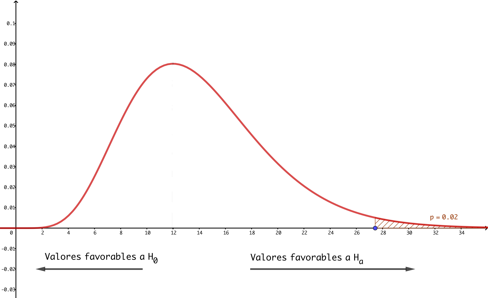

```{r set-options, echo = FALSE, purl=FALSE}
options(width = 60)
library(knitr)
def.chunk.hook  = knitr::knit_hooks$get("chunk")
knitr::knit_hooks$set(chunk = function(x, options) {
  x = def.chunk.hook(x, options)
  ifelse(options$size != "normalsize", paste0("\\", options$size,"\n\n", x, "\n\n \\normalsize"), x)
})


if (grepl(pattern = "cloud", getwd())){
  homeDir = "/cloud/project/"
  } else {
  homeDir = "../"
  }
figpath = function(figname){
  paste0(homeDir,"fig/", figname)
}

```

```{r echo = FALSE}
## title: 'Master en Big Data. Fundamentos  matemáticos  del  análisis  de  datos.'
## author: "Fernando San Segundo"
## subtitle: "Sesión 5. Introducción a la Inferencia Estadística."

```


# El Teorema Central del Límite.

## Medias muestrales.

+ En temas anteriores hemos visto de manera informal y mediante simulaciones que la distribución muestral de la media producía una curva normal. Ahora que sabemos más sobre la normal vamos a expresar ese resultado de forma más precisa y lo usaremos para empezar a hacer Inferencia.

+ Queremos estudiar la distribución de una variable aleatoria cuantitativa $X$ definida en los individuos de cierta población. En particular, la variable $X$ tendrá una media $\mu$ y una varianza $\sigma^2$. 
<!-- Aunque nos ocuparemos de las dos, vamos a empezar pensando en la media poblacional $\mu$.  -->

+ Vamos a **estimar** el valor de $\mu$ usando **muestras** de la población. Si tenemos una **muestra aleatoria simple** formada por $n$ valores como $x_1,\, x_2,\,\ldots,\, x_n$ (elegidos al azar y con remplazamiento) podemos usar la media muestral
$$
\bar x = \dfrac{x_1 + x_2 + \cdots + x_n}{n}
$$
para estimar la media poblacional $\mu$. 

## El espacio muestral.

+ Es el conjunto de todas las muestras aleatorias simples posibles de tamaño $n$ que llamaremos $\Omega^n$. Como ya vimos, al pasar de la población original al espacio muestral en general estamos pasando a un espacio muchísimo más grande. 

+ **Ejemplo:** si tenemos una población de tamaño $1000$, ¿cuántas muestras aleatorias simples de tamaño 7 podemos construir? Es fácil ver que son 
$$1000^7 = 1000000000000000000000$$
muestras distintas. 

+ Entre todas esas muestras hay *muestras buenas* (en las que $\bar x\approx\mu$) y *muestras malas*, con un valor de $\bar x$ poco representativo. Si elegimos la muestra al azar,  *¿cómo de probable es que nos toque una muestra buena?* 

+ Para responder necesitamos información sobre la  distribución de los valores de $\bar X$ entre todas las muestras posibles (en $\Omega^n$).

---

## Distribución muestral de la media: teorema central del límite (TCL).

+ Sea $X$ una v.a. con media $\mu_X$ y varianza $\sigma^2$. Sea $\bar X$ la media muestral construida a partir de una muestra aleatoria simple $X_1, X_2,\cdots, X_n$ de tamaño $n$. Es decir:
$$\bar X = \dfrac{X_1+X_2+\cdots +X_n}{n}$$
donde las $X_i$ son *copias independientes entre sí de $X$*.  


\begin{center}
  \fcolorbox{black}{Gris025}{\begin{minipage}{10cm}
  Teorema Central del Límite.\\
  Cuando consideramos valores {\bf suficientemente grandes} del tamaño muestral $n$, la distribución de la media muestral en el espacio muestral $\Omega^n$ se aproxima a una variable normal, cuya media y varianza son:
$$
\bar X \sim N\left(\mu_X,\frac{\sigma}{\sqrt{n}}\right) \qquad
$$
\end{minipage}}
\end{center}

+ ¿Cuánto es *suficientemente grande*? Depende de la población inicial. Por ejemplo, si la población es normal, $n$ puede ser arbitrariamente pequeño (incluso $n = 1$). Pero si la población es, por ejemplo, muy asimétrica, entonces puede que necesitemos $n$ bastante grande. 

# Intervalos de confianza para la media.

## Estimación en forma de intervalo. 

+ Empezamos pensando en el caso más sencillo: suponemos que la variable $X$ es (aproximadamente) normal, pero desconocemos su media $\mu$ y queremos estimarla usando muestras. 

+ Este caso es bastante frecuente porque hay muchas magnitudes en la naturaleza cuya distribución es (aproximadamente) normal.

+ Si $X$ es normal el TCL es válido para cualquier tamaño muestral $n$. Podemos tomar una muestra aleatoria simple y usar la estimación $\mu\approx\bar X$. Naturalmente esto significa;
$$
\mu = \bar X + \text{error}
$$
  Es muy importante entender que **el error es aleatorio**.

+ Para que esto tenga alguna utilidad científica es imprescindible cuantificar ese error. Si descubrimos que el tamaño del error es menor que $\delta$ (piensa en un número pequeño) entonces podremos decir que:
$$
\bar X - \delta < \mu < \bar X + \delta
$$
y nuestra estimación de $\mu$ será **en forma de intervalo** $(a, b) = (\bar X - \delta, \bar X + \delta)$. Como veremos el TCL nos ayuda a (obtener $\delta$ y) construir esos intervalos. 

## El error es aleatorio porque la muestra es aleatoria.

+ En esta figura (mira el código que la ha generado) hemos obtenido 20 muestras de tamaño $n = 30$. La marca roja indica la media de la población, que es $\mu =0$. Los puntos de cada muestra (puntos azules) están todos a la misma altura y se señala la media de esa muestra con un rombo naranja. Como ves, el error es aleatorio. Recuerda que en un caso real no sabemos donde está la línea roja.
    ```{r echo=FALSE, message=FALSE, warning=FALSE, fig.align='center', out.width = "75%"}
    ## El error es aleatorio porque la muestra es aleatoria.
  
    par(mar = c(5.1,4.1,1,2.1)) 
    set.seed(2019)
    library(tidyverse)
    # generamos los datos, 20 muestras (se distinguen por su "tipo")
    datos = data.frame(x = rnorm(600), tipo = rep(1:20, each = 30))
    # calculamos las medias por muestra con dplyr
    medias = datos %>%
      group_by(tipo) %>%
      summarise(medias = mean(x)) %>%
      .$medias 
    # Usamos stripchart para dibujar las medias por tipo  
    stripchart(x ~ tipo, data = datos, pch = 16, col="blue",
               xlab="Valores de la variable X", ylab = "Número de muestra")
    # Añadimos líneas horizontales para ayudar a visualizar
    segments(x0 = min(datos$x), y0 = 1:20, x1 = max(datos$x), y1 = 1:20,  col="blue")
    # La línea vertical central marca la media
    abline(v = 0, lty=2, col= "red", lwd=5)
    # Y los puntos naranjas son las medias muestrales
    points(x = medias, y = 1:20, col="orange", pch=18, cex=3)
    ```

## Intervalos de confianza para la media.

+ Si nos toca una muestra *"buena"* el error será pequeño, pero si damos con una muestra *"mala"* puede ser bastante grande. El TCL garantiza que cuando $n$ aumenta las muestras buenas son mucho más abundantes que las malas.  

+ Recuerda que el muestreo es aleatorio: podemos *hacerlo todo bien* y obtener una estimación errónea por azar. Buscamos garantizar que es *poco probable* que nos pase eso. Por eso los intervalos de estimación que construimos tienen forma probabilística:  
\begin{center}
  \fcolorbox{black}{Gris025}{\begin{minipage}{9cm}
      {\bf Intervalos de confianza.}\\
      Dado un {\bf nivel de confianza} $nc$, un intervalo $(a, b)$ tal que 
$$
P(a < \mu < b) = nc 
$$
es un {\bf intervalo de confianza al nivel $nc$} para la media $\mu$.
\end{minipage}}
\end{center}
  La probabilidad aquí se mide **sobre el conjunto (normalmente enorme) de todas las muestras aleatorias simples** de tamaño $n$ y $nc$, el **nivel de confianza**, es la probabilidad de que nos toque una muestra *"buena"*. Siempre tomará valores cercanos a uno, como $0.90$, $0.95$ o $0.99$.


## Comentarios sobre la definición de intervalo de confianza.

+ *La probabilidad $nc$ no se refiere a un intervalo concreto sino al método de construcción de intervalos a partir de muestras*. Se puede entender así:

  \textbf{(Si estimas $\mu$ usando este método) hay una probabilidad del 95\% de que (te toque una muestra buena y) $\mu$ esté dentro del intervalo $(a, b)$.}  

    Las partes entre paréntesis suelen omitirse pero están implícitas.

+ En particular los valores de $a$ y $b$ son aleatorios y **dependen de la muestra que nos toque**.

+ Es importante además entender que en la construcción del intervalo entran en juego dos fuentes distintas de incertidumbre:  

    $(1)$ La **anchura** del intervalo $(a, b)$ mide la **precisión** (o el error) con la que estimamos el valor de $\mu$. Cuanto más estrecho sea el intervalo, mejor.  
    
    $(2)$ pero el nivel de confianza $nc$ mide la **probabilidad muestral** de esa estimación, que depende de que hayamos tenido suerte con la muestra. Cuanto más cerca de 1 esté $nc$, mejor.  
    
    Pero la precisión y la incertidumbre no son independientes, y en la práctica es necesario establecer un equilibrio entre las dos.

## Interpretación probabilística de los intervalos de confianza.

+ La construcción del intervalo parte de una muestra aleatoria y ya que hay muestras buenas y malas, **a veces el intervalo puede errar por completo** y $\mu$ no pertenece a ese intervalo. Eso no significa que hayamos hecho nada mal, hemos tenido mala suerte. La figura (¡ver código!) ilustra esto con 100 intervalos a partir de sendas muestras.

    ```{r echo=FALSE, message=FALSE, fig.align='center', out.width = "70%"}
    # Código para generar la figura de los intervalos de confianza
    par(mar = c(5.1,4.1,1,2.1)) 
    set.seed(2018)
    library(tidyverse)
    # Esta función calcula un intervalo de confianza para cada muestra
    # Pronto veremos como funciona
    getCI = function(x){
      CI = t.test(x, alternative = "two.sided", mu = 0)$conf.int
      return(CI)
    }
    # Generamos las muestras
    datos = matrix(rt(3000, df = 29), nrow = 100)
    # y los correspondientes intervalos
    intervalos = t(apply(datos, MARGIN = 1, FUN = getCI))
    # los colores dependen de que el intervalo capture la media poblacional
    # que en nuestro caso es 0
    colores = ifelse(intervalos[,1] * intervalos[,2] < 0, "blue", "red")
    # Ahora pintamos los extremos de los intervalos
    plot(c(intervalos), rep(1:100,times = 2), col=rep(colores, 2), 
         xlab = "La línea de puntos indica la media poblacional real", ylab="")
    # Los segmentos que los conectan
    segments(x0 = intervalos[,1], 
             y0 = 1:100, 
             x1 = intervalos[ ,2], 
             y1 = 1:100,
             col=colores)
    # Y una línea vertical en la media poblacional
    abline(v = 0, lty=2, col= "black", lwd=5)
    ```
    

## El papel del TCL en la construcción de intervalos de confianza. 

+ Para una población normal el TCL garantiza que 
$$
\bar X \sim N\left(\mu_X,\frac{\sigma}{\sqrt{n}}\right) \qquad
$$
Eso significa que  $Z = \dfrac{\bar X - \mu}{\frac{\sigma}{\sqrt{n}}}$ 
es una normal estándar $N(0, 1)$. 

+ Además, dado un nivel de confianza $nc$ como $0.9$ sabemos construir un intervalo simétrico $(-K,\, K)$ tal que $P(-K < \, Z \,<  K) = nc$ como en la figura:
    ```{r echo=FALSE, fig.align='center', out.width="7cm", purl=FALSE}
    include_graphics("../fig/06-02-ProblemaInversoZ-02.png")
    ```
  Sustituyendo la anterior expresión de $Z$ aquí y despejando $\mu$ obtenemos la fórmula del intervalo de confianza. 

## Fórmula preliminar del intervalo del confianza.

+ Pero antes vamos a darle un nombre a $K$. La zona sombreada de la anterior figura tiene probabilidad $nc$. Queda una probabilidad 
$$\alpha = 1 - nc$$
para repartir *entre las dos colas*. Así, *cada una de las dos colas* que son iguales por simetría tiene una probabilidad igual a $\dfrac{\alpha}{2}$.  

+ Dada una probabilidad $p$, el **valor crítico** $z_p$ es el valor de la normal estándar que deja **a su derecha** esa probabilidad $p$. Es decir, $P(Z > z_p) = p$. Y por tanto, $K = z_{\alpha/2}$. 

+ Una *versión preliminar* de la fórmula del intervalo de confianza es: 
  \begin{center}
  \fcolorbox{black}{Gris025}{\begin{minipage}{10cm}
  Un intervalo de confianza $(a, b)$ al nivel $nc$ es:
  $$a = \bar X - z_{\alpha/2} \dfrac{\sigma}{\sqrt{n}}, \qquad\qquad 
  b = \bar X + z_{\alpha/2}\dfrac{\sigma}{\sqrt{n}}$$
  Que se resume así:
  $$\mu = \bar X \pm z_{\alpha/2}\dfrac{\sigma}{\sqrt{n}}$$
  \end{minipage}}
  \end{center}
    **¿Por qué preliminar?** Fíjate en que aquí aparece $\sigma$, que es desconocido.

## La aproximación de las muestras grandes.

+ ¿Y si no conocemos $\sigma$ entonces qué hacemos? Hay un remedio sencillo **siempre que la variable $X$ sea normal en la población y además la muestra sea suficientemente grande**. 

+ En esos casos podemos cambiar $\sigma$ por *desviación típica muestral* $s$ en la primera fórmula utilizable del intervalo. 
  \begin{center}
  \fcolorbox{black}{Gris025}{\begin{minipage}{10cm}
  {\bf Intervalo de confianza al nivel $nc$, población normal y muestra grande.}
  $$\mu = \bar X \,\pm\, z_{\alpha/2}\,\,\dfrac{s}{\sqrt{n}}$$
  \end{minipage}}
  \end{center}

 + ¿Qué es una muestra grande? $n = 30$ puede servir, pero recomendamos $n > 100$.


+ **Ejemplo:** una muestra de una población normal tiene estos *valores muestrales*:
$$n = 100,\qquad \bar X = 7.34, \qquad s = 0.31$$
  Sea $nc = 0.95$ (luego $\alpha = 0.05$). Sabiendo que $z_{\alpha/2}\approx 1.96$ el intervalo de confianza al 95% que se obtiene es:
$$
\mu = \bar X \pm z_{\alpha/2}\dfrac{s}{\sqrt{n}} \approx 7.34 + `r signif(qnorm(0.975), 4)` \dfrac{0.31}{\sqrt{100}} =  
(`r signif(7.34 +c(-1, 1) * qnorm(0.975) * 0.31/sqrt(100), 4)`).
$$
  ¿Cómo hemos llegado a ese valor de $z_{\alpha/2}\approx 1.96$?


## Valores críticos e intervalos de confianza con R.

+ El cálculo de $z_{\alpha/2}$ para cualquier $\alpha$ (y cualquier $nc$) se realiza en R con `qnorm`. ¡Pero cuidado!, por defecto R trabaja con la cola izquierda. 

+ Usando por ejemplo el nivel de confianza $nc = 0.95$ calculemos el correspondiente valor crítico $z_{0.025}$, que guardaremos en la variable `zc`:\small
    ```{r echo = -1}
    ## Valores críticos con R.
    nc = 0.95
    alfa = 1 - nc
    (zc = qnorm(alfa / 2, lower.tail = FALSE)) # Atención, cola derecha
    ```
    \normalsize

+ A partir de aquí obtener el intervalo partiendo de los valores muestrales es muy fácil:\small
    ```{r}
    ## Intervalos de confianza con R.
    n = 100
    barX = 7.34
    s = 0.31
    (intervalo = barX + c(-1, 1) * zc * s / sqrt(n))
    ```
    \normalsize

    ```{r echo=FALSE, message=FALSE, warning=FALSE, purl=FALSE, eval=FALSE, comment = NULL}
    # Fabricando los datos de 05-IntervConfNormalGrande.csv
    set.seed(2017)
    n = 120
    barX = 4.43
    s = 0.31
    library(MASS)
    x = data.frame(x = mvrnorm(n, mu = barX, Sigma = s^2,empirical = TRUE)[,1])
    write.table(x, "../datos/06-IntervConfNormalGrande.csv", row.names = FALSE, col.names = TRUE)
    ```

+ Partiendo de un fichero csv con la muestra, como \link{https://raw.githubusercontent.com/fernandosansegundo/MBDFME/master/datos/05-IntervConfNormalGrande.csv}{05-IntervConfNormalGrande.csv}:  
$(a)$ Leemos los datos con `read.table`. $(b)$ Calculamos $n$, $\bar X$ y $s$ con `length, mean, sd`, respectivamente. $(c)$ Procedemos como antes. 

+ **Ejercicio:** con los datos de ese fichero calcula un intervalo de confianza para la media.

## Cálculo del tamaño muestral necesario.

+ En la primera fórmula vimos que la **semianchura del intervalo** es $\delta =  z_{\alpha/2}\cdot\dfrac{\sigma_X}{\sqrt{n}}$.  Esta cantidad es la que define la **precisión** del intervalo. Para conseguir una precisión $\delta$ dada, por ejemplo $0.0001$, podemos tratar de despejar en esta fórmula  $n$,el tamaño muestral necesario:
$$ 
z_{\alpha/2}\cdot\dfrac{\sigma}{\sqrt{n}} < \delta \qquad \Rightarrow \qquad 
n=\left(z_{\alpha/2}\cdot\dfrac{\sigma}{\delta}\right)^2
$$
  Pero de nuevo, desconocemos $\sigma$. La solución es hacer un *estudio piloto* con una muestra pequeña para estimar con $s$ la desviación típica $\sigma$. 

+ **Ejemplo.** *Una empresa produce unas piezas y desea estimar su diámetro medio (que sigue una distribución normal). Una muestra piloto tuvo una desviación típica $s = 1.3$mm. La empresa quiere una medida del diámetro con un error no mayor de $0.1$mm y un nivel de confianza del $99\%.$ ¿Qué tamaño de muestra debe utilizarse para conseguir ese objetivo?*  
Se desea una precisión $\delta=0.1$mm. Al ser $nc=0.99$, tenemos $\frac{\alpha}{2}=0.005$, y $z_{\alpha/2}=z_{0.1}\approx 2.58$. Sustituyendo
$$
n=\left(z_{\alpha/2}\cdot\dfrac{\sigma_X}{\delta}\right)^2     \approx \left(2.58\cdot\dfrac{1.3}{0.1}\right)^2\approx 1121.3
$$
  Usaríamos una muestra de tamaño $1122$ *al menos* (conviene ser precavidos y redondear al alza).

## Muestras pequeñas en poblaciones normales.

+ Los resultados anteriores sirven *para poblaciones normales y muestras grandes*. ¿Qué sucede si sabemos que **la variable $X$ tiene una distribución normal** en la población, pero sólo   disponemos de una **muestra pequeña** (con $n < 30$)?

+ Si la muestra es pequeña disponemos de menos información sobre la variable $X$. Eso debe traducirse, necesariamente, en un intervalo de confianza más ancho. Student (que en realidad se llamaba [\textcolor{blue}{William S. Gosset}](https://es.wikipedia.org/wiki/William_Sealy_Gosset)) se dio cuenta de que en este tipo de problemas no se podía usar $Z$ directamente y descubrió un sustituto, la distribución $t$ de Student. 

+ Esa distribución tiene las *colas más pesadas* (con más probabilidad) que $Z$. En realidad hay una $t$ distinta para cada tamaño muestral. La siguiente figura compara $Z$ con la distribución $t$ con $df = 2$ (muestras de tamaño 3).
    ```{r echo=FALSE, fig.align='center', out.width="5cm", purl=FALSE}
    include_graphics("../fig/06-04-TvsZ.png")
    ```
    ```{r echo=FALSE, eval=FALSE, comment=NULL}
    # La distribución t vs Z
    
    k = 1000
    xvals = seq(-5, 5, length = k) 
    d = data.frame(y = c(dnorm(xvals), dt(xvals, df = 2)), 
                    x = xvals,
                    dist = factor(rep(c("Normal", "T"), c(k,k)))) 
    g = ggplot(d, aes(x = x, y = y))
    g = g + geom_line(size = 2, aes(color = dist))
    g 
    ```
  
## Intervalos de confianza usando la $t$ de Student.

+ **Grados de libertad:** Sea $X$ una variable normal en la población y supongamos que el tamaño $n$ de la muestra es pequeño. Diremos que $k = n - 1$ son los grados de libertad (en inglés, *degrees of freedom*) de esa muestra. 

+ **Valores críticos de $t$:**si $T$ es una variable $t$ de Student con $k$ grados de libertad, el valor $t_{k; p}$ verifica $P(T_k > t_{k; p}) = p$ (su cola derecha tiene probabilidad $p$).

    ```{r echo=FALSE, fig.align='center', out.width="4cm", purl=FALSE}
    include_graphics("../fig/06-05-ValorCriticoT.png")
    ```

+ Con esta terminología podemos dar la fórmula para el intervalo de confianza para $\mu$ usando $t$:
  \begin{center}
  \fcolorbox{black}{Gris025}{\begin{minipage}{10cm}
  {\bf Intervalo de confianza al nivel $nc$, población normal, muestra pequeña.}
  $$\mu = \bar X \pm t_{k; \alpha/2} \dfrac{s}{\sqrt{n}}$$
  \end{minipage}}
  \end{center}

## La distribución $t$ en R.

+ La función `pt` es análoga a `pnorm` y sirve para el *cálculo directo de probabilidad*.  Por ejemplo, para calcular $P(T_{17} > 2.5)$ (que es una cola derecha) usaríamos: \small
    ```{r echo = -(1:3)}
    ## La distribución $t$ en R.
    
    ## Función pt
    
    1 - pt(2.5, df = 17)
    ```
\normalsize Fíjate en que se indican los grados de libertad con `df` (degrees of freedom).

+ `qt`, como `qnorm`, hace cálculos inversos de probabilidad; dada una probabilidad buscamos *el valor* que deja esa probabilidad en su cola izquierda o derecha. Por ejemplo, para calcular el valor crítico `tc` para un nivel de confianza `nc` cualquiera haríamos:\scriptsize
    ```{r echo = -1}
    # Valores críticos con qt
    n = 20
    nc = 0.95
    alfa = 1 - nc
    df = n - 1
    (tc = qt(alfa / 2, df, lower.tail = FALSE)) # Atención, cola derecha
    ```
  \normalsize

+ La función `rt` sirve para simular valores aleatorios de una variable $t$ de Student. \scriptsize
    ```{r echo=-1}
    # Valores aleatorios con rt
    rt(8, df = 19)
    ```
    \normalsize

## Ejemplo de cálculo de intervalo de confianza con la $t$ de Student.

+ **Ejemplo:** *Se sospecha que en las aguas de un embalse las concentraciones de nitritos superan el umbral tolerable por los peces, que es de 0.03 mg NO2/l o menos. Para verificar esta sospecha se midieron los niveles de nitritos en diez puntos aleatorios del embalse, obteniendo estos valores:*  
  $\quad$  
  `0.04, 0.05, 0.03, 0.06, 0.04, 0.06, 0.07, 0.03, 0.06, 0.02`  
  $\quad$  
  *Calculemos un intervalo de confianza al 95% para el nivel medio de nitritos en las aguas del embalse. *\scriptsize  
  $\quad$  
    ```{r echo=-1}
    # Intervalo de confianza con t
    datos = c(0.04, 0.05, 0.03, 0.06, 0.04, 0.06, 0.07, 0.03, 0.06, 0.02)
    n = length(datos)
    barX = mean(datos)
    s = sd(datos)
    nc = 0.95
    alfa = 1 - nc
    tc = qt(1 - alfa/2, df = n - 1)
    (intervalo = barX + c(-1, 1) * tc * s / sqrt(n))
    ```
    \normalsize
    ¿Cuál es la conclusión?

## Resumen de intervalos de confianza para la media $\mu$.

+ **Variable $X$ normal y muestra grande ($n > 100$)**:  
$$\mu = \bar X \pm z_{\alpha/2} \dfrac{s}{\sqrt{n}}$$
En raras ocasiones usaremos aquí $\sigma$ en lugar de $s$. 

+ **Variable $X$ normal pero muestra pequeña**:  
$$\mu = \bar X \pm t_{\alpha/2;k} \dfrac{s}{\sqrt{n}}$$
con $k = n - 1$, los grados de libertad.

+ **Variable $X$ *aproximadamente normal* y muestra grande:**  

  El TCL permite usar la fórmula previa con $t$ para el intervalo de confianza.  
  Enseguida discutiremos que significa ser aproximadamente normal.

+ **Variable posiblemente no normal:**  

  En este caso los métodos que hemos visto no sirven para obtener un intervalo de confianza para la media. 


## Intervalos de confianza por bootstrap.

+ Muchos métodos de la Estadística clásica (intervalos de confianza, contrastes de hipótesis) asumen que las variables son al menos aproximadamente normales. Entre otras cosas, eso implica que los intervalos de confianza para la media son simétricos respecto a la media muestral. Pero a menudo encontramos muestras muy asimétricas, que no justifican la  simetría del intervalo. 

+ El aumento de la capacidad de cómputo ha propiciado el desarrollo de **métodos no paramétricos** para los intervalos de confianza basados en el **remuestreo**, como el **bootstrap**. Vamos a usar ese método para obtener un intervalo de confianza de los datos contenidos en el fichero \link{https://raw.githubusercontent.com/fernandosansegundo/MBDFME/master/datos/skewdata.csv}{skewdata.csv}
(basado en un ejemplo de  [@crawley2005statistics, pág. 47]). La figura ilustra la asimetría de esos datos:
    ```{r echo=FALSE, fig.height=3}
    ## Intervalos de confianza por bootstrap.
    # set.seed(2017)
    # skewdata = rchisq(100, df = 3) + 5
    # write.table(skewdata,file = "../datos/skewdata.csv", row.names = FALSE)
    url = "https://raw.githubusercontent.com/fernandosansegundo/MBDFME/master/datos/skewdata.csv"
    x = read.table(file = url, header = TRUE)[, 1]
    hist(x, freq = FALSE, main=" ", ylim = c(0, 0.30), breaks = 15)
    lines(density(x), col = "red")
    ```

## Esquema del método.

+ Empezamos leyendo esos datos (fíjate en que usamos la url directamente):\small
    ```{r}
    url = paste0("https://raw.githubusercontent.com/fernandosansegundo",
                 "/MBDFME/master/datos/skewdata.csv")
    x = read.table(file = url, header = TRUE)[, 1]
    ```
  \normalsize Ahora vamos a explorar los tamaños muestrales entre $n = 5$ y $n = 40$:  
  
  $(a)$ Para cada tamaño construiremos $10000$ remuestreos aleatorios con remplazamiento de esa muestra.  
  
  $(b)$ En cada remuestreo calculamos la media obteniendo así 10000 medias muestrales.  
  
  $(c)$ Dibujamos el intervalo que va del primer al tercer cuartil de esas 10000 medias (todas de muestras de tamaño $n$).  
  
+ El código R correspondiente a este esquema es un ejemplo muy sencillo de uso de los bucles `for` que vimos al final de un tema previo. 
  
## Representación gráfica de los intervalos bootstrap.   

+ En la gráfica el eje horizontal es el tamaño de la muestra y el vertical los valores de $X$. La media de $X$ se indica con una línea horizontal azul.

+ los intervalos bootstrap se muestran como segmentos verticales en naranja, la media en azul y en rojo representamos los intervalos *clásicos* usando la $t$ de Student. Fíjate en que para muestras grandes no hay apenas diferencia. Pero en muestras pequeñas el intervalo bootstrap refleja mucho mejor la asimetría de los datos. 
    ```{r bootstrap, echo=FALSE, message=FALSE, fig.align='center', out.width = "60%"}
    # Creamos la "caja" del gráfico.
    plot(c(0, 40), c(5,10.5), type="n", xlab="Tamaño muestral", ylab="") 
    
    for (k in seq(5, 40, 1)){ # Este bucle recorre los tamaños muestrales
      a =  numeric(10000) # el vector a almacenará las medias muestrales
      for (i in 1:10000){ # este es el bucle de remuestreo (bootstrap)
      # generamos un remuestreo con reemp. y calculamos su media
        a[i] = mean(sample(x, k, replace=T)) 
        }
      # dibujo del intervalo bootstrap de este tamaño muestral  
      points(c(k,k), quantile(a, c(.025,.975)), type="o", 
             col = "orange", lwd= 3) 
    }
    
    # el siguiente bloque de código genera una banda con 
    # los intervalos clásicos correspondientes a esas muestras.
    xv = seq(5, 40, 0.1) 
    yv = mean(x) - qt(0.975, xv) * sqrt(var(x) / xv)
    lines(xv, yv, lty = 2, col = "black", lwd = 4)
    yv = mean(x) + qt(.975, xv) * sqrt(var(x) / xv)
    lines(xv, yv, lty = 2, col = "black", lwd = 4)
    
    # añadimos una línea horizontal en la media
    abline(h = mean(x), col="blue", lwd=2) 
    ```

## Código R del bootstrap.

  \small
  ```{r eval=FALSE, purl=FALSE, ref.label="bootstrap"}
  ```
  \normalsize

# Intervalos de confianza para la varianza. 

## Distribución muestral de $s^2$ y la distribución $\chi^2$ (chi cuadrado).

+ Después de $\mu$, lo natural es calcular intervalos de confianza para $\sigma^2$.  

+ Sea $X$ de tipo $N(\mu, \sigma)$. Lo idea natural es aproximar $\sigma^2$  mediante $s^2$. Para que la idea necesitamos algo como el TCL: información que relacione $\sigma^2$ con la distribución de $s^2$ en el conjunto de todas las $n$-muestras posibles (espacio muestral).

+ Importante: la media es una medida central y por eso era interesante analizar la **diferencia** $\mu - bar X$. Pero la varianza es una medida de dispersión y por eso los **cocientes** son más útiles que las diferencias. 

+ El resultado que necesitamos es este:  

  \begin{center}
  \fcolorbox{black}{Gris025}{\begin{minipage}{10cm}
  {\bf Distribución muestral de $\sigma^2$ en poblaciones normales.}\\
  Si $X$ es una variable aleatoria de tipo $N(\mu; \sigma)$, y se utilizan muestras aleatorias
  de tamaño n, entonces:
  $$(n - 1)\dfrac{s^2}{\sigma^2} \sim \chi^2_{n - 1}$$
  siendo $\chi^2_{n - 1}$ la {\bf distribución chi cuadrado con $n-1$ grados de libertad,}
  \end{minipage}}
  \end{center}
  Veamos como es esa distribución $\chi^2_{n - 1}$.


## La distribución $\chi^2_k$ y funciones de R.

+ Esta distribución *sólo toma valores positivos* y además es *asimétrica*, a diferencia de la $Z$ o la $t$ de Student. Por ejemplo, la distribución $\chi^2_4$ tiene este aspecto:
    ```{r echo=FALSE, message=FALSE, fig.align='center', out.width = "50%", purl=FALSE}
    include_graphics("../fig/06-06-DensidadChiCuadrado.png")
    ```
  La asimetría, como veremos, afecta al proceso de construcción de intervalos de confianza basados en esta distribución.

+ En R disponemos de las funciones `pchisq`, `qchisq` y `rchisq` con los significados previsibles. 

## Intervalos de confianza para la varianza.

+ La novedad en este caso es que por la asimetría de $\chi^2_k$ hay que usar valores críticos distintos a derecha e izquierda. Cada uno de ellos deja una probabilidad $\alpha/2$ en la cola correspondiente.
    ```{r echo=FALSE, message=FALSE, fig.align='center', out.width = "45%", purl=FALSE}
    include_graphics("../fig/06-07-ChiCuadradoValoresCriticosIntervalo.png")
    ```
    donde si $Y = \chi^2_k$ se cumple $P(Y > \chi^2_{k, p}) = p$.  

  \begin{center}
  \fcolorbox{black}{Gris025}{\begin{minipage}{10cm}
  {\bf Intervalo de confianza para  $\sigma^2$ en poblaciones normales.}\\
  $$
  \dfrac{(n-1)s^2}{\chi^2_{k,\alpha/2}}\leq\sigma^2\leq\dfrac{(n-1)s^2}{\chi^2_{k,1-\alpha/2}} ,\qquad\mbox{ con }k=n-1
  $$
  \end{minipage}}
  \end{center}

## Construcción con R de intervalos de confianza para la varianza.

+ **Ejemplo:** *La variable aleatoria $X$ tiene una distribución normal. Una muestra aleatoria de 7 valores de $X$ dio como resultado $s^2 = 62$. Vamos a construir con R un intervalo de confianza (nc = 95%) para $\sigma^2$*.\scriptsize
    ```{r echo =-1}
    ## Chi cuadrado: intervalos de confianza para la varianza.
    
    # Estos son los valores muestrales y el nc deseado
    varianza = 62 # cuidado si el dato muestral es s y no s^2
    n = 7
    nc = 0.95
    (alfa = 1 - nc)
    
    # Calculamos dos valores críticos de chi cuadrado.
    (chi1 = qchisq(alfa / 2, df = n - 1, lower.tail = FALSE)) # cola derecha
    (chi2 = qchisq(alfa/2, df = n - 1)) # cola izquierda
    
    # Construimos el intervalo
    (intervalo = (n - 1) * varianza / c(chi1, chi2))
    ```
    \normalsize Fíjate en que el valor crítico de cola derecha se usa en el extremo izquierdo del intervalo y viceversa. Y si queremos un intervalo para $\sigma$ simplemente calculamos la raíz cuadrada. `sqrt(intervalo)` produce el intervalo (`r signif(sqrt(intervalo), 4)`) para $\sigma$.

# Evaluación de la normalidad.

## ¿Cómo podemos analizar la normalidad de una población?

+ Los métodos de los apartados anteriores requieren evaluar si la variable de interés es (al menos aproximadamente) normal. En muestras grandes examinaremos *histogramas* y *curvas de densidad*.  La figura muestra a la izquierda una muestra de datos normales y a la derecha datos no normales, con $n = 500$ en ambos casos. Con muestras más pequeñas las cosas pueden estar menos claras.
    ```{r echo=FALSE, message=FALSE, fig.align='center', out.width = "65%"}
    # Analizando la normalidad de una población a partir de muestras
    
    # Primero con datos normales
    
    par(mfrow = c(1, 2))
    set.seed(2017)
    tamMuestra = 500
    normales = rnorm(tamMuestra)
    altDens = density(normales)
    histNoPlot = hist(normales, plot=FALSE)
    maxY = max(altDens$y[which.max(altDens$y)], max(histNoPlot$density))
    hist(normales, #breaks = cortes, 
         cex.lab=0.7, cex.axis = 0.6,
         ylab = "", xlab="", main="Normal", 
         freq = FALSE, ylim = c(0, maxY), col="#eec591")
    title(ylab="Frecuencias", line=2, cex.lab=0.7)
    lines(altDens, col="red", lwd=4)
    
    # Y ahora con datos no normales
    
    set.seed(2017)
    tamMuestra = 500
    noNormales = rchisq(tamMuestra, df = 4)
    altDens = density(noNormales)
    histNoPlot = hist(noNormales, plot=FALSE)
    maxY = max(altDens$y[which.max(altDens$y)], max(histNoPlot$density))
    hist(noNormales, #breaks = cortes, 
         cex.lab=0.7, cex.axis = 0.6,
         ylab = "", xlab="", main="No Normal", 
         freq = FALSE, ylim = c(0, maxY), col="#eec591")
    title(ylab="Frecuencias", line=2, cex.lab=0.7)
    lines(altDens, col="red", lwd=4)
    par(mfrow = c(1, 1))
    ```
  En esta y en las siguientes páginas, mira el código de este tema.

## Boxplots para analizar la simetría.

+ A menudo la simetría es el requisito más importante para que los métodos de la Estadística (basados en el TCL) funcionen. Los boxplots son especialmente útiles para detectar la falta de simetría (¡puede ser buena idea añadir los puntos de la muestra!).  

    ```{r echo=FALSE, message=FALSE, fig.align='center', out.width = "70%"}
    # Boxplots para analizar la simetría.
    par(mfrow = c(1, 2))
    boxplot(normales, main="Normal", col = "lightblue")
    stripchart(normales, method = "jitter", 
               vertical = TRUE, add = TRUE, 
               pch=19, col="blue", cex=0.3)
    boxplot(noNormales, main="No normal", col = "lightblue")
    stripchart(noNormales, method = "jitter", 
               vertical = TRUE, add = TRUE, 
               pch=19, col="blue", cex=0.3)
    par(mfrow = c(1, 1))
    ```

## Violinplot.

+ Este tipo de gráfico son interesantes al combinar la curva de densidad con el boxplot. Y de nuevo, es posible, añadir los puntos de la muestra:

  ```{r echo=FALSE, fig.align='center', message = FALSE, results='hide', warning=FALSE, out.width = "80%"}
  # Violinplot
  par(mfrow = c(1, 2))
  library(vioplot)
  vioplot(normales, col = "lightblue")
  stripchart(normales, method = "jitter", 
             vertical = TRUE, add = TRUE, 
             pch=19, col="blue", cex=0.3)
  
  title("Normal")
  vioplot(noNormales, col = "lightblue")
  stripchart(noNormales, method = "jitter", 
             vertical = TRUE, add = TRUE, 
             pch=19, col="blue", cex=0.3)
  title("No normal")
  par(mfrow = c(1, 1))
  ```

---

## QQplots.
    
+ El nombre proviene de *"quantile vs quantile"*, porque se representa en el eje horizontal los percentiles de una variable normal exacta y en el vertical los de la muestra a examen.  Son el tipo de gráficos más utilizado para analizar la normalidad. Si la muestra procede de una variable normal, los puntos deben coincidir con la recta. 
    
    ```{r echo=FALSE, fig.align='center', message = FALSE, results='hide', warning=FALSE, out.width = "70%"}
    ## QQplots.
    
    par(mfrow = c(1, 2))
    qqnorm(normales, main="Normal")
    qqline(normales, lwd=2, col="red")
    qqnorm(noNormales, main="No normal")
    qqline(noNormales, lwd=2, col="red")
    par(mfrow = c(1, 1))
    ```    
    
## ¡¡Precaución con las muestras pequeñas!!

+ Los métodos que hemos descrito funcionan bien con muestras grandes. Para muestras pequeñas, las cosas se complican. Todas las figuras son curvas de densidad de muestras de tamaño 15 que **provienen de poblaciones normales**.

    ```{r echo=FALSE, fig.align='center', message = FALSE, results='hide', warning=FALSE, out.width = "85%"}
    # Precaución al analizar la normalidad con muestras pequeñas
    
    # Densidades...
    
    par(mfrow=c(4, 4))
    for(i in 1:16){
      plot(density(rnorm(15)), lwd=3, col="red", main="", xlab = "", ylab = "")
    }
    par(mfrow=c(1, 1))
    ```

---

##  Con los boxplots sucede algo parecido.

+ Todos estos boxplots son de muestras normales con $n = 15$.
    ```{r echo=FALSE, fig.align='center', out.width="11cm", message=FALSE, warning=FALSE}
    # ... y boxplots
    
    par(mfrow=c(3, 3))
    for(i in 1:9){
      muestra = rnorm(15)
      boxplot(muestra, main="", xlab = "", ylab = "")
      stripchart(muestra, method = "jitter", add = TRUE, vertical = TRUE)
    }
    par(mfrow=c(1, 1))
    ```

# Contrastes de Hipótesis.

    ```{r echo=FALSE, eval=FALSE, comment = NULL}
    #####################################################################
    # Contraste de Hipótesis
    #####################################################################
    ```
    

## Ejemplo inicial: una discusión científica. 

+ Hemos desarrollado un nuevo método de fabricación de las baterías que se usan en ciertos equipos. Pensamos que es tan bueno que, con este método, los equipos podrán funcionar más tiempo con cada carga completa de la batería. De hecho, afirmamos que  *"la duración (media) de la batería será mayor de lo que era antes de usar el método".* Esta es nuestra **hipótesis (alternativa)**.

+ Para obtener datos relacionados con nuestra afirmación, hemos tomado una muestra de $n = 100$ baterías, fabricadas con nuestro nuevo método. Y nos ponemos muy contentos, porque la duración media es mayor que antes de usar el método. 

+ Concretamente, las *mediciones previas de referencia* nos dice que la duración (en horas) de las baterías fabricadas por el anterior método **se distribuye como una normal**, con media $$\mu_0 = 2.5$$ (en horas). Pero en la muestra de 100 baterías fabricadas con nuestro método hemos observado una duración media (muestral) $$\bar X =  2.65$$
horas, con desviación típica muestral $s = 0.5$. Pues ya está, nuestro método es mejor que el anterior.

+ Pero ese no es el final de la historia, claro...

\vspace{2mm}

---

## Hipótesis nula y alternativa.

\vspace{4mm}

+ La empresa de la competencia, que lleva años vendiendo sus baterías, dirá que nuestro método tiene **efecto nulo** y que las duraciones que hemos observado en nuestras baterías son, simplemente, la variabilidad natural, que las baterias a veces duran más y a veces menos, y que nuestras medidas son simplemente **fruto del azar**. Tenemos así dos afirmaciones o hipótesis enfrentadas.

\vspace{2mm}

+ La hipótesis de la competencia, que llamaremos **hipótesis nula** $H_0$ (porque dice que el efecto es nulo), sostiene que la media no ha aumentado con el nuevo método\vspace{2mm}  
+ Nuestra hipótesis, que dice que la media sí ha aumentado. A esta la llamaremos **hipótesis alternativa** $H_a$.

\vspace{2mm}

+ Un **contraste de hipótesis** puede entenderse como la forma científica de resolver esta discusión, usando los datos y la teoría sobre Probabilidad que hemos aprendido.

\vspace{6mm}

\quad

--- 

## Notación. 

\vspace{2mm}

+ Vamos a usar la siguiente notación, y es **muy importante** entenderla bien desde el principio:  

\vspace{1mm}

+ Llamaremos siempre $\mu$ a la **media real** de la población de la que hemos tomado la muestra (en el ejemplo, las baterías fabricadas por el nuevo método). Ni los defensores de $H_0$ ni los de $H_a$ conocen (ni es posible que conozcan) este valor.  

\vspace{1mm}

+ Además en la discusión ha aparecido un **valor de referencia** $\mu_0 = 2.5$, que compararemos con $\mu$ mediante muestras. Este valor se utiliza para formular claramente las dos hipótesis contrapuestas. 

\vspace{1mm}

+ Los dos valores $\mu$ y $\mu_0$ son *valores teóricos*, no observados. Por último, tenemos el valor de la media muestral, $\bar X$, que es un *valor empírico* y procede de las observaciones. Pero es el valor fundamental para decidir a cuál de las dos hipótesis damos más credibilidad. 

\vspace{1mm}

+ Además es importante entender que ambas partes aceptan el valor de $\bar X$; ese valor no se discute (sería otra discusión). Recuerda que usamos $\bar X$ para **estimar** $\mu$. Así que si $\bar X$ es muy grande, ¿a quién parecen darle la razón los datos?

## Formalizando el contraste.

+ La utilidad de la notación es que podemos usarla para escribir las dos hipótesis con más precisión:

  $(a)$ La **hipótesis alternativa** $H_a$ sostiene que la media de la población (recuerda, la población es *tratada*) es mayor que el valor de referencia.
$$H_a = \{\mu > \mu_0\}$$

  $(b)$ La **hipótesis nula** $H_0$ dice justo lo contrario: que la media de la población (recuerda, la población es *tratada*) es menor o igual que el valor de referencia. 
$$H_0 = \{\mu \leq \mu_0\}$$
  Fíjate en que ponemos el igual en $H_0$ porque si la media es igual, seguirá teniendo razón en que no ha habido **efecto** del tratamiento.  Hay autores que siempre usan $=$  en la hipótesis nula y ponen $H_0 = \{\mu = \mu_0\}$.

+ **En el ejemplo:**  Recuerda que era $\mu_0 = 2.5$. Por lo tanto la hipótesis alternativa es
  $$H_a = \{\mu > 2.5\}$$
  mientras que la nula es:
  $$H_0 = \{\mu > 2.5\}\qquad (\text{ o bien } H_0 = \{\mu = 2.5\})$$
  **¡Atención!** es un error común incluir la media muestral $\bar X= 2.65$ en las hipótesis. 

---

## La idea clave.

+ El punto de partida es este: dado que la muestra procede de la población a examen,  debe ser $\bar X\approx \mu$ y, por lo tanto, si $\bar X$ es mayor que $\mu_0$, eso parece darle la razón a $H_a$. 

+ Pero recuerda que hay *"muestras malas"*. Así que el partidario de $H_0$ dirá ese valor de $\bar X$ se debe a que **por azar** nos ha tocado una muestra mala. Naturalmente, cuanto más grande sea el valor de $\bar X$, **menos probable** es que nos haya tocado por azar **una muestra así de mala**.

+ **En el ejemplo:** el partidario de $H_0 = \{\mu \leq 2.5\}$ puede entonces decir que el valor $\bar X = 2.65$ se debe al azar y a una muestra desafortunada. Pero si el valor muestral hubiera sido $\bar X = 5$, ese argumento de que la muestra es mala pierde mucho peso porque **es muy poco probable que nos toque una muestra tan mala**. 

+ Para hacer de esto una discusión precisa: ¿podemos calcular esa probabilidad? Es decir, ¿podemos calcular la probabilidad de muestras tan malas como esa?  


## Teorema Central del Límite y p-valor.

+ Lo que vamos a hacer es esto: supondremos, provisionalmente, que $H_0$ es cierta. De hecho, admitiremos como correcto el valor de $\mu$ que más le conviene al partidario de $H_0$ (luego volvemos sobre esto). Ese valor es: 
$$\mu = \mu_0$$
+ Y ahora usaremos esa suposición provisional para calcular la probabilidad de una muestra *tan mala o peor para $H_0$* como la nuestra. La probabilidad que vamos a calcular es el **p-valor** del contraste de hipótesis. 

+ Al suponer (provisionalmente) que $\mu = \mu_0$, podemos usar el TCL para decir que la distribución de la media muestral es:
$$
\bar X \sim N\left(\dfrac{\mu_0}{\frac{s}{\sqrt{n}}}\right)
$$
O, lo que es lo mismo, que
$$
\dfrac{\bar X - \mu_0}{\frac{s}{\sqrt{n}}}\sim Z
$$
Y esto nos permite calcular la probabilidad que buscamos, el p-valor, usando la normal estándar.

---

## Cálculo del p-valor en el ejemplo.

+ Recuerda que teníamos:
  $$
  \mu_0 = 2.5,\qquad n = 100,\qquad \bar X = 2.65, s = 0.5 
  $$
  Así que el valor de $Z$ que obtenemos es:
  $$
  \dfrac{\bar X - \mu_0}{\frac{s}{\sqrt{n}}} = 
  \dfrac{2.65 - 2.5}{\frac{0.5}{\sqrt{100}}} = 3
  $$
  Y la siguiente figura ilustra que el p-valor es la probabilidad de la cola derecha de 3 en Z.
  
    ```{r echo=FALSE, fig.align='center', out.width="7cm", purl=FALSE}
    include_graphics("../fig/07-01-PValorEjemploCanguros.png")
    ```

+ En R, obtenemos `pValor = pnorm(3, lower.tail = FALSE)` $\approx$ `r signif(1 - pnorm(3), 4)` 


## Interpretación del resultado.

+ Lo que hemos hecho se puede resumir así: *suponiendo que la hipótesis nula fuera cierta* y usando $\mu = \mu_0$, la probabilidad de obtener un valor muestral tan grande o más que $\bar X$ es de tan sólo `r signif(1 - pnorm(3), 4)`. 

+ El partidario de $H_0$ puede insistir en que es fruto del azar, pero ahora sabemos cuantificarlo. Para que el partidario de $H_0$ tenga razón nos debería haber tocado una muestra tan mala que sólo hay una así en cada mil.

+ Imagínate que el valor de $\bar X$ hubiera sido $2.7$, más alejado de $\mu_0 = 2.5$ (y por tanto más favorable a $H_a$). Puedes comprobar que el correspondiente valor de Z sería 
$$
\dfrac{\bar X - \mu_0}{\frac{s}{\sqrt{n}}} = 
\dfrac{2.7 - 2.5}{\frac{0.5}{\sqrt{100}}} = `r (2.7 - 2.5)/(0.05)`
$$
y entonces el p-valor habría sido aún más pequeño: 
`1 - pnorm(4)` $\approx `r signif(1 - pnorm(4), 4)`$. En ese caso al partidario de $H_0$ *le costaría mucho más hacernos creer que todo es fruto del azar.*

+ En resumen, un p-valor pequeño le quita la razón al partidario de $H_0$ y nos llevaría a **rechazar la hipótesis nula.**

## Comentarios.

+ La idea del p-valor es medir **cómo de extraños, inexplicables o sorprendentes le parecen los resultados de la muestra a alguien que cree en la hipótesis nula.** Simbólicamente:
$$\text{p-valor } = P(\text{ datos }\,|\, H_0\text{ es cierta})$$

+ En muchos casos la hipótesis nula representa el conocimiento establecido o aceptado. Y por eso, en general, debemos estar muy convencidos antes de rechazar la hipótesis nula.  Por eso la hipótesis nula *"juega con ventaja".*

+ Y por eso mismo el valor de $\mu = \mu_0$ es el más ventajoso para la hipótesis nula, Si al calcular el p-valor usáramos otro valor de $\mu$ menor que $\mu_0$ el p-valor habría sido aún más pequeño. Así que usamos $\mu_0$ para darle a $H_0$ todas las ventajas. 

+ Esa es la también la razón por la que incluimos todos los valores de la cola derecha. Es la misma idea: si tomáramos sólo una parte de esa cola la probabilidad (el p-valor) sería aún menor, así que usamos todos los valores de la cola. 

+ Hemos usado el TCL para calcular el p-valor, pero también se puede hacer mediante remuestreo, como en el bootstrap. Esa es una opción muy interesante, que cada vez gana más peso en las aplicaciones. Mira el código de este tema.
    ```{r echo=FALSE, eval=FALSE, comment = NULL}
    # p-valor usando el TCL

    
    digits = 30
    
    # Simulamos una muestra de una población normal como la del ejemplo.
    set.seed(2017)
    library(MASS)
    muestra = mvrnorm(n = 100, mu = 2.65, Sigma = 0.5^2, empirical = TRUE)
    
    mu0 = 2.5
    (n = length(muestra))
    (xBar = mean(muestra))
    (s = sd(muestra))
    # El valor del estadístico es: 
    (z = (xBar - mu0) / (s / sqrt(n)))
    # Y el p-valor es:
    (pValor = 1 - pnorm(z))
    
    ###    
    # p-valor por remuestreo
    
    
    # En el ejemplo de las baterías de vehículos, supongamos 
    # que la Hipótesis nula tiene razón. 
    # Concretamente,  suponemos que mu <= 2.5. Entonces podemos simular 
    # la toma de muestras de la población de baterías del nuevo método. 
    # Vamos a usar replicate para hacer esto y ver qué fracción de 
    # esas muestras están de acuerdo con H0.
    # Estimamos p(H0 | datos muestrales)
    
    numMuestras = 100000
    mediasRemuestras = replicate(n = numMuestras, {
      remuestra = sample(muestra, 100, replace = TRUE)
      mediaRemuestra = mean(remuestra)
    })
    # Hemos obtenido muchas medias muestrales. Las primeras son:
    head(mediasRemuestras)
    # ¿Qué proporción de estas medias muestrales está de acuerdo con H0?
    # Es fácil de obtener:
    sum(mediasRemuestras <= mu0) / numMuestras
    # Esta es otra manera de medir el p-valor y como ves, nos 
    # da una respuesta muy parecida al TCL.
    # hist(mediasRemuestras)
    ```
    

## Rechazando la hipótesis alternativa.

+ Volviendo al ejemplo que venimos usando, supongamos que hubiéramos obtenido $\bar X = 2.51$, manteniendo todos los demás valores iguales. Entonces
$$
\dfrac{\bar X - \mu_0}{\frac{s}{\sqrt{n}}} = 
\dfrac{2.51 - 2.5}{\frac{0.5}{\sqrt{100}}} = `r (pv = (2.51 - 2.5)/(0.05))`
$$
y el p-valor correspondiente sería: `1 - pnorm(0.2)` $\approx `r signif(1 - pnorm(0.2), 4)`$.  
Para alguien que cree que la hipótesis nula es cierta eso significa que el valor de $\bar X$ que hemos obtenido no es, en absoluto, una sorpresa (¡la probabilidad es el 42%!). Así que no hay evidencia, usando estos datos, para rechazar $H_0$ y, en su lugar, rechazamos la hipótesis alternativa $H_a$.

+ Hay otra situación que a veces causa confusión al principio. Desde luego, si hubiésemos obtenido una media muestral como $\bar X = 2.45$, que es menor que $\mu_0 = 2.5$ **no necesitaríamos siquiera calcular el p-valor para rechazar $H_a$**. Recuerda que creemos que $\mu \sim \bar X$ y, por tanto, tratar de convencer a alguien de que $\mu > 2.5$ enseñándole el valor $\bar X = 2.45$ es una pérdida de tiempo. Pero por supuesto puedes calcular el valor de $Z$ y el p-valor, que son respectivamente:
$$
\dfrac{\bar X - \mu_0}{\frac{s}{\sqrt{n}}} = 
\dfrac{2.45 - 2.5}{\frac{0.5}{\sqrt{100}}} = `r (pv = (2.45 - 2.5)/(0.05))`, 
\qquad \text{p-valor } \approx `r signif(1 - pnorm(-1), 4)`
$$


---

## Regla de decisión y p-valor. Nivel de significación.

+ Recuerda siempre que:  
    $(a)$ con un **p-valor suficientemente pequeño rechazamos la hipótesis nula**.  
    $(b)$ con un **p-valor grande rechazamos la hipótesis alternativa**

+ ¿Qué es un p-valor pequeño? Para que la decisión sea más objetiva y simple se suele utilizar un umbral de corte predeterminado, llamado el **nivel de significación** *ns*. Entonces, los p-valores más pequeños que 
$$\alpha = 1 - ns$$ 
se consideran suficientemente pequeños. Los valores más frecuentes de *ns* coinciden con los que usamos como nivel de confianza en los intervalos, y son $0.90$, $0.95$ y $0.99$. ¡No los confundas, son cosas distintas! Los correspondientes valores de $\alpha = 1 - ns$ son $0.10$, $0.05$ y $0.01$.

+ Por lo tanto, si hacemos un contraste de hipótesis usando un nivel de significación del $95\%$ y obtenemos un p-valor = 0.004, puesto que $1 - ns = 0.05$, teniendo en cuenta que
$$\text{p-valor }= 0.004 < 0.05 = \alpha = \text{1 - nc}$$
diremos que el p-valor es suficientemente pequeño y rechazamos $H_0$. Si obtuviéramos, por ejemplo, un  $\text{p-valor }= 0.07 > 0.05 = \alpha$ rechazaríamos $H_a$.

## Errores en los contrastes.

+ Al realizar un contraste de hipótesis podemos cometer dos tipos de errores **por la naturaleza aleatoria del proceso de muestreo**. 

\begin{table}[htbp]
    \begin{center}
    \begin{tabular}{cccc}
    \cline{3-4}
    &&\multicolumn{2}{|c|}{\bf ¿Qué hipótesis es cierta?}\\[1mm]
    \cline{3-4}
                                                  &&\multicolumn{1}{|c|}{\bf $H_a$ (alternativa) es cierta}&\multicolumn{1}{|c|}{\bf $H_0$ (nula) es cierta}\\[3mm]
    \cline{2-4}
                                    &\multicolumn{1}{|c|}{\bf Rechazar $H_0$}&\multicolumn{1}{|c|}{\bf Decisión correcta}&\multicolumn{1}{|c|}{\bf Error tipo I ($\alpha$)}\\[3mm]
    \cline{2-4}
                                    &\multicolumn{1}{|c|}{\bf Rechazar $H_a$}&\multicolumn{1}{|c|}{\bf Error tipo II ($\beta$)}&\multicolumn{1}{|c|}{\bf Decisión correcta}\\[3mm]
    \cline{2-4}
    \end{tabular}
\end{center}
\end{table}

+ Esta situación recuerda a la de las pruebas diagnósticas y, de hecho, ese lenguaje se aplica también aquí hasta cierto punto.

+ En muchos casos los errores de tipo I se consideran los más importantes. ¿Cuál es la probabilidad de cometer un error de tipo I, cuando usamos un nivel de significación $ns$ (y el correspondiente $\alpha = 1 - ns$)? Sería:
$$
P(\text{ rechazar }H_0\,|\, H_0\text{ es cierta})
$$
Pero eso ocurre precisamente si la muestra que hemos usado es una de esas muestras malas cuyo p-valor es menor que $\alpha$. Así que cuando pensamos en todas ellas vemos que **la  probabilidad de cometer un error de tipo I usando *ns* es precisamente $\alpha$.**

## Estadístico del contraste. Región de rechazo. 

+ En el ejemplo que hemos utilizado hemos organizado el cálculo del p-valor y la decisión del contraste este diagrama:
$$
H_0\text{ y }H_a \longrightarrow
\text{datos muestra }n, \bar X, s \longrightarrow
\textbf{estadístico }Z = \dfrac{\bar X - \mu_0}{\frac{s}{\sqrt{n}}} \longrightarrow
$$
$$
\text{ p-valor usando  }Z \longrightarrow 
\text{¿p-valor }< \alpha = 1 - ns\text{?} \longrightarrow
\text{rechazar } H_0 \text{ o rechazar }H_a
$$
+ Al hacer esto vemos que existe un valor $z_{\alpha}$ tal que si el *estadístico* $Z$ calculado en la muestra cumple $Z > z_{\alpha}$, entonces rechazamos $H_0$. Esos valores del estadístico forman la **región de rechazo** del contraste.
    ```{r echo=FALSE, fig.align='center', out.width="9cm", purl=FALSE}
    include_graphics("../fig/07-02-RegionRechazoNormalColaDerecha.png")
    ```

---

## Ejemplo de región de rechazo y uso de los valores muestrales.

+ En el caso del ejemplo que venimos usando, si queremos trabajar a un nivel de significación del 95% entonces $\alpha = 0.05$ y el valor $z_{\alpha} = z_{0.05}$ es:
$$
\text{\tt qnorm(1 - 0.05)} \approx `r signif(qnorm(1 - 0.05), 4)` 
$$
Por lo tanto la región de rechazo la forman los valores de $Z > `r signif(qnorm(1 - 0.05), 4)`$.

+ Pero también podemos expresar el valor $Z$ a partir de los valores muestrales de ese ejemplo y escribir esa condición en términos de $\bar X$:
$$
\dfrac{\bar X - 2.5}{\frac{0.5}{\sqrt{100}}} > `r signif(qnorm(1 - 0.05), 4)`
$$
Despejando de aquí el valor de $\bar X$ obtenemos esta condición:
$$
\bar X >  `r signif(2.5 + (0.5/sqrt(100)) * qnorm(1 - 0.05), 4)`
$$
que nos indica a partir de que valores de la media muestral rechazaríamos $H_0$. Pero cuidado, esto se debe interpretar con prudencia, porque cada muestra produce su propio valor de $s$.

---

## Otro ejemplo de contraste de hipótesis. 

+ Vamos a pensar en otro ejemplo:  
*La inspección de consumo está examinando un envío de latas de conserva, de las que el fabricante afirma que el peso medio son $1000$ gramos. Al examinar una muestra aleatoria de $100$ latas, un inspector obtuvo un peso medio muestral de $998.5$ gramos, con una varianza muestral de $s^2 = 36.1$ (gramos$^2$). Con esos datos, el inspector se pregunta si el peso medio de las latas será en realidad  menor que el enunciado por el fabricante. Al nivel de confianza $95$\%, ¿qué responderías a la pregunta del inspector? Queremos, además, obtener el p-valor de este contraste.*

+ Vamos a tomar como valor de referencia $\mu_0 = 1000$g, como afirma el fabricante. Es importante entender que el peso medio real $\mu$ no se conoce. La sospecha del inspector se puede traducir en forma de esta hipótesis alternativa:
$$H_a:\{\mu < \mu_0\},\quad\text{ con }\mu_0 = 1000$$
a la que corresponde la hipótesis nula:
$$H_0:\,\{\mu \geq \mu_0\}$$
Las desigualdades en estas hipótesis tienen el sentido contrario al del ejemplo inicial con la duración de las baterías de vehículos.  

---

## Cálculo del p-valor.

+ El esquema es muy parecido al que hemos usado en el primer ejemplo, pero la figura de referencia ahora es esta:
    ```{r echo=FALSE, fig.align='center', out.width="6cm", purl=FALSE}
    include_graphics("../fig/07-03-RegionRechazoNormalColaIzquierda.png")
    ```
  Calculamos el estadístico que es, naturalmente, negativo:
  $$\dfrac{\bar X - \mu_0}{\frac{s}{\sqrt{n}}} = 
  \dfrac{998.5 - 1000}{\sqrt{\frac{36.1}{100}}} \approx 
  `r (estadistico = signif((998.5 - 1000)/sqrt(36.1/100) ,4))`
  $$
+ El p-valor ahora es la probabilidad de la cola izquierda del estadístico:
  $$
  \text{\tt pnorm((998.5 - 1000)/sqrt(36.1/100))} \approx `r signif(pnorm(estadistico),4)`
  $$
Comparamos el p-valor con $\alpha = 0.05$ y al ser p-valor $< \alpha$, rechazamos $H_0$. Con esos datos rechazamos que el peso medio de las latas sea $\geq 1000g$.

## Contraste bilateral.

+ Pensemos el mismo problema desde la perspectiva del fabricante. Al inspector le preocupa que el peso de las latas pueda ser menor que $1000g$, porque eso podría ser un fraude a los consumidores (pero si el fabricante decide envasar en cada lata más producto del que anuncia, el inspector no pondrá pegas). 

+ En cambio la decisión del fabricante es más complicada:  

    $-$ si envasa demasiado poco producto, el inspector le sancionará.  
    $-$ si, para evitar eso, envasa demasiado producto en cada lata, estará perdiendo dinero. 
    
+ ¿Cuál debe ser entonces su objetivo? Lo razonable es intentar que la cantidad de producto envasado se parezca mucho al objetivo marcado $\mu_0=1000$ gramos. Así que el fabricante tratará de cumplir la hipótesis nula (bilateral):
\[ H_0=\{\mu = \mu_0\}.\]
El departamento de control de calidad de la fábrica trabajará para contrastar esta hipótesis frente a la hipótesis alternativa
\[ H_a=\{\mu\neq \mu_0\}.\]

+ En un contraste bilateral es más difícil rechazar $H_0$. Por eso, si hay *"presunción de inocencia"* para $H_0$ se suelen usar contrastes bilaterales.

## Cálculo del p-valor en el caso bilateral. ¡¡Cuidado!!

+ En este caso al defensor de la hipótesis nula le preocupa por igual alejarse de $\mu_0$ hacia valores más bajos o más altos. La figura que refleja esa situación es:
    ```{r echo=FALSE, fig.align='center', out.width="6cm", purl=FALSE}
    include_graphics("../fig/07-04-RegionRechazoNormalBilateral.png")
    ```
  Por eso, al calcular el estadístico del contraste incluimos un valor absoluto:\small
  $$\text{estadistico} = \left|\dfrac{\bar X - \mu_0}{\frac{s}{\sqrt{n}}}\right| = 
  \left|\dfrac{998.5 - 1000}{\sqrt{\frac{36.1}{100}}} \right|\approx 
  `r (estadistico = signif(abs(998.5 - 1000)/sqrt(36.1/100) ,4))`
  $$\normalsize
+ Al calcular el p-valor **sumamos la probabilidad de las dos colas**, multiplicando por 2:
  $$
  \text{\tt 2 * pnorm(estadistico, lower.tail = FALSE)} \approx `r signif(2 * (1 - pnorm(estadistico)),4)`
  $$
  En este caso, con $ns = 0.95$ también rechazaríamos la $H_0$.

## Contrastes sobre la media con muestras pequeñas en variables normales.

    ```{r echo=FALSE}
    ###    
    # t de Student: contrastes sobre la media 
    # con muestras pequeñas en variables normales.
    
    n = 21
    barX = 3.6
    s = 0.6
    mu0 = 4
    estadistico = (barX - mu0) / (s/sqrt(n))
    pValor = pt(estadistico, df = n - 1)
    ```
+ El contraste es análogo, cambiando $Z$ por la $t_k$,  siendo $k$ el tamaño de la muestra.

+ **Ejemplo:** Vamos a hacer el contraste: 
$$H_0 = \{\mu \geq 4\}, \qquad H_a = \{\mu < 4\}$$
con $ns = 99\%$ y estos datos muestrales:
$$
n = 21,\qquad \bar X = 3.6, \qquad s = 0.6
$$
+ El valor de referencia es $\mu_0 = 4$, así que el estadístico es:
$$
T = \dfrac{\bar X - \mu_0}{\frac{s}{\sqrt{n}}} =
\dfrac{3.6 - 4}{\frac{0.6}{\sqrt{21}}}\approx
`r signif(estadistico, 4)`
$$
Aunque la fórmula es la misma, lo llamamos $T$ porque usamos la $t_k$ de Student (con $k = n - 1 = 20$) para calcular el p-valor:
$$
\text{ \tt pValor = pt(estadistico, df = n - 1)} \approx `r signif(pValor,4)`
$$
¿Cuál es la decisión?

+ Los otros tipos de contrastes son similares, cambiando $Z$ por la $t_k$. 

## La función `t.test` de R.

+ Usar siempre `pnorm` para hacer contrastes no es cómodo ni eficiente. Por eso no existe `t.test`.

+ **Ejemplo:** Vamos a usar `t.test` con los datos de la variable `cty` en la tabla `mpg` (librería `tidyverse`) para contrastar la hipótesis alternativa:
$$H_a =\{\mu \neq 16\}$$
  \small
    ```{r echo = -1}
    # La función t.test
    
    library(tidyverse)
    (testCty = t.test(mpg$cty, mu = 16, 
                      alternative = "two.sided", conf.level = 0.95))
    ```
  \normalsize Las $H_a$ para contrastes unilaterales se indican con `less` y `greater`.
  
## Detalles adicionales sobre `t.test`  
  
+ Asignar el resultado de $t.test$ a una variable permite acceder a componentes de la respuesta. Por ejemplo, el p-valor:\small
    ```{r}
    testCty$p.value
    ```
  \normalsize
  
+ Además `t.test` también calcula un intervalo de confianza para la media:\small
    ```{r}
    testCty$conf.int
    ```
  \normalsize Si el contraste es unilateral R produce un intervalo de confianza *no acotado*. Por ejemplo, si para la variable `displ` de `mpg` contrastamos $H_a = \{\mu > 3.4\}$\small
    ```{r}
    testDispl = t.test(mpg$displ,  mu = 3.4, 
                        alternative = "greater", conf.level = 0.95)
    testDispl$conf.int
    ```
  \normalsize El intervalo (al 95%) para $\mu$ es  $(`r signif(testDispl$conf.int[1], 4)`, +\infty)$ 
  
  


## Contrastes de hipótesis para la varianza.

+ En el caso de la varianza, que es una medida de **dispersión**,  las comparaciones adecuadas utilizan **cocientes en lugar de diferencias**.

+ Tipos de contraste: dos unilaterales y una bilateral:
$$H_0 = \{\sigma^2 \leq \sigma^2_0\}, \qquad H_a = \{\sigma^2 > \sigma^2_0\}$$
$$H_0 = \{\sigma^2 \geq \sigma^2_0\}, \qquad H_a = \{\sigma^2 < \sigma^2_0\}$$
$$H_0 = \{\sigma^2 = \sigma^2_0\}, \qquad H_a = \{\sigma^2 \neq \sigma^2_0\}$$

+ Si la variable es normal el estadístico adecuado es un cociente, cuya distribución es:
$$Y = (n-1)\dfrac{s^2}{\sigma^2}\, \sim\,\chi^2_k,\quad\mbox{ con }\,k=n-1.$$
**¡Cuidado!** Cuando usemos este resultado cambiaremos $\sigma^2$ por $\sigma^2_0$ porque ese es el valor más favorable a la hipótesis nula.

+ El **p-valor** se calcula como en el caso de la media: calculamos la probabilidad de la cola adecuada del estadístico en los casos unilaterales y la multiplicamos por dos en el bilateral.

+ **Cuidado:** cuando los contrastes se plantean sobre la **desviación típica** hay que elevar al cuadrado o calcular la raíz cuadrada de los datos muestrales según sea preciso.

---

## Ejemplo de contraste sobre la desviación típica.

+ **Ejemplo:** *Un laboratorio farmacéutico garantiza que produce comprimidos de diámetro uniforme, porque la desviación típica de su diámetro es 0.5mm. Una muestra de 15 unidades dio una desviación típica $s = 0.7mm$. ¿Es aceptable la afirmación del laboratorio al nivel de significación del 5\%?*
    ```{r echo=FALSE}
    ## Contraste sobre la desviación típica.
    
    n = 15
    sigma0 = 0.5
    s = 0.7
    estadistico = (n - 1) * s^2 / sigma0^2
    pValor = pchisq(estadistico, df = n - 1, lower.tail = FALSE)
    ```

+ El valor de referencia es $\sigma_0^2 = 0.5^2$ y las hipótesis son: 
$$H_0 = \{\sigma^2 \leq \sigma^2_0\}, \qquad H_a = \{\sigma^2 > \sigma^2_0\}$$
+ Con los datos muestrales calculamos el estadístico:
$$
Y = (n-1)\dfrac{s^2}{\sigma_0^2} = (15 - 1) \dfrac{0.7^2}{5^2}
\approx `r signif(estadistico,4)`
$$

+ Para calcular el p-valor tienes que decidir si calculas la cola izquierda o derecha de este valor en $\chi^2_{14}$. **¡Es bueno pensar sobre un dibujo que ayude a elegir los valores más favorables a cada una de las hipótesis!** 

## 

+ La figura para entender la situación es parecida a:
    ```{r echo=FALSE, fig.align='center', out.width="8cm", purl=FALSE}
    
    ```
  Por tanto  para obtener el p-valor calculamos la cola derecha:
  $$
  \text{ \tt pValor = 1 - pchisq(estadistico, df = n - 1)} \approx `r signif(pValor,4)`
  $$
  con lo que a un nivel de significación del 95% ($\alpha = 0.05$) podemos rechazar $H_0$ y concluir que los datos no permiten afirmar que la desviación típica sea menor o igual que $0.5$.

## Opcional: la función `sigma.test` de la librería TeachingDemos.

+ Aunque R básico no incluye ninguna función para los contrastes de varianza en una única variable normal, la librería TeachingDemos proporciona `sigma.test`. Asegúrate de instalarla antes de ejecutar este código que ilustra el contraste de $$H_a = \{\sigma^2 > 16\}$$
en la variable `cty` de `mpg`.\small
    ```{r echo = -1}
    # Usando TeachingDemos
    require(TeachingDemos)
    (varTestCty = sigma.test(mpg$cty, sigmasq = 16, 
               alternative = "greater", conf.level = 0.95))
    ```
  \normalsize


## Tamaño muestral y potencia del contraste.

+ Recordemos:  
  $-$ Error de tipo I: rechazar $H_0$ cuando es cierta. $P(\text{error tipo I}) = \alpha$.  
  $-$ Error de tipo II: rechazar $H_a$ cuando es cierta. $P(\text{error tipo II}) = \beta$.  

+ La **potencia** de un contraste es $1 -\beta$ y por tanto puedes pensar que:\small
$$\mbox{potencia } =  1-\beta\, = \,1-P(\mbox{error de tipo II})  = $$
$$
= 1 - P(\mbox{rechazar }H_a | H_a\mbox{ es cierta}) = P(\mbox{rechazar }H_0 | H_0\mbox{ es falsa}).
$$
\normalsize

+ La potencia del contraste mide cómo de bueno es detectando una $H_0$ falsa. En general nos gustaría tener a la vez $\alpha$ pequeño y potencia grande. Pero, como en otros casos, no se pueden tener las dos cosas a la vez. 

+ El cálculo de la potencia es en general complicado. **En el caso de un contraste para la media** es aproximadamente:
$$
\text{potencia} = 1 - \beta = K\, \dfrac{\delta\,\sqrt{n}\,\alpha}{\sigma}
$$
donde $K$ es una constante de proporcionalidad, $n$, $\alpha$ y $s$ son conocidos y $\delta$ es el **tamaño del efecto**. Es decir, la diferencia mínima entre $\mu$ y $\mu_0$ que queremos que el contraste sea capaz de detectar para rechazar $H_0$ en tal caso.

## Ecuaciones de potencia, observaciones generales

+ Observa la ecuación de potencia que hemos obtenido:
$$
\text{potencia} = 1 - \beta = K\, \dfrac{\delta\,\sqrt{n}\,\alpha}{\sigma}
$$
+ Aunque esta ecuación es sencilla, ilustra varias ideas importantes sobre la potencia:  
    
    $1$. $n$ es el tamaño de la muestra. A más muestra, más potencia.  
    
    $2$. $\delta$ es la diferencia entre $\mu$ y $\mu_0$. Es decir, el *efecto* que esperamos detectar. Cuanto mayor sea el efecto, mayor potencia.  
    
    $3$. $\alpha$ es el nivel de significación del contraste, que solemos fijar en $0.05$. **No podemos tener a la vez $\alpha$ pequeño y potencia = $1 - \beta$ grande**
    
    $4.$ $\sigma$ es la desviación típica, que indica la dispersión de la población. La solemos estimar con $s$, a menudo procedente de estudios piloto o previos. Y a mayor dispersión, menor potencia.  

## Curvas de potencia.

+ Las ecuaciones de potencia permiten dibujar las llamadas *curvas de potencia* que, para valores de $n$, $\alpha$ y $s$ fijos, muestran como depende la potencia del tamaño del efecto (medido en "unidades" $s$). El aspecto típico de una de estas curvas es:
    ```{r echo=FALSE, message=FALSE, fig.align='center', out.width = "50%"}
    # Gráfica de las curvas de potencia
    
    alfa = 0.01
    s = 0.5
    deltas = seq(0, s, length.out=1000)
    n0 = 100
    powers = power.t.test(sd = s, n=n0, sig.level =alfa, delta = deltas, 
                          type = "one.sample", alternative = "two.sided", strict=FALSE)$power
    plot(deltas, powers,pch=20,col="blue",lwd=0.6,ylab="Potencia",xlab=expression(delta==mu-mu[0]),font.lab=2,cex.axis=1.5,cex.lab=1.3)
    
    ```
  que confirma la idea de que a mayor tamaño del efecto, mayor es la potencia.

## La función power.t.test

+ Las ecuaciones de potencia permiten determinar el tamaño muestral necesario para poder detectar un efecto de tamaño dado, con niveles de significación y potencia dados. En R las funciones con nombres que empiezan por power sirven para esto.

+ **Ejemplo:** ¿Cuál es el tamaño muestral $n$ necesario para un contraste unilateral de hipótesis con $nc = 0.99$ ($\alpha = 0.01$) y potencia $1 - \beta = 0.80$ que sea capaz de detectar un efecto (diferencia entre las medias $\mu$ y $\mu_0$) mayor o igual a $\delta = 0.1$? En un estudio piloto obtuvimos $s = 0.5$.

+ Usamos:\scriptsize
  ```{r echo = -(1:2)}
  ## Tamaño muestral y potencia del contraste.
  
  power.t.test(delta = 0.1, sd = 0.5, sig.level = 0.05,
               power = 0.80, type="one.sample", alternative="one.sided")
  ```
  \normalsize

+ **Ejercicio.** Aquí hemos calculado $n$, pero esta función puede usarse para determinar uno de los valores a partir de los restantes. Prueba  \scriptsize
  ```{}
  power.t.test(delta = 0.1, sd = 0.5, sig.level = 0.05, n = 300, 
               type="one.sample", alternative="one.sided")
  ```
  \normalsize


# Uso y abuso del p-valor.

---
  
```{r echo=FALSE, eval=FALSE, purl=FALSE}
library(RXKCD)
getXKCD(which = "1478", saveImg = TRUE)
```
```{r echo=FALSE, message=FALSE, fig.align='center', out.width = "50%", purl=FALSE}
include_graphics("../fig/xkcd_p_values_2x.png")
```

## Significación estadística vs relevancia científica. 

+ *Un fabricante garantiza que produce comprimidos de diámetro medio de 13mm.  En una muestra de 50 unidades tiene un  diámetro medio $\bar X =13.05$mm, desviación típica $s = 0.6$mm. ¿Es aceptable esta afirmación al nivel de significación del 99%?*
    ```{r echo=FALSE}
    ## Significación estadística vs relevancia científica. 

    n = 50
    barX = 13.05
    s = 0.6
    mu0 = 13
    estadistico = (barX - mu0) / (s/sqrt(n))
    pValor = 2 * pt(abs(estadistico), df = n - 1, lower.tail = FALSE)
    ```

+ La hipótesis nula es $H_0:\{\mu = 13\}$, y la alternativa $H_a:\{\mu\neq 13\}$. El estadístico y p-valor (calculado con la $t$ de Student) son:
$$
T = \dfrac{\bar X - \mu_0}{\frac{s}{\sqrt{n}}} =
\dfrac{13.05 - 13}{\frac{0.6}{\sqrt{50}}}\approx
`r signif(estadistico, 4)`,\qquad
\text{p-valor: }
`r signif(pValor, 4)`
$$
+ El contraste **no** es significativo, rechazamos $H_a$. Fíjate en que el efecto es $\delta = 0.05$.
Pero ahora repetimos la cuenta con los mismos valores, salvo que aumentamos el tamaño muestral a $n = 5000$.
  ```{r echo=FALSE}
  # ahora con una muestra mucho más grande:
  
  n = 5000
  barX = 13.05
  s = 0.6
  mu0 = 13
  estadistico = (barX - mu0) / (s/sqrt(n))
  pValor = 2 * pt(abs(estadistico), df = n - 1, lower.tail = FALSE)
  ```
$$
T = \dfrac{\bar X - \mu_0}{\frac{s}{\sqrt{n}}} =
\dfrac{13.05 - 13}{\frac{0.6}{\sqrt{5000}}}\approx
`r signif(estadistico, 4)`,\qquad
\text{p-valor: }
`r signif(pValor, 4)`
$$

+ Ahora el p-valor es *muy* pequeño y rechazamos $H_0$. Este ejemplo ilustra un principio general: **si se usan muestras suficientemente grandes, incluso un efecto $\delta = \mu - \mu_0$ muy pequeño (irrelevante) puede llegar a ser estadísticamente significativo.**

---

## Relevancia y la d de Cohen.

+ ¿Como podemos entonces juzgar la **relevancia** del efecto observado? El primer consejo es que *los resultados de un contraste deberían ir siempre acompañados de estimaciones del tamaño del efecto*.  Por ejemplo, usando intervalos de confianza. 

+ La **d de Cohen** es:
$$d = \dfrac{\bar X - \mu_0}{s}$$
Podemos usarla para hacernos una idea aproximada de la relevancia del efecto observado teniendo en cuenta estas indicaciones:  

    $-$ Un valor $d < 0.2$ indica  un efecto no relevante.  
    $-$ Si es $d > 0.8$  es muy posible que la diferencia sea relevante.
    $-$ Cuando $0.2 < d < 0.8$ se necesita la **opinión de un experto** que juzgue la relevancia de los resultados.


+ En el ejemplo anterior, con la muestra grande, se obtiene:
    ```{r echo=FALSE}
    ## Relevancia y la d de Cohen.
    
    dCohen = (barX - mu0) / s
    ```
    $$
    d = \dfrac{\bar X - \mu_0}{s} =
    \dfrac{13.05 - 13}{0.6}\approx
    `r signif(dCohen, 4)`
    $$
    así que parece que ese efecto $\delta  = 0.05$ es, seguramente, irrelevante.

## El problema de los contrastes múltiples.

+ El contraste de hipótesis es el método habitual para confirmar un resultado científico o técnico a partir de los datos. Pero su uso puede prestarse a errores o incluso a manipulaciones mal intencionadas. 

+ Por ejemplo, ya sabemos que $\alpha$ es la probabilidad de cometer un error de tipo I (rechazar una $H_0$ cierta). Si por ejemplo $\alpha = 0.05$. Si realizamos 20 contrastes independientes de hipótesis nulas **todas ellas ciertas** ¿cuál es la probabilidad de que (nos toque alguna muestra mala y) rechacemos alguna $H_0$? Es fácil ver que la situación tiene todos los ingredientes de una binomial $B(20, \alpha)$ y si $X = ($número de $H_0$ rechazadas) entonces
$$P(X > 0) = 1 - P(X = 0) = 1 - (1 - \alpha)^{20}\approx`r signif(1 - 0.95^20)`$$
que también puedes calcular en R como: `1 - dbinom(0, size = 20, prob = 0.05)`. 

+ Eso significa que simplemente repitiendo el contraste 20 veces hay un 64% de probabilidades de obtener un resultado *significativo ¡¡y falso!!*.

## Simulando contrastes múltiples con R.

+ Vamos a usar R para confirmar la discusión anterior en una simulación.\small
  ```{r echo = -(1:2)}
  ## Simulando contrastes múltiples con R.
  
  set.seed(2019)
  nTests = 20 # Haremos 20 contrastes
  # y este vector los 20 p-valores
  pValores = numeric(nTests)
  # Ahora hacemos los contrastes y guardamos los p-valores
  for(i in 1:nTests){
    muestra = c(rnorm(15))
    pValores[i] = t.test(muestra, alternative = "two.sided", mu = 0)$p.value
  }
  # ¿Cuál es el p-valor más pequeño?
  min(pValores)
  ```
  \normalsize Como puede verse, hay al menos un p-valor  $< \alpha$, así que estaríamos rechazando incorrectamente al menos una de las $H_0$.

+ Una primera solución consiste en aplicar la \link{https://en.wikipedia.org/wiki/Bonferroni_correction}{corrección de Bonferroni}, que en esencia cambia el criterio de rechazo de $H_0$ de p-valor $< \alpha$ por el criterio p-valor $< \frac{\alpha}{m}$ siendo $m$ el número de contrastes. 

## p-hacking y otras problemáticas.

+ La situación que acabamos de describir puede ocurrir por desconocimiento, pero también puede ser una estratagema de alguien tratando de obtener un resultado significativo a cualquier coste. Este tipo de manejos forman parte de lo que se denomina \link{https://en.wikipedia.org/wiki/Data_dredging}{p-hacking, o data-dredging}.  Un ejemplo en clave de humor de \link{https://xkcd.com/882/}{XKCD}.

+ Recomendamos leer esta nota breve de [\textcolor{blue}{Investigación y Ciencia}](http://www.investigacionyciencia.es/noticias/grandes-expertos-en-el-uso-de-la-estadstica-proclaman-que-0-05-no-es-el-filtro-adecuado-15521?utm_source=boletin&utm_medium=email&utm_campaign=Del+1+al+8+de+septiembre) o aún mejor el [\textcolor{blue}{artículo de Nature}](https://www.nature.com/news/big-names-in-statistics-want-to-shake-up-much-maligned-p-value-1.22375) del que procede, o este [\textcolor{blue}{otro más extenso}](http://www.nature.com/news/scientific-method-statistical-errors-1.14700), de Regina Nuzzo, también en Nature. 

+ El control del error en contrastes repetidos es un tema ha sido objeto de estudio intenso recientemente. Por ejemplo en *Genómica* o en *Big Data* son comunes los casos en los que se contrastan decenas de miles de hipótesis a la vez (uno por gen, por ejemplo).  En esos casos usar correcciones tipo Bonferroni sería demasiado drástico: rechazaríamos demasiado pocas $H_0$. Una referencia elemental para empezar a entender este tema es \link{https://en.wikipedia.org/wiki/Family-wise_error_rate}{este artículo} dela Wikipedia.


# Complementos de R: funciones `apply` y datos limpios con tidyR .

```{r echo=FALSE}
#########################################################
## Complementos de R
## 
#########################################################

```


## Familia apply.

+ La función `apply` sirve para aplicar una función a una tabla *marginalmente* (por filas o por columnas). Tabla aquí significa una estructura tabular, como un data.frame o matriz. Por ejemplo, para calcular un intervalo de confianza para cada columna de una matriz:\scriptsize
    ```{r echo=-(1:4)}
    ## Familia apply.
    
    # apply 
    
    options(width = 80)
    set.seed(2019)
    M = matrix(rnorm(100 * 5), ncol = 5)
    head(M, 3)
    apply(M, MARGIN = 2, 
          FUN = function(x)t.test(x, alternative = "two.sided")$conf.int)
    ```
  \normalsize La función que hemos aplicado es una *función anónima*, definida ad hoc dentro de apply y el resultado es una matriz que contiene en cada columna el intervalo de confianza correspondiente.

+ **Notas:**  Recientemente los bucles for de R han mejorado mucho y ya no puede decirse sin más `apply` sea mucho más rápido. Con `apply` se consigue código más compacto, pero menos legible. Recomendamos usar preferentemente `dplyr`.

## lapply

+ La función `lapply` es similar pero operando sobre listas. Es decir, `lapply` recorre la lista, aplica una función a cada elemento y produce una lista con los resultados. Por ejemplo, aquí aplicaremos `lapply` para calcular la dimensión de los elementos de una lista que contiene data.frames, matrices o tablas.\small
    ```{r echo = -(1:2)}
    # lapply
    
    L = list(A = iris, B = matrix(1:12, nrow = 3), 
             C = table(mpg$cyl), D = iris)
    lapply(L, FUN = dim)
    ```
    \normalsize

## sapply

+ `sapply` actúa como `lapply` pero trata de simplificar el resultado si es posible a un vector o matriz en lugar de una lista. Una ejemplo típico: cuando queremos aplicar una función a cada elemento de un vector. Vamos a fabricar muestras de tamaño 4 de varias binomiales el mismo $p= 1/3$ pero con tamaño distinto:
    ```{r size="small", echo = -(1:2)}
    # sapply
    
    (muestras = sapply(4:8, function(k)rbinom(n = 4, size = k, prob = 1/3)))
    ```
    \normalsize Como se ve no obtenemos una lista de muestras sino una matriz.

## tapply

+ La función `tapply` solía usarse para aplicar funciones (como la media) a columnas de un data.frame según los valores de un factor en otra columna. Por ejemplo en la tabla `mpg` la media del consumo urbano en cada clase de vehículo se obtiene con:\scriptsize
    ```{r echo = -(1:2)}
    # tapply
    
    tapply(mpg$cty, INDEX = mpg$class, FUN = mean)
    ```
  \normalsize aunque hay alternativas más claras como `aggregate`\scriptsize
    ```{r echo = -(1:2)}
    # aggregate
    
    aggregate(cty ~ class, data = mpg, FUN = mean)
    ```

## Alternativa con dplyr

+ Como hemos dicho, resulta preferible utilizar `dplyr` con `group_by` y `summarize`. Para el último ejemplo que hemos visto sería así: 
    ```{r echo = -(1:2)}
    # con dplyr (preferible!)
    
    mpg %>% 
      group_by(class) %>% 
      summarize(mean(cty))
    ```


## Datos limpios (tidy data).

    ```{r echo = -(1:2)}
    ##
    ## Datos limpios (tidy data).
    ```

+ El \link{https://r4ds.had.co.nz/tidy-data.html}{Capítulo 12} de *R for Data Science* es una lectura casi obligada, ya que H. Wickham es el creador del concepto de *datos limpios*.

+ Un conjunto de datos se considera *limpio* si cumple estas tres condiciones:  

  $1.$ Cada variable tiene su propia columna.  
  $2.$ Cada observación tiene su propia fila.  
  $3.$ Cada valor tiene su propia celda.  
  
+ Por ejemplo, los datos del conjunto de datos `anscombe` no son limpios, porque las filas no corresponden a observaciones:
    ```{r echo = -(1:2)}
    # Ejemplo de datos no limpios 1
    
    head(anscombe, 3)
    ```

  
## Más ejemplos de datos `not tidy`
  
+ Este otro ejemplo, contenido en el `tidyverse`, tampoco es un conjunto de datos limpio porque hay variables distintas almacenadas en una misma columna. ¿Cuáles son las unidades de la columna `count`?
    ```{r echo = -(1:2)}
    # Ejemplo de datos no limpios 2
    
    head(table2, 4)
    ```


## Y más ejemplos...

+ En otro ejemplo reciente, unos biólogos querían hacer unos análisis de unos datos de germinación de unas plantas obtenidos en un estudio de campo. Por comodidad a la hora de recoger los datos, estos estaban organizados en un *estadillo* que a su vez se reflejaba en una tabla Excel como la de la figura:
    ```{r echo=FALSE, message=FALSE, fig.align='center', out.width = "80%", purl=FALSE}
    include_graphics("../fig/06-DatosExcel.png")
    ```
  en este conjunto de datos ni filas ni columnas corresponden a observaciones ni variables de una manera limpia. 
  
+ **Ejercicio:** Descarga el fichero \link{https://raw.githubusercontent.com/swirldev/swirl_courses/master/Getting_and_Cleaning_Data/Tidying_Data_with_tidyr/students3.csv}{students3.csv}, ábrelo con R y piensa qué problemas tiene esta tabla de datos.
  
## Herramientas para limpiar datos con tidyR.

+ La librería `tidyR` (parte del `tidyverse`) contiene varias funciones que llevan a cabo operaciones que permiten limpiar muchos conjuntos de datos. Puedes consultar este resumen de comandos Las más importantes son:  

  $-$ `gather`: se aplica cuando los nombres de algunas columnas de la tabla no son realmente variables, sino valores de una variable (que no aparece por su nombre en la tabla). Por ejemplo, algunas columnas pueden ser nombres de países. Al aplicar `gather` obtenemos normalmente una tabla que es más estrecha y larga.  
  $-$ `spread`: lo usamos cuando una observación está repartida en varias filas de la tabla o cuando una columna contiene nombres de variables como en algunos ejemplos que hemos visto.  Esta función produce a menudo tablas más anchas y cortas.  
  $-$ `separate` y `unite`: Otras funciones auxiliares de `tidyR` como `separate` y `unite` son especialmente útiles para trabajar con columnas que contienen varias variables agrupadas con algún formato. Por ejemplo, puede ser conveniente separar una columna con fechas como 1988-02-15 en tres columnas año, mes, día. 

+ Es muy recomendable ver los esquemas gráficos que aparecen en el resumen de tidyR elaborado por RStudio (enlace al final del tema) para ver gráficamente el efecto de las operaciones `gather` y `spread`.

## Ejemplo de gather.

+ La tabla de datos `USArrests` de la librería `datasets` comienza así:\small
    ```{r echo = FALSE}
    # Ejemplo de gather.
    
    library(datasets)
    head(USArrests)
    ```
  \normalsize Fijate en que hay tres columnas que en realidad contienen la variable *tipo de delito* (tasa por 100000 habitantes). Vamos a usar `gather` para crear una variable llamada `felony` a partir de esas tres columnas:\scriptsize 
    ```{r}
    USArrests %>% 
      gather("Murder", "Assault", "Rape", 
      key = "Felony", 
      value = "ratePer100K") %>% 
      sample_n(4)
    ```  
  \normalsize 

+ **Ejercicio:** mira las dimensiones de las dos tablas, para ver que ha pasado.

## Ejemplo de `spread`

+ Vamos a usar `tabla2` del `tidyverse` que hemos visto antes (se muestra el comienzo, la tabla tiene dimensiones `r dim(table2)`):\scriptsize
    ```{r echo = FALSE}
    # Ejemplo de spread.
    
    head(table2, 4)
    ```
\normalsize Aplicamos \small
    ```{r}
    table2 %>% 
      spread(key = "type", value = "count")
    ```
  \normalsize y ahora las variables de *cases* y population ya tienen columnas propias. 

## Ejemplo de separate.

+ Supongamos dada una tabla `datos` como esta en la que la segunda columna contiene códigos con una cierta estructura. \small
    ```{r echo=FALSE}
    # Ejemplo de separate.
    
    set.seed(2019)
    codigo = paste0(sample(1:5, 6, replace = TRUE), "/", sample(LETTERS[1:2], 6, replace = TRUE))
    (datos = data.frame(x = sample(1:10, 6, replace = TRUE), codigo))
    ```
  \normalsize
  A veces estaremos interesados en separar las dos partes del código. La función `separate` permite hacer esto y es suficientemente lista como para adivinar lo que queremos en casos sencillos:\scriptsize
    ```{r}
    datos %>% 
      separate("codigo", into = c("Numero", "Letra"))
    ```
  \normalsize La función `unite` sirve para hacer el proceso contrario. Cuando veamos fechas con R veremos ejemplos útiles de uso de esta función.
  
## Funciones recientes de `tidyr`: las funciones `pivot`.

+ Las funciones `gather` y `spread` son las funciones más conocidas por los usuarios del tidyverse y la mayoría del código que encontrarás online las usa. Pero A finales de 2019 la versión 1.0 de TidyR introdujo un conjunto de funciones destinadas a mejorar las capacidades y la facilidad de uso de `gather` y `spread` (puedes leer más \link{https://tidyr.tidyverse.org/dev/articles/pivot.html\#manual-specs-1}{en este enlace}) que se describen en el
\link{https://r4ds.had.co.nz/tidy-data.html}{Capítulo 12 (Tidy Data)} de *R for Data Science* . 

+ Esas funciones son `pivot_longer` (que remplaza a `gather`) y 
`pivot_wider` (que remplaza a `spread`). Vamos a ver como realizar las operaciones de las páginas previas con estas funciones.

## El ejemplo de `gather` con `pivot_longer`.

+ Recuerda que la tabla de datos `USArrests` comienza así:\small
    ```{r echo = FALSE}
    # Ejemplo de pivot_longer.
    
    head(USArrests)
    ```
    \normalsize Vamos a usar `pivot_longer` para crear la variable `felony` a partir de las tres columnas de tres columnas que contienen la variable *tipo de delito*:\small 
    ```{r}
    USArrests %>% 
      pivot_longer(cols = c(Murder, Assault, Rape), 
                   names_to = "felony", 
                   values_to = "ratePer100K") %>% 
      sample_n(4)
    ```  
  \normalsize 

## El ejemplo de `spread` con `pivot_wider`.

+ De nuevo usaremos `tabla2` del `tidyverse`. Recordemos:\scriptsize
  ```{r echo = FALSE}
  # Ejemplo de pivot_wider. 
  
  head(table2, 4)
  ```
\normalsize Aplicaremos `pivot_wider` para que las variables de `cases` y `population` pasan a ocupar sendas columnas:
\small
    ```{r}
    table2 %>% 
      pivot_wider(names_from = type, values_from = count)
    ```
  \normalsize


## Referencias para la sesión

**Enlaces**

```{r eval = FALSE, comment = NULL,  echo=FALSE, purl=FALSE, message=FALSE, error=FALSE}
getwd()
sessionName = "sesion05"
RmdName = paste0(sessionName,".Rmd")
ScriptName = paste0(sessionName,"-comandos.R")
lnkScriptGitHub = paste0("https://raw.githubusercontent.com/fernandosansegundo/MBDFME/master/scripts/", ScriptName)
knitr::purl(RmdName, output = paste0("../scripts/", ScriptName), documentation = 0)
codigo = readLines(paste0("../scripts/", ScriptName))
codigo = gsub(pattern = '../datos', replacement= "./datos", codigo, fixed=TRUE)
empty_lines = grepl('^\\s*$', codigo)
dobleBlanco = empty_lines[-1] * empty_lines[-length(empty_lines)]
codigo = codigo[!dobleBlanco]
writeLines(codigo, paste0("../scripts/", ScriptName))
```


- \link{https://raw.githubusercontent.com/fernandosansegundo/MBDFME/master/scripts/sesion05-comandos.R}{Código de esta sesión}


**Bibliografía**

